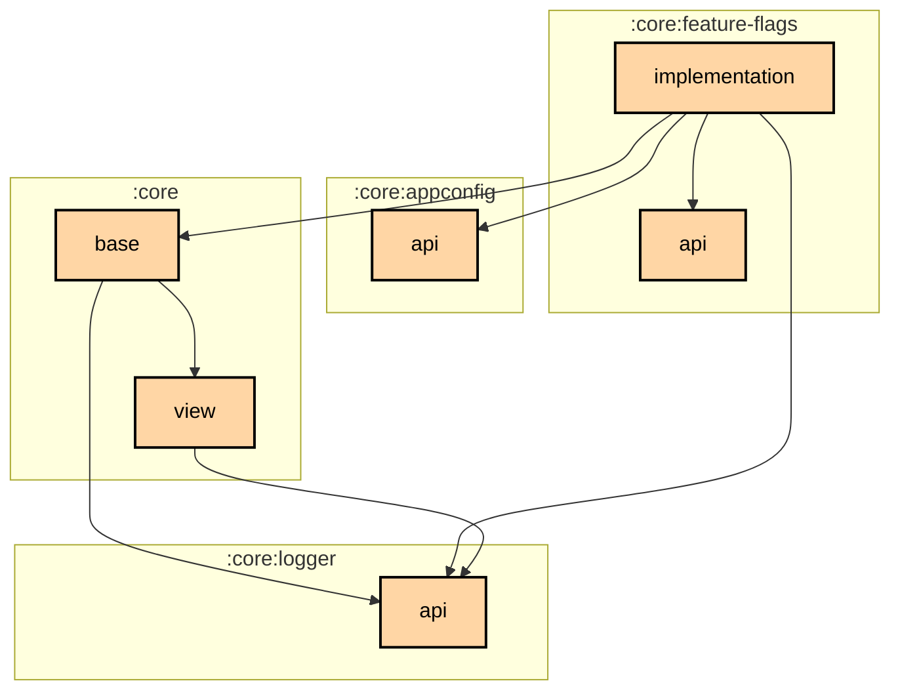
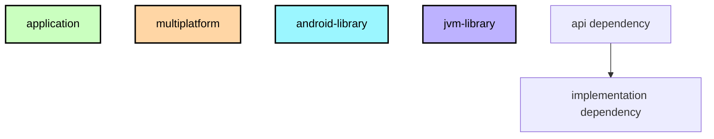

# `:core:feature-flags:implementation`

## Module dependency graph

<!--region graph-->

```mermaid
graph TB
  subgraph :core
    direction TB
    :core:base[base]:::multiplatform
    :core:view[view]:::multiplatform
  end
  subgraph :core:appconfig
    direction TB
    :core:appconfig:api[api]:::multiplatform
  end
  subgraph :core:feature-flags
    direction TB
    :core:feature-flags:api[api]:::multiplatform
    :core:feature-flags:implementation[implementation]:::multiplatform
  end
  subgraph :core:logger
    direction TB
    :core:logger:api[api]:::multiplatform
  end

  :core:base --> :core:logger:api
  :core:base --> :core:view
  :core:feature-flags:implementation --> :core:appconfig:api
  :core:feature-flags:implementation --> :core:base
  :core:feature-flags:implementation --> :core:feature-flags:api
  :core:feature-flags:implementation --> :core:logger:api
  :core:view --> :core:logger:api

classDef application fill:#CAFFBF,stroke:#000,stroke-width:2px,color:#000;
classDef multiplatform fill:#FFD6A5,stroke:#000,stroke-width:2px,color:#000;
classDef android-library fill:#9BF6FF,stroke:#000,stroke-width:2px,color:#000;
classDef jvm-library fill:#BDB2FF,stroke:#000,stroke-width:2px,color:#000;
classDef unknown fill:#FFADAD,stroke:#000,stroke-width:2px,color:#000;
```

Graph legend

```mermaid
graph TB
  application[application]:::application
  multiplatform[multiplatform]:::multiplatform
  android-library[android-library]:::android-library
  jvm-library[jvm-library]:::jvm-library

  api["api dependency"] --> implementation["implementation dependency"]

classDef application fill:#CAFFBF,stroke:#000,stroke-width:2px,color:#000;
classDef multiplatform fill:#FFD6A5,stroke:#000,stroke-width:2px,color:#000;
classDef android-library fill:#9BF6FF,stroke:#000,stroke-width:2px,color:#000;
classDef jvm-library fill:#BDB2FF,stroke:#000,stroke-width:2px,color:#000;
classDef unknown fill:#FFADAD,stroke:#000,stroke-width:2px,color:#000;
```

<!--endregion-->
