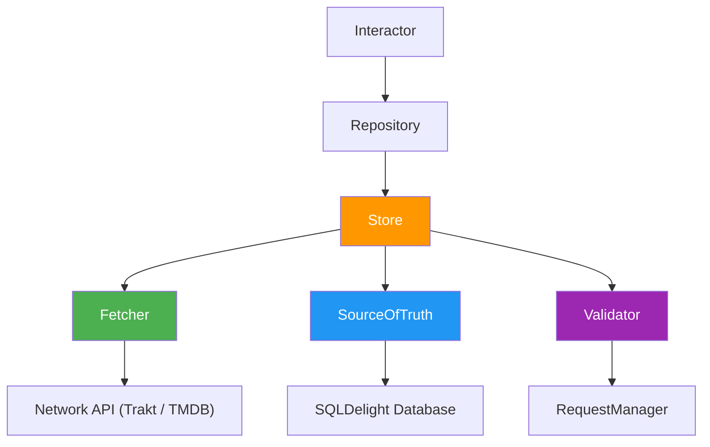

# Data Layer

> **What this covers**: the Store pattern, the hybrid Trakt and TMDB strategy, cache validation, the SQLDelight database, and how errors propagate.
> **Prerequisites**: skim the [Key Concepts](../../README.md#key-concepts) section for the Store pattern, then read [Modularization](MODULARIZATION.md) for where data modules live.

The data layer handles all data fetching, caching, and persistence. It is built on the [Store pattern](https://store.mobilenativefoundation.org/) which provides a consistent approach to managing data from network and local sources.

## Table of Contents

- [Hybrid API Strategy](#hybrid-api-strategy)
- [Store Pattern](#store-pattern)
- [Cache Validation](#cache-validation)
- [Database](#database)
- [Error Handling](#error-handling)

## Hybrid API Strategy

The app uses two external APIs, each serving a different purpose:

| API       | Purpose                                                     | Examples                                               |
|-----------|-------------------------------------------------------------|--------------------------------------------------------|
| **Trakt** | Show listings, user authentication, watchlist management    | Popular shows, trending shows, watchlist, user profile |
| **TMDB**  | Show details, images (posters, backdrops), cast information | Show metadata, season details, trailers                |

This means some features require data from **both** APIs. For example, trending shows come from Trakt, but their poster images come from TMDB. The Store pattern handles this composition transparently — a single Store can fetch from multiple sources in its fetcher.

## Store Pattern

Every data feature follows the same architecture:

### Components

**Store** — The core component that coordinates fetching, caching, and validation. Given a key, it decides whether to serve from cache or fetch from the network.

**Fetcher** — The network layer. Calls external APIs (Trakt, TMDB, or both) and returns domain models. For hybrid features, the fetcher composes multiple API calls internally.

**SourceOfTruth** — The local persistence layer. Uses SQLDelight for type-safe SQL storage. Exposes a `reader` (observable flow of cached data) and a `writer` (stores fetched data).

**Validator** — The cache freshness check. Consults the `RequestManagerRepository` to determine if cached data is still valid based on configurable time thresholds. If valid, the Store skips the network call.

### Data Flow

1. **UI subscribes** — A presenter observes data via a `SubjectInteractor`, which calls the repository
2. **Cache check** — The Store's validator asks: "Is the cached data still fresh?"
3. **Cache hit** — If fresh, the SourceOfTruth emits cached data directly
4. **Cache miss** — If expired, the Fetcher calls the network API(s)
5. **Write-through** — Fetched data is written to the SourceOfTruth (database)
6. **Emit** — The SourceOfTruth emits the newly cached data to subscribers
7. **Force refresh** — Presenters can bypass validation with `store.fresh(key)` for pull-to-refresh

### Repository Role

Repositories wrap Stores and provide a clean interface to the domain layer:

- **`observe()`** — Returns a `Flow` from the SourceOfTruth (cache-first, reactive)
- **`fetch()`** — Triggers the Store to check freshness and potentially fetch from the network

Repositories live in `data/*/implementation/` and implement interfaces defined in `data/*/api/`.

## Cache Validation

The `RequestManagerRepository` tracks when each data type was last fetched. The Store validator compares the elapsed time against a configured threshold to decide if a network fetch is needed.

### Duration Tiers

| Tier | Duration | Data Types |
|---|---|---|
| **Short** | 1 day | Featured shows, trending shows, watchlist, library sync, calendar |
| **Medium** | 3 days | Top rated shows, upcoming shows, user profile, genre shows |
| **Long** | 5–6 days | Show details, similar shows, season details, popular shows, cast, trailers |
| **Very long** | 7–30 days | Watch providers, genre list |
| **Aggressive** | 1–3 hours | Episode watch sync, up-next sync |

The tier reflects how frequently the underlying data changes. Show details rarely change (long), while trending shows shift daily (short).

### Force Refresh

Pull-to-refresh and explicit user actions bypass the validator entirely by calling `store.fresh(key)` instead of `store.get(key)`. This always triggers a network fetch regardless of cache age.

## Database

The project uses [SQLDelight](https://cashapp.github.io/sqldelight/) for type-safe SQL across platforms. All database definitions live in `data/database/sqldelight/`.

- **Schema**: Defined in `.sq` files with standard SQL
- **Migrations**: Sequential `.sqm` files using the temp-table pattern for schema changes
- **DAOs**: Generated Kotlin interfaces for type-safe queries
- **Shared**: The same database runs on both Android (SQLite) and iOS (SQLite)

## Error Handling

Errors in the data layer propagate naturally — they are **not** caught or swallowed. The presentation layer is responsible for catching errors (via `collectStatus()`) and displaying them to the user through `UiMessageManager`.

Network errors are mapped to `ApiResponse` sealed types at the HTTP client level, which allows callers to handle success and failure cases explicitly.
