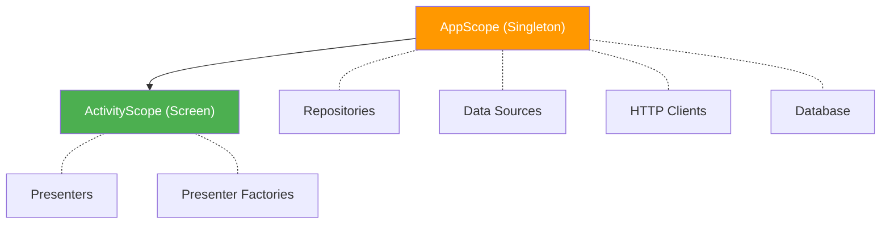

# Dependency Injection

The project uses compile-time dependency injection. This document covers the scope hierarchy and wiring principles that apply regardless of the specific DI framework or annotations in use.

> **Note:** The project is migrating from kotlin-inject to Metro (kotlin-inject-anvil). The concepts below are stable across this migration — specific annotations may change.

## Scope Hierarchy

### AppScope

Application-wide singletons. Created once and shared across the entire app lifetime.

**What lives here:**
- Repositories and their Store instances
- Database and DAO instances
- Network API clients
- Request manager (cache validation)
- Datastore (preferences)
- Logger, Localizer, and other utilities

### ActivityScope

Screen-scoped instances. Created when a screen appears and destroyed when it's removed from the navigation stack.

**What lives here:**
- Presenter factories
- Presenters (created by factories with runtime parameters)

## API / Implementation Boundary

The DI system enforces the module dependency rules described in [Modularization](MODULARIZATION.md):

1. **Interfaces in `api/` modules** — Repository interfaces, data source interfaces, and models are defined in `data/*/api/`
2. **Implementations in `implementation/` modules** — Concrete classes live in `data/*/implementation/` and are bound to their interfaces via DI
3. **Consumers depend on `api/` only** — Presenters, interactors, and other modules import the interface, never the implementation

The DI framework resolves the binding at compile time — when a presenter asks for a `LibraryRepository`, it receives `DefaultLibraryRepository` without ever importing the implementation module.

## Assisted Injection

Presenters require runtime parameters that aren't available at compile time:

- **ComponentContext** — Decompose lifecycle context, provided when the screen is created
- **Navigation callbacks** — Lambdas like `navigateToShowDetails: (Long) -> Unit`, wired by the parent presenter

These are provided through assisted injection: the DI framework creates a factory that accepts the runtime parameters and produces the fully-injected presenter instance.

## Wiring Pattern

The general pattern for any new injectable class:

1. **Define the interface** in the `api/` module
2. **Implement it** in the `implementation/` module
3. **Annotate** the implementation to bind it to the interface within the appropriate scope
4. **Inject** the interface wherever it's needed — the DI framework resolves it automatically

For presenters, add a factory interface in the `api/` module and a factory implementation in the presenter module, using assisted injection for runtime parameters.
