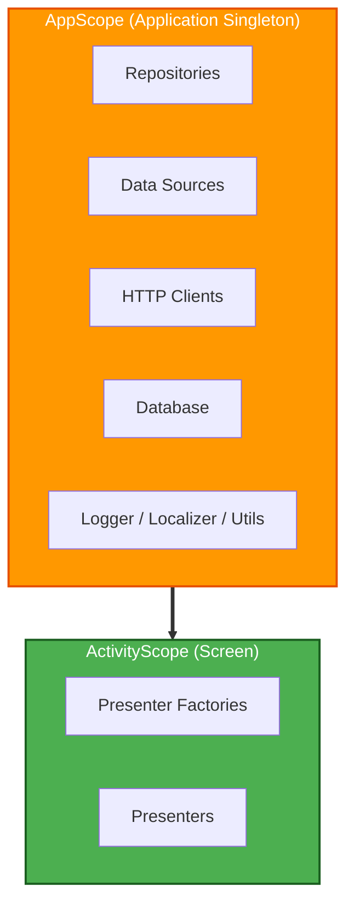

# Dependency Injection

The project uses [Metro](https://zacsweers.github.io/metro/latest/) for compile-time dependency injection. Metro is a Kotlin compiler plugin that treats aggregation as a first-class citizen, so there is no KSP processor and no runtime reflection. Every binding is resolved at graph-processing time.

The primary entry points in Metro are **dependency graphs**: interfaces annotated with `@DependencyGraph` that expose types from the object graph via accessor properties or functions. Those accessors act as the roots from which the rest of the graph is resolved.

This document covers the concepts that matter when adding or touching DI code in this project: scopes, naming, binding containers, qualifiers, assisted injection, initializers, graph creation, and testing.

## Scope Hierarchy



`ActivityScope` is a child of `AppScope`. It inherits every binding in the parent graph and layers screen-scoped bindings on top.

### AppScope

Application-wide singletons. Created once and shared across the entire app lifetime.

**What lives here**
- Repositories and their Store instances
- Database and DAO instances
- Network API clients (TMDB, Trakt)
- Request manager (cache validation)
- Datastore (preferences)
- Logger, Localizer, and other utilities

### ActivityScope

Screen-scoped instances. Created when a screen appears and destroyed when it is removed from the navigation stack.

**What lives here**
- Presenter factories
- Presenters (created by factories with runtime parameters)

### TestScope

Lives alongside `AppScope` in tests. The `TestJvmGraph` / `TestIosGraph` root graphs target `AppScope` and swap in fakes via `FakeAppBindings`. See [Testing](#testing).

## Naming Conventions

Metro distinguishes three DI concepts that used to collapse into a single `*Component` name under kotlin-inject. This project maps them to explicit suffixes so there is exactly one place to look for each shape:

| Metro annotation                       | Suffix              | Purpose                                                                                                                                | Example                                                                     |
| -------------------------------------- | ------------------- | -------------------------------------------------------------------------------------------------------------------------------------- | --------------------------------------------------------------------------- |
| `@DependencyGraph`                     | `*Graph`            | A dependency graph. The entry point an app, activity, or test creates to access its wired types.                                      | `ApplicationGraph`, `IosApplicationGraph`, `TestJvmGraph`                   |
| `@GraphExtension`                      | `*Graph`            | A child graph scoped to a narrower lifetime that inherits every binding from a parent graph.                                           | `ActivityGraph`, `IosViewPresenterGraph`                                    |
| `@BindingContainer` + `@ContributesTo` | `*BindingContainer` | A `public object` that groups `@Provides` methods and contributes them to a scope. Used for bindings `@ContributesBinding` can't express. | `BaseBindingContainer`, `TmdbBindingContainer`, `NavigationBindingContainer` |

**Why the split matters.** Decompose (the navigation/presenter library) has its own `Component` and `ComponentContext` types. Reusing `*Component` for DI classes would create constant ambiguity at every reference site. The Metro-aligned naming keeps the two domains disjoint: DI classes are always `*Graph` or `*BindingContainer`, and anything named `Component` (`ComponentContext`, `DefaultComponentContext`, the Swift `ComponentHolder<T>` helper) belongs to Decompose.

## Binding Containers

A binding container groups related `@Provides` methods into a single object and contributes them to a scope. In this project, every binding container is a `public object` annotated with `@BindingContainer` and `@ContributesTo(SomeScope::class)`:

```kotlin
@BindingContainer
@ContributesTo(AppScope::class)
public object BaseBindingContainer {

    @Provides
    @SingleIn(AppScope::class)
    public fun provideCoroutineDispatchers(): AppCoroutineDispatchers = AppCoroutineDispatchers(
        io = Dispatchers.IO,
        computation = Dispatchers.Default,
        main = Dispatchers.Main,
    )
}
```

Rules:
- **`@BindingContainer` must be on a `public object`**, never an `interface`. Metro rejects `@BindingContainer` on interfaces with direct `@Provides` methods.
- Prefer `@ContributesBinding` on the implementation class itself when you're binding an interface to a concrete class. Metro describes it as contributing "injected classes to a target scope as a given bound type", which is exactly what the repository and data-source classes in this project do.
- Reach for a binding container only when `@ContributesBinding` can't express the binding: platform types, third-party types, qualified `@Provides`, factory methods, or bindings that need explicit construction.

## Qualifiers

Metro identifies every binding by a **type key**: the concrete type plus any qualifier annotation attached to it. Two bindings of the same type with different qualifiers are distinct, so qualifiers are the project's way of disambiguating otherwise-identical types (multiple `CoroutineScope`s, multiple `HttpClientEngine`s, Android `Context`).

The project defines its qualifiers in `core/base` (`Qualifiers.kt`):

| Qualifier                    | Used for                                                                                 |
| ---------------------------- | ---------------------------------------------------------------------------------------- |
| `@ApplicationContext`        | Android `Context` injection sites that want the application context.                    |
| `@TmdbApi`, `@TraktApi`      | `HttpClientEngine` and related Ktor types, splitting TMDB vs Trakt networking.           |
| `@MainCoroutineScope`        | `CoroutineScope` bound to the main dispatcher.                                           |
| `@IoCoroutineScope`          | `CoroutineScope` bound to the IO dispatcher.                                             |
| `@ComputationCoroutineScope` | `CoroutineScope` bound to the computation dispatcher.                                    |
| `@Initializers`              | Multibinding set for synchronous app initializers.                                       |
| `@AsyncInitializers`         | Multibinding set for asynchronous app initializers.                                      |

The qualifier goes on both the `@Provides` site and every injection site:

```kotlin
@Inject
public class DefaultTraktAuthRepository(
    @IoCoroutineScope private val ioScope: CoroutineScope,
    @MainCoroutineScope private val mainScope: CoroutineScope,
) : TraktAuthRepository
```

## Assisted Injection

Metro describes assisted injection as the mechanism "for types that require dynamic dependencies at instantiation". Presenters that have screen-specific parameters (show ID, season params) use assisted injection. Metro matches assisted parameters by parameter name, so no explicit `@Assisted("id")` values are needed.

### Presenters without screen parameters

Most presenters use plain `@Inject`. Their `ComponentContext` is provided by a `@GraphExtension` scope (see [Navigation](NAVIGATION.md) for the scope hierarchy). No Factory interface needed.

```kotlin
@Inject
public class HomePresenter(
    componentContext: ComponentContext,              // provided by ScreenScope
    private val homeTabGraphFactory: HomeTabGraph.Factory,
    private val observeUserProfileInteractor: ObserveUserProfileInteractor,
) : ComponentContext by componentContext
```

Parent code resolves these directly from the graph: `screenGraph.homePresenter`.

### Presenters with screen parameters

Presenters that need runtime parameters beyond `ComponentContext` use `@AssistedInject` with a Factory. Only the screen-specific params are `@Assisted`. `ComponentContext` comes from the scope.

```kotlin
@AssistedInject
public class ShowDetailsPresenter(
    componentContext: ComponentContext,              // provided by ScreenScope
    @Assisted private val param: ShowDetailsParam,  // screen-specific
    private val navigator: ShowDetailsNavigator,
    private val showDetailsInteractor: ShowDetailsInteractor,
) : ComponentContext by componentContext {

    @AssistedFactory
    public fun interface Factory {
        public fun create(param: ShowDetailsParam): ShowDetailsPresenter
    }
}
```

Parent code gets the factory from the graph: `screenGraph.showDetailsFactory.create(param)`.

## App Initializers

In Metro, multibindings are "collections of bindings of a common type" that are implicitly declared by the existence of `@IntoSet` / `@IntoMap` providers. The project uses two qualified `Set<() -> Unit>` multibindings to coordinate startup work:

- `@Initializers`: runs inline at startup. Use for lightweight, synchronous setup that must complete before the first UI frame (logger, locale, Coil `ImageLoader`).
- `@AsyncInitializers`: runs inside a coroutine launched on `@IoCoroutineScope`. Use for anything touching disk or network (token refresh, sync schedulers, cache warming).

Both sets are declared once in `core/base` with `@Multibinds` so Metro knows they exist even if a given module contributes nothing:

```kotlin
@ContributesTo(AppScope::class)
public interface InitializerMultibindings {
    @Initializers @Multibinds public fun initializers(): Set<() -> Unit>
    @AsyncInitializers @Multibinds public fun asyncInitializers(): Set<() -> Unit>
}
```

To add a new initializer, write a plain `@Inject` class with an `init()` method and contribute a lambda into the correct set from a sibling binding container. `AppInitializers.initialize()` iterates each set at startup. No registration code to touch, no application-class edits.

## Graph Creation

Metro's stance is that "graphs are relatively cheap and should be used freely". The project follows that: a long-lived application graph, a short-lived graph extension per activity or per iOS view, and throwaway test graphs per test class.

### Android

`ApplicationGraph` is the `@DependencyGraph(AppScope::class)`. `TvManicApplication` creates it once with the `Application` instance and holds it for the lifetime of the process:

```kotlin
@DependencyGraph(AppScope::class)
public interface ApplicationGraph {
    public val initializers: AppInitializers
    public val workerFactory: TvManiacWorkerFactory

    @DependencyGraph.Factory
    public fun interface Factory {
        public fun create(@Provides application: Application): ApplicationGraph
    }
}
```

`ActivityGraph` is a `@GraphExtension(ActivityScope::class)` accessed through the parent graph via `asContribution<Factory>()`:

```kotlin
public companion object {
    public fun create(activity: ComponentActivity): ActivityGraph =
        (activity.application as TvManicApplication)
            .getApplicationGraph()
            .asContribution<Factory>()
            .createGraph(activity)
}
```

### iOS

`IosApplicationGraph` is created with `createGraph<>()` from `AppDelegate`. It exposes a `IosViewPresenterGraph.Factory` that Swift calls to produce a per-view graph.

```kotlin
@DependencyGraph(AppScope::class)
public interface IosApplicationGraph {
    public val initializers: AppInitializers
    public val viewPresenterGraphFactory: IosViewPresenterGraph.Factory

    public companion object {
        public fun create(): IosApplicationGraph = createGraph<IosApplicationGraph>()
    }
}
```

Swift holds the root graph in `AppDelegate` and wraps the per-view graph in `ComponentHolder<IosViewPresenterGraph>`.

## API / Implementation Boundary

The DI system enforces the module dependency rules described in [Modularization](MODULARIZATION.md):

1. **Interfaces in `api/` modules**: repository interfaces, data source interfaces, and models live in `data/*/api/`.
2. **Implementations in `implementation/` modules**: concrete classes live in `data/*/implementation/` and are bound to their interfaces via `@ContributesBinding`.
3. **Consumers depend on `api/` only**: presenters, interactors, and other modules import the interface, never the implementation.

When a presenter asks for a `LibraryRepository`, Metro supplies `DefaultLibraryRepository` without the consuming module ever importing the implementation module.

## Testing

Tests build their own dependency graph that reuses the production aggregation and swaps in fakes.

- `TestJvmGraph` / `TestIosGraph`: `@DependencyGraph(AppScope::class)` interfaces that expose the presenters and repositories a test needs via accessor properties.
- `FakeAppBindings`: a `@BindingContainer public object` that uses `@ContributesTo(AppScope::class, replaces = [...])` to override specific production bindings (auth, datastore, crash reporter, background task scheduler, etc.) with fakes from the `testing` modules.
- `FakeIosPlatformBindings`: same pattern for iOS-specific platform bindings.
- `TestJvmGraphTest`: a smoke test that instantiates the graph and verifies every presenter factory resolves, catching DI regressions in a single JVM test.

Every `data/*/testing` module provides a fake implementation. Tests never use mocks.

## Adding a New Injectable

The general pattern for any new injectable class:

1. **Define the interface** in the `api/` module.
2. **Implement it** in the `implementation/` module.
3. **Annotate** the implementation with `@Inject` and `@ContributesBinding(AppScope::class)`. Add `@SingleIn(AppScope::class)` if it should be a singleton.
4. **Inject** the interface wherever it's needed. Metro resolves it at graph-processing time.

For presenters, use `@AssistedInject` with an `@AssistedFactory fun interface Factory` for runtime parameters. For platform types or third-party classes that Metro can't `@Inject` directly, add a `*BindingContainer` `public object` with `@Provides` methods and contribute it to the scope with `@ContributesTo`.
