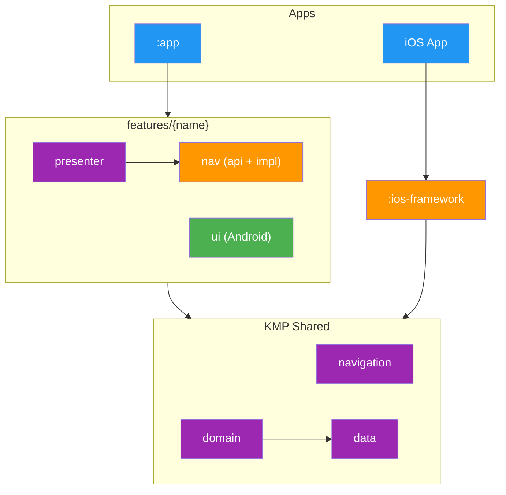

# Modularization

The project is split across roughly **170 Gradle modules** grouped into a handful of archetypes. The count is large, but the archetypes are few. Once you recognise them, the whole codebase becomes navigable.

This document covers the layers that exist, how they depend on each other, and the shapes individual modules take. For the DI side of the story (scopes, graphs, binding containers) see [Dependency Injection](DI.md).

## Module Dependency Graph



Both platforms consume the same **KMP Shared** layer. Each feature is co-located under `features/{name}/` with presenter (KMP), ui (Android Compose), and nav (navigator api + implementation) sub-modules. iOS screens live in Swift and reach the shared layer through `:ios-framework`, which exports the KMP types as an XCFramework (`import TvManiac`).

The diagram omits utility layers (`core/*`, `i18n/*`, `api/{tmdb,trakt}`, `data/database`, `data/datastore`, `data/request-manager`) for clarity. They sit underneath `data/*` and `domain/*` and are reached throughout the shared layer.

## Layers

| Layer | Modules | Role |
|---|---|---|
| Entry points | `:app`, `:ios-framework` | Wire the DI graph and host the app binary. Only these two see implementation modules. |
| Feature modules | `features/{name}/presenter`, `features/{name}/ui`, `features/{name}/nav` | Co-located presenter (KMP), Android UI (Compose), and navigation (navigator interface + implementation). |
| Root feature | `features/root/presenter`, `features/root/ui`, `features/root/nav` | RootPresenter, root composable, and shared nav models (ThemeState, DeepLinkDestination, etc.). |
| Navigation | `navigation/api`, `navigation/implementation` | Pure navigation contracts (RootNavigator, RootDestinationConfig, RootChild) and infra (DefaultRootNavigator). |
| Business logic | `domain/*` | Interactors. The only place business rules live. |
| Data contracts | `data/*/api` | Repository interfaces, data models, and query keys. |
| Data implementation | `data/*/implementation` | Stores, repositories, DAOs, and mappers. |
| Data infrastructure | `data/database`, `data/datastore`, `data/request-manager` | SQLDelight, preferences, and freshness/cache validation. |
| Network | `api/tmdb`, `api/trakt` | Ktor clients, request models, and auth plumbing. |
| Localization | `i18n/*` | Moko-generated string resources, the `Localizer` interface, and the code generator. |
| Core | `core/*` | Coroutine dispatchers, logger, connectivity, utilities, design system base types, test scaffolding. |

## Dependency Rules

1. **Modules depend on API modules only**, never on `implementation/`. If a presenter needs a repository, it pulls `data/foo/api`. Metro wires the binding at graph processing time.
2. **Entry points are the only implementation consumers.** `:app` and `:ios-framework` pull the full set of `data/*/implementation` and `features/*/nav/implementation` modules so the DI graph can resolve every binding.
3. **Feature nav modules follow api/implementation split.** `features/{name}/nav/api` has the navigator interface. `features/{name}/nav/implementation` has the default implementation with `@ContributesBinding`. Presenter modules depend only on `nav/api`.
4. **`navigation/api` has zero presenter dependencies.** It contains only pure contracts (`RootNavigator`, `RootDestinationConfig`, `RootChild`, `SheetChild`). Feature-specific types live in feature modules.
5. **Fakes live in dedicated testing modules.** Every `data/*/testing` and `core/*/testing` module exposes a fake implementation. Presenter and domain tests depend on `api/` + `testing/`, never on `implementation/`.
6. **`core/*` modules are leaves.** Nothing inside `core/` depends on `data/`, `domain/`, features, or platform UI.
7. **UI modules contain no business logic.** `features/*/ui` renders state from presenters and dispatches intents back.

## Module Archetypes

### 1. Entry Point Modules

Single-module roots that assemble the DI graph and produce the final binary or framework.

```
:app/                   # Android application
:ios-framework/         # iOS XCFramework
```

### 2. Feature Modules

The dominant pattern for user-facing features. Each feature is co-located under `features/{name}/`:

```
features/{name}/
├── presenter/           # KMP: XxxPresenter, XxxDestination, state, actions
├── ui/                  # Android: Compose screen, screenshot tests
└── nav/
    ├── api/             # KMP: XxxNavigator (interface)
    └── implementation/  # KMP: DefaultXxxNavigator (@ContributesBinding)
```

- **`presenter/`**: `@Inject` classes that hold screen state, delegate to `domain/*` interactors, and expose `StateFlow<State>`. Define `XxxDestination : RootChild` for the navigation layer.
- **`ui/`**: Compose screens. Depend on `presenter/` and `android-designsystem`.
- **`nav/api/`**: Navigator interface with typed methods (`showDetails`, `goBack`).
- **`nav/implementation/`**: Delegates to `RootNavigator`. Uses `@ContributesBinding(ActivityScope::class)`.

Some features skip `nav/` (trailers, progress, home) because they have no outbound navigation or use specialized controllers.

**Examples**: `features/search`, `features/show-details`, `features/discover`.

### 3. Grouped Data Modules (api + implementation + testing)

```
data/{feature}/
├── api/              # Repository interfaces, models
├── implementation/   # Stores, repositories, DAOs
└── testing/          # Fake implementation
```

**Examples**: `data/library`, `data/calendar`, `data/episode`, `api/tmdb`, `api/trakt`.

### 4. Domain Modules

Single-module KMP features with no sub-modules. Contain interactors and use cases.

```
domain/{feature}/
└── src/commonMain/kotlin    # Interactors
```

**Examples**: `domain/watchlist`, `domain/showdetails`, `domain/episode`.

### 5. Standalone Modules

Self-contained single-purpose modules.

**Examples**: `core/base`, `core/view`, `core/paging`, `android-designsystem`, `core/testing/di`.

## Adding a New Feature

1. **`data/{feature}/`**: create `api/`, `implementation/`, and `testing/` sub-modules.
2. **`domain/{feature}/`**: add interactors.
3. **`features/{name}/presenter`**: add presenter, state, and `XxxDestination : RootChild`.
4. **`features/{name}/ui`**: add Compose screen.
5. **`features/{name}/nav/api`**: add `XxxNavigator` interface.
6. **`features/{name}/nav/implementation`**: add `DefaultXxxNavigator`.
7. Wire into `ScreenGraph` and `DefaultRootPresenter.createScreen()`.
8. Add fake navigator in `FakeAppBindings`.
9. Register modules in `settings.gradle.kts`.
10. Add `nav/implementation` deps to `:app` and `:ios-framework`.
