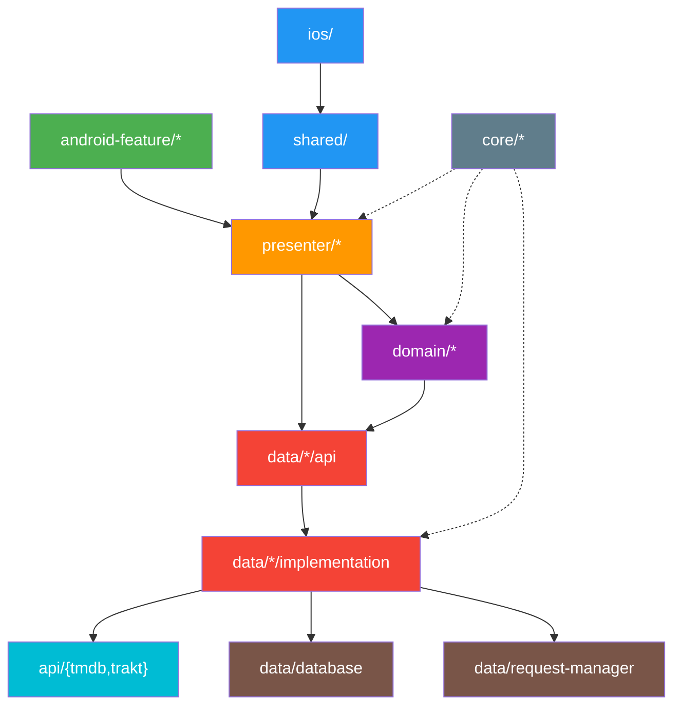

# Modularization

The project is organized into **120+ Gradle modules** across several categories. Despite the count, every module follows one of a small number of archetypes. Understanding these archetypes is enough to navigate the entire codebase.

## Module Dependency Graph



**Key rule**: Modules depend on **API modules only**, never on implementation modules. The `:app` module (Android) and `:shared` module (iOS) are the only consumers of implementation modules, wired through dependency injection.

## Module Categories

| Category | Count | Purpose |
|---|---|---|
| `data/*` | ~30 | Repositories, stores, and local data access |
| `domain/*` | ~16 | Business logic and interactors |
| `presenter/*` | ~16 | Shared presentation state management |
| `android-feature/*` | ~15 | Android Compose UI screens |
| `core/*` | ~12 | Shared utilities and infrastructure |
| `api/*` | 2 | Network API clients (TMDB, Trakt) |
| `i18n/*` | 4 | Localization and string resources |
| `navigation/*` | 2 | Decompose navigation |
| `shared/` | 1 | KMP framework consumed by iOS |

## Module Archetypes

### Standalone Modules

Self-contained modules with a single purpose. No sub-modules.

```
:core/base/
├── build.gradle.kts
└── src/
    └── commonMain/
```

**Examples**: `core/base`, `core/logger`, `core/paging`, `i18n/api`, `android-designsystem`

### Data Modules (Grouped)

The dominant pattern in the project. Each data feature is split into three sub-modules that enforce a clean boundary between contract and implementation.

```
:data/{feature}/
├── api/              # Interfaces, models, and data contracts
├── implementation/   # Store, repository, DAO implementations
└── testing/          # Fakes for test doubles
```

- **`api/`** — Lightweight. Depends only on `core/*` or other `api` modules. This is what other modules import.
- **`implementation/`** — Contains the Store, repository, and database access. Depends on `api/` (own module), network API clients, and `data/database`. Only consumed by `:app` and `:shared` via DI.
- **`testing/`** — Provides fake implementations of the `api/` interfaces. Used by presenter and domain tests.

**Examples**: `data/library`, `data/calendar`, `data/episode`, `data/traktauth`

**Infrastructure data modules** follow the same pattern: `data/database`, `data/datastore`, `data/request-manager`.

### Feature Modules (Android)

Android-specific UI modules. Each contains Compose screens that consume shared presenters.

```
:android-feature/{feature}/
├── build.gradle.kts
└── src/
    ├── main/         # Compose UI screens
    └── test/         # Screenshot tests (Roborazzi)
```

- Depend on: `presenter/{feature}` (shared state), `core/view`, `i18n`, `android-designsystem`
- Contain **no business logic** — pure UI rendering

**Examples**: `android-feature/discover`, `android-feature/show-details`, `android-feature/library`

### Presenter Modules

Shared KMP modules containing presentation logic consumed by both Android and iOS.

```
:presenter/{feature}/
├── build.gradle.kts
└── src/
    ├── commonMain/   # Shared presenter logic
    └── commonTest/   # Tests (Kotest + Turbine)
```

- Depend on: `domain/*` modules, `data/*/api` modules, `core/view`
- Expose: State flows and action dispatchers via Decompose component contexts
- Contain **state management only** — no business logic, formatting, or sorting

**Examples**: `presenter/discover`, `presenter/show-details`, `presenter/calendar`

## Adding a New Feature

A typical new feature touches four module groups:

1. **`data/{feature}/`** — `api` + `implementation` + `testing` sub-modules for data access
2. **`domain/{feature}/`** — Interactors for business logic
3. **`presenter/{feature}/`** — Shared presenter for state management
4. **`android-feature/{feature}/`** — Android Compose UI

iOS UI lives in `ios/ios/UI/` and imports the shared framework directly.
