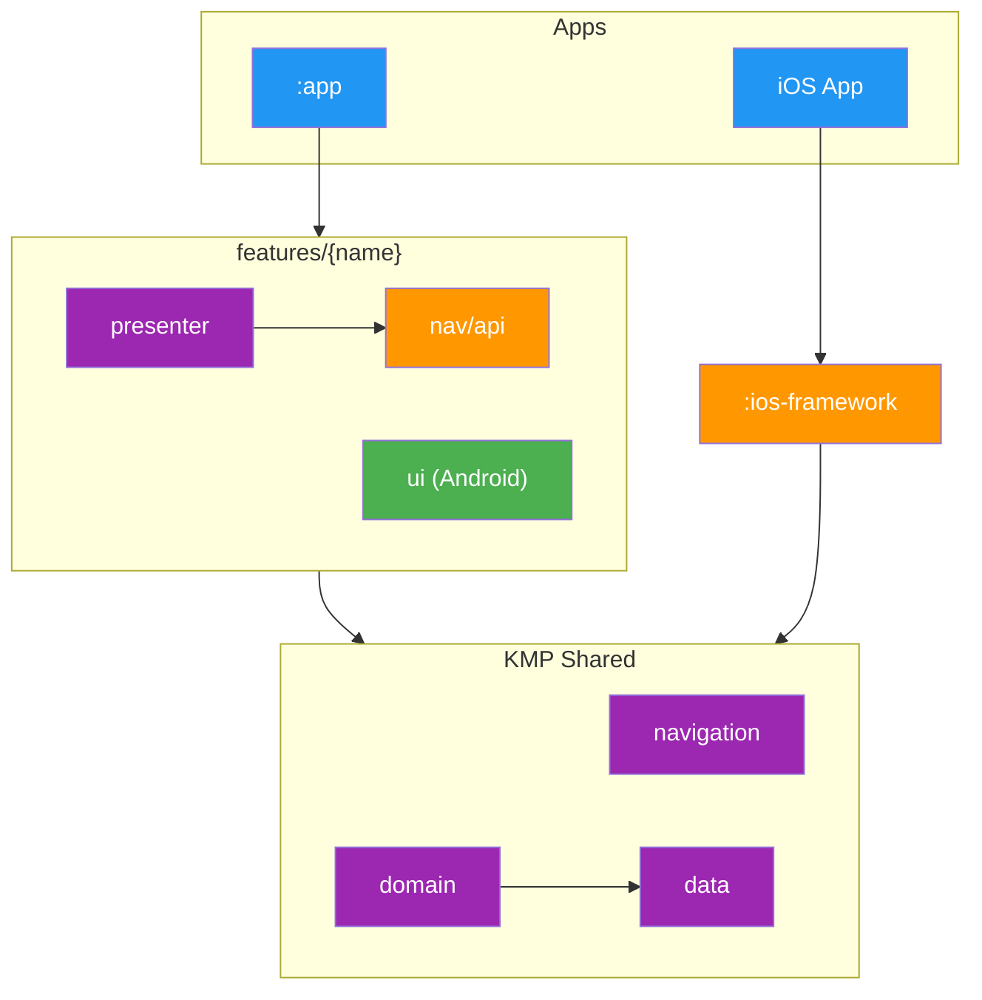

# Modularization

> **What this covers**: the layers of modules in this project, how they depend on each other, and the shape each module type takes.
> **Prerequisites**: skim the [Key Concepts](../../README.md#key-concepts) section in the root README if Metro, Decompose, or the Store pattern are new.

The project is split across many Gradle modules grouped into a handful of archetypes. The module list is long, but the archetypes are few. Once you recognise them, the whole codebase becomes navigable.

This document covers the layers that exist, how they depend on each other, and the shapes individual modules take. For the DI side of the story (scopes, graphs, binding containers) see [Dependency Injection](DI.md).

## Table of Contents

- [Module Dependency Graph](#module-dependency-graph)
- [Layers](#layers)
- [Dependency Rules](#dependency-rules)
- [Module Archetypes](#module-archetypes)
- [Adding a New Feature](#adding-a-new-feature)

## Module Dependency Graph



Both platforms consume the same **KMP Shared** layer. Each feature is co-located under `features/{name}/` with a presenter (KMP), an Android Compose `ui` module, and a `nav/api` module that publishes the feature's route type and per-screen DI scope. iOS screens live in Swift and reach the shared layer through `:ios-framework`, which exports the KMP types as an XCFramework (`import TvManiac`).

The diagram omits utility layers (`core/*`, `i18n/*`, `api/{tmdb,trakt}`, `data/database`, `data/datastore`, `data/request-manager`) for clarity. They sit underneath `data/*` and `domain/*` and are reached throughout the shared layer.

## Layers

| Layer               | Modules                                                                      | Role                                                                                                                                                                                                                                                    |
|---------------------|------------------------------------------------------------------------------|---------------------------------------------------------------------------------------------------------------------------------------------------------------------------------------------------------------------------------------------------------|
| Entry points        | `:app`, `:ios-framework`                                                     | Wire the DI graph and host the app binary. Only these two see implementation modules.                                                                                                                                                                   |
| Feature modules     | `features/{name}/presenter`, `features/{name}/ui`, `features/{name}/nav/api` | Co-located presenter (KMP), Android UI (Compose), and the feature's nav contract (route type, per-screen DI scope, and a navigator interface when navigation is stateful).                                                                              |
| Root feature        | `features/root/presenter`, `features/root/ui`, `features/root/nav`           | The root presenter, the root composable, and shared root nav models (theme state, deep-link destinations, sheet-controller interface). Feature-specific sheet configs live in the owning feature's `nav/api`.                                          |
| Navigation          | `navigation/api`, `navigation/implementation`                                | Cross-cutting navigation contracts (the Navigator interface, the open `NavRoute` interface, the SheetNavigator interface, the open `SheetConfig` interface, stack and sheet child markers, destination factories, route and sheet config binding registries, the navigation event bus) and their default implementations and binding container. |
| Business logic      | `domain/*`                                                                   | Interactors. The only place business rules live.                                                                                                                                                                                                        |
| Data contracts      | `data/*/api`                                                                 | Repository interfaces, data models, and query keys.                                                                                                                                                                                                     |
| Data implementation | `data/*/implementation`                                                      | Stores, repositories, DAOs, and mappers.                                                                                                                                                                                                                |
| Data infrastructure | `data/database`, `data/datastore`, `data/request-manager`                    | SQLDelight, preferences, and freshness/cache validation.                                                                                                                                                                                                |
| Network             | `api/tmdb`, `api/trakt`                                                      | Ktor clients, request models, and auth plumbing.                                                                                                                                                                                                        |
| Localization        | `i18n/*`                                                                     | Moko-generated string resources, the `Localizer` interface, and the code generator.                                                                                                                                                                     |
| Core                | `core/*`                                                                     | Coroutine dispatchers, logger, connectivity, utilities, design system base types, test scaffolding.                                                                                                                                                     |

## Dependency Rules

1. **Modules depend on API modules only**, never on `implementation/`. If a presenter needs a repository, it pulls `data/foo/api`. Metro wires the binding at graph processing time.
2. **Entry points are the only implementation consumers.** `:app` and `:ios-framework` pull the full set of `data/*/implementation` modules and every feature presenter module so the DI graph can resolve all bindings (including the navigator implementations that live as `internal` classes inside presenter modules).
3. **Feature nav contracts live in `nav/api` only.** Each feature's `nav/api` exposes its `@Serializable` route type, its per-screen DI scope, and (when needed) a navigator interface for stateful flows. There is no per-feature `nav/implementation` module: the default navigator implementation, when one is needed, lives in the same presenter module as an `internal` class bound via `@ContributesBinding`.
4. **`navigation/api` has zero presenter dependencies.** It contains only cross-cutting contracts: the `Navigator` and `SheetNavigator` interfaces, the open `NavRoute` and `SheetConfig` markers, stack and sheet child markers, the generic `ScreenDestination<T>` and `SheetDestination<T>` wrappers, the stack and sheet destination factories, the route and sheet config binding entries, and the navigation event bus. Feature-specific route types, sheet configs, and presenter types live in feature modules.
5. **Fakes live in dedicated testing modules.** Every `data/*/testing` and `core/*/testing` module exposes a fake implementation. Presenter and domain tests depend on `api/` + `testing/`, never on `implementation/`.
6. **`core/*` modules are leaves.** Nothing inside `core/` depends on `data/`, `domain/`, features, or platform UI.
7. **UI modules contain no business logic.** `features/*/ui` renders state from presenters and dispatches intents back.

## Module Archetypes

### 1. Entry Point Modules

Single-module roots that assemble the DI graph and produce the final binary or framework.

```
:app/                   # Android application
:ios-framework/         # iOS XCFramework
```

### 2. Feature Modules

The dominant pattern for user-facing features. Each feature is co-located under `features/{name}/`:

```
features/{name}/
├── presenter/   # KMP: presenter, state, actions, per-screen DI graph extension,
│                #      destination + route-serializer bindings
├── ui/          # Android: Compose screen, screenshot tests
└── nav/api/     # KMP: @Serializable route type, per-screen scope marker,
                 #      navigator interface (only for stateful flows)
```

- **`presenter/`** holds `@Inject`/`@AssistedInject` presenter classes, screen state, and a per-screen `@GraphExtension` that exposes the presenter from the activity-scoped graph. Its `di/` package contributes a `NavDestination` (route matcher + child builder) and a `NavRouteBinding` (route class + serializer) into the navigation multibinding sets. Sheet-owning features additionally contribute a `SheetChildFactory` + `SheetConfigBinding` pair into the sheet-slot multibinding sets.
- **`ui/`** holds Compose screens that depend on `presenter/` and `android-designsystem`.
- **`nav/api/`** holds the feature's `@Serializable` route class, its per-screen scope marker class, and any model types passed across module boundaries. It also holds a navigator interface in the few cases where navigation is stateful (tab switching, slot-based sheets, etc.). Most features inject the Navigator interface directly and do not declare a per-feature navigator.

A `nav/api` module may be omitted entirely when a screen is purely internal to the feature and never reached as a destination on its own.

### 3. Grouped Data Modules (api + implementation + testing)

```
data/{feature}/
├── api/              # Repository interfaces, models
├── implementation/   # Stores, repositories, DAOs
└── testing/          # Fake implementation
```

**Examples**: `data/library`, `data/calendar`, `data/episode`, `api/tmdb`, `api/trakt`.

### 4. Domain Modules

Single-module KMP features with no sub-modules. Contain interactors and use cases.

```
domain/{feature}/
└── src/commonMain/kotlin    # Interactors
```

**Examples**: `domain/watchlist`, `domain/showdetails`, `domain/episode`.

### 5. Standalone Modules

Self-contained single-purpose modules.

**Examples**: `core/base`, `core/view`, `core/paging`, `android-designsystem`, `core/testing/di`.

## Adding a New Feature

1. **`data/{feature}/`**: create `api/`, `implementation/`, and `testing/` sub-modules (only if the feature needs new persistence or remote data).
2. **`domain/{feature}/`**: add interactors.
3. **`features/{name}/nav/api`**: add the `@Serializable` route class implementing `NavRoute`, plus a per-screen scope marker class.
4. **`features/{name}/presenter`**: add the presenter, screen state, the per-screen `@GraphExtension`, and the `di/` bindings that contribute one `NavDestination` and one `NavRouteBinding` into the activity-scoped multibinding sets. For sheet features, also contribute a `SheetChildFactory` and a `SheetConfigBinding`.
5. **`features/{name}/ui`**: add the Android Compose screen. Build the SwiftUI counterpart in the iOS app.
6. If the screen has stateful navigation (switches tabs, dismisses a sheet then routes to another screen), declare a navigator interface in `nav/api` and bind its default implementation as an `internal` class inside the presenter module. For sheet navigators specifically, the implementation must inject `SheetNavigator` from `navigation/api` and delegate `activate`/`dismiss` to it rather than declaring its own `SlotNavigation`.
7. Register modules in `settings.gradle.kts` and add the new presenter and `nav/api` modules to `:app` and `:ios-framework`.
8. If tests need a no-op or fake navigator, contribute it from `FakeAppBindings`.
