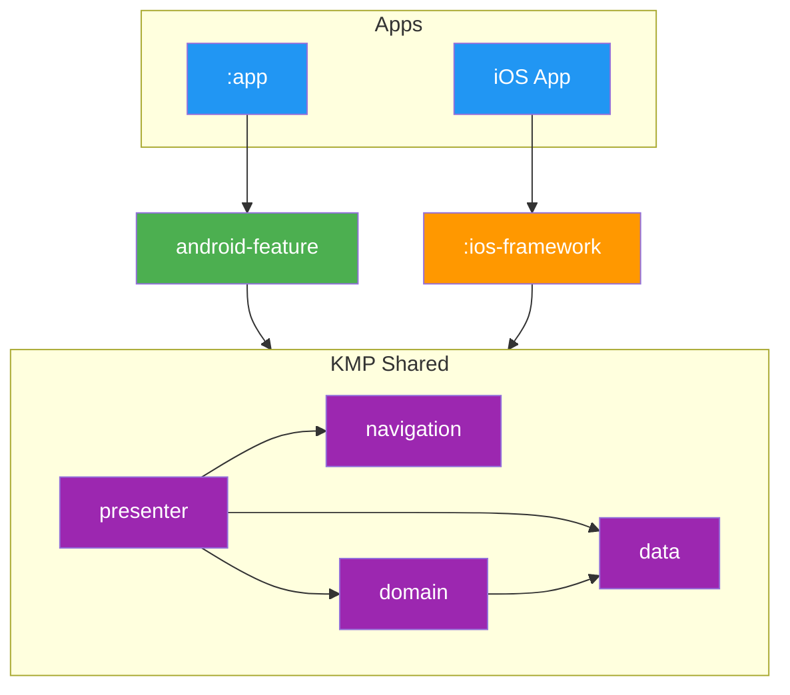

# Modularization

The project is split across roughly **150 Gradle modules** grouped into a handful of archetypes. The count is large, but the archetypes are few. Once you recognise them, the whole codebase becomes navigable.

This document covers the layers that exist, how they depend on each other, and the shapes individual modules take. For the DI side of the story (scopes, graphs, binding containers) see [Dependency Injection](DI.md).

## Module Dependency Graph



Both platforms consume the same **KMP Shared** layer. Android screens live in `android-feature/*` and call into shared presenters directly. iOS screens live in Swift and reach the shared layer through `:ios-framework`, which exports the KMP types as an XCFramework (`import TvManiac`).

The diagram omits utility layers (`core/*`, `i18n/*`, `api/{tmdb,trakt}`, `data/database`, `data/datastore`, `data/request-manager`) for clarity. They sit underneath `data/*` and `domain/*` and are reached throughout the shared layer. The Layers table below gives the full picture.

## Layers

| Layer               | Modules                                                   | Role                                                                                                |
| ------------------- | --------------------------------------------------------- | --------------------------------------------------------------------------------------------------- |
| Entry points        | `:app`, `:ios-framework`                                  | Wire the DI graph and host the app binary. Only these two see implementation modules.              |
| Platform UI         | `android-feature/*`, `ios/ios/UI`                         | Compose / SwiftUI screens. Pure rendering over shared presenter state.                              |
| Shared presentation | `presenter/*`, `navigation/*`                             | KMP presenter state and Decompose navigation graph. Consumed by both platforms.                     |
| Business logic      | `domain/*`                                                | Interactors. The only place business rules live.                                                    |
| Data contracts      | `data/*/api`                                              | Repository interfaces, data models, and query keys. Lightweight and widely depended on.             |
| Data implementation | `data/*/implementation`                                   | Stores, repositories, DAOs, and mappers that realise the contracts.                                 |
| Data infrastructure | `data/database`, `data/datastore`, `data/request-manager` | SQLDelight, preferences, and freshness/cache validation shared across data modules.                 |
| Network             | `api/tmdb`, `api/trakt`                                   | Ktor clients, request models, and auth plumbing for the two backends.                               |
| Localization        | `i18n/*`                                                  | Moko-generated string resources, the `Localizer` interface, and the code generator.                 |
| Core                | `core/*`                                                  | Coroutine dispatchers, logger, connectivity, utilities, design system base types, test scaffolding. |

Counts aren't listed because they change often and don't affect how you use the layers. To see the exact current set, run `./gradlew projects` or read `settings.gradle.kts`.

## Dependency Rules

1. **Modules depend on API modules only**, never on `implementation/`. If presenter A needs a repository defined in `data/foo`, it pulls `data/foo/api`. Metro wires the binding to `DefaultFooRepository` at graph processing time; the presenter module never imports the implementation.
2. **Entry points are the only implementation consumers.** `:app` and `:ios-framework` both pull the full set of `data/*/implementation` modules so the DI graph can resolve every binding. No other module does.
3. **Fakes live in dedicated testing modules.** Every `data/*/testing` and `core/*/testing` module exposes a fake implementation of its sibling `api/` interfaces. Presenter and domain tests depend on `api/` + `testing/`, never on `implementation/`.
4. **`core/*` modules are leaves.** Nothing inside `core/` depends on `data/`, `domain/`, `presenter/`, or platform UI. This keeps core reusable and cycle-free.
5. **UI modules contain no business logic.** `android-feature/*` and `ios/ios/UI` render state from presenters and dispatch intents back. Formatting, sorting, and rules all live further down.

Violating any of these rules shows up immediately as a compile error because the relevant module simply isn't on the classpath. The archetypes below are what enforce that.

## Module Archetypes

Every module in the project is one of five shapes.

### 1. Entry Point Modules

Single-module roots that assemble the DI graph and produce the final binary or framework.

```
:app/                   # Android application
└── src/main/           # Application class, activities, Metro ApplicationGraph

:ios-framework/         # iOS XCFramework
└── src/iosMain/        # IosApplicationGraph, IosViewPresenterGraph
```

- **`:app`** depends on every `android-feature/*`, every `data/*/implementation`, every `core/*/implementation`, plus `presenter/*`, `domain/*`, and `navigation/*`. It declares `ApplicationGraph` as described in [DI.md](DI.md).
- **`:ios-framework`** targets iOS only (no `commonMain`, no `androidMain`). It exports the same implementation modules as `:app` to the `TvManiac` XCFramework and declares `IosApplicationGraph` + `IosViewPresenterGraph` for Swift consumption. The Swift side imports it as `import TvManiac`.

### 2. Grouped Data Modules (api + implementation + testing)

The dominant pattern. Used by almost every `data/*` feature, every `api/*` network client, and the api/impl `core/*` submodules (`core/connectivity`, `core/logger`, `core/locale`, `core/util`, `core/tasks`, `core/network-util`, `core/notifications`, `core/imageloading`).

```
:data/{feature}/
├── api/              # Repository interfaces, models, query keys
├── implementation/   # Stores, repositories, DAOs, mappers
└── testing/          # Fake implementation of the api contract
```

- **`api/`**: depends only on `core/*` and its own domain models. This is what other modules import.
- **`implementation/`**: depends on its own `api/`, network `api/*`, `data/database`, `data/request-manager`, `data/datastore`, and `core/*`. Contributes bindings via `@ContributesBinding(AppScope::class)` so entry points pick them up automatically.
- **`testing/`**: depends only on its own `api/`. Provides a fake with public setters and private state for deterministic presenter/domain tests. See [Testing](DI.md#testing).

**Examples**: `data/library`, `data/calendar`, `data/episode`, `data/traktauth`, `api/tmdb`, `api/trakt`, `core/connectivity`.

### 3. Grouped api + implementation Modules (no testing)

Same idea as the trio but without a dedicated fake. Used when the module doesn't need test doubles (navigation, for example, is driven by Decompose fixtures, not by fakes).

```
:navigation/
├── api/              # RootPresenter, RootNavigator interfaces, deeplink parsing
└── implementation/   # Decompose wiring and route graph
```

**Examples**: `navigation/`, `i18n/` (api + implementation + generator + testing, see below).

`i18n/` is a minor exception: it has an extra `generator/` module that produces Kotlin code from XML string resources via Moko, plus a `testing/` module for `Localizer` fakes. Treat it as the same archetype with a codegen bolt-on.

### 4. Flat Feature Modules

Single-module KMP features with no api/impl split. These are typically already "contracts" (domain interactors) or "leaf consumers" (presenters and Android screens).

```
:presenter/{feature}/
├── build.gradle.kts
└── src/
    ├── commonMain/kotlin    # Presenter class + State
    └── commonTest/kotlin    # Kotest + Turbine + StandardTestDispatcher
```

- **`presenter/*`**: `@AssistedInject` classes that hold screen state, delegate to `domain/*` interactors, and expose `StateFlow<State>` to platform UI. Depend on `domain/*`, `data/*/api`, `core/view`. Contain **state orchestration only**. Business rules belong in interactors.
- **`domain/*`**: interactors and use cases. Depend on `data/*/api` and `core/*`. This is where business rules live (sorting, filtering, combining multiple repositories).
- **`android-feature/*`**: Compose screens and Roborazzi screenshot tests. Depend on `presenter/{feature}`, `core/view`, `i18n/api`, `android-designsystem`.

**Examples**: `presenter/discover`, `domain/watchlist`, `android-feature/show-details`.

### 5. Standalone Modules

Self-contained single-purpose modules with no sub-modules. Used for leaf utilities, base types, and the Compose design system.

```
:core/base/
├── build.gradle.kts
└── src/commonMain/kotlin
```

**Examples**: `core/base` (scopes, qualifiers, `AppInitializers`), `core/view` (Decompose helpers), `core/paging`, `core/screenshot-tests`, `core/testing/di` (the test DI graph), `android-designsystem`.

## Adding a New Feature

A typical feature touches four module groups in this order:

1. **`data/{feature}/`**: create `api/`, `implementation/`, and `testing/` sub-modules. The `api/` module exposes the repository interface and models; the `implementation/` module supplies the Store, repository, and DAO. Use `/data-module` to scaffold.
2. **`domain/{feature}/`**: add interactors that compose the repositories and encode the business rules.
3. **`presenter/{feature}/`**: add a presenter that holds the screen state and dispatches to the interactors. Use `/presenter` to scaffold.
4. **`android-feature/{feature}/`**: add the Compose screen wired to the presenter. Use `/compose-screen` to scaffold, `/compose-test` for screenshot tests.
5. Wire the screen into navigation: `navigation/api` (route) and `navigation/implementation` (Decompose child). Use `/navigation`.
6. Register the modules in `settings.gradle.kts`.
7. Add the `implementation` module to `:app` and `:ios-framework` so the DI graph resolves the new bindings.

iOS UI lives in `ios/ios/UI/` and consumes the new presenter through the `TvManiac` framework. No additional gradle wiring is needed beyond step 7.
