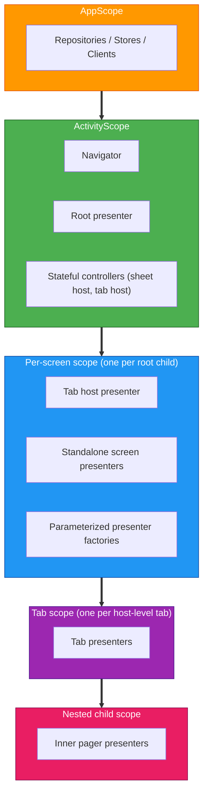
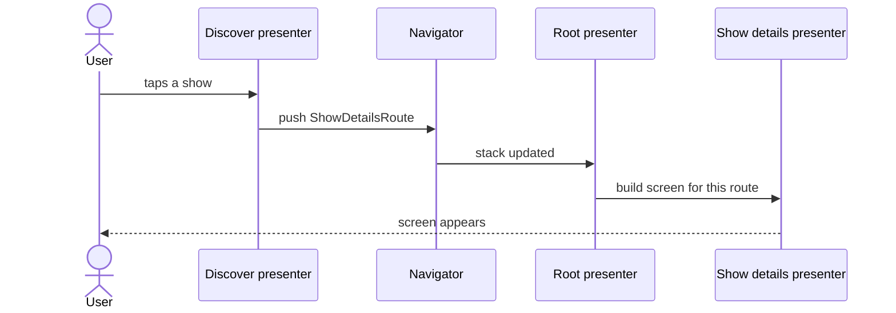
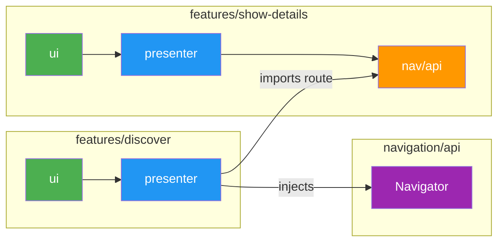

# Navigation

> **What this covers**: the navigation stack, route types, Navigator, scope hierarchy, and how features communicate without depending on each other.
> **Prerequisites**: read [Modularization](MODULARIZATION.md) and [Dependency Injection](DI.md) first. Decompose is summarised in the root README [Key Concepts](../../README.md#key-concepts).

The project uses [Decompose](https://arkivanov.github.io/Decompose/) for shared navigation across Android and iOS. Navigation state is managed entirely in shared KMP code. Platform UI simply observes and renders the current screen.

## Table of Contents

- [Scope Hierarchy](#scope-hierarchy)
- [Core Components](#core-components)
- [Navigator pattern](#navigator-pattern)
- [Feature-to-feature communication](#feature-to-feature-communication)
- [Module structure](#module-structure)

## Scope Hierarchy

Navigation and DI scopes are aligned. Each level in the navigation tree has a corresponding Metro scope that provides `ComponentContext` to its children.



Each scope is created from the parent scope through a `@GraphExtension.Factory` that takes the Decompose `ComponentContext` for the new child. There is no central per-screen graph: each feature owns its own per-screen graph extension co-located with its presenter, and parent presenters (the root presenter, a tab host) call the relevant factory when a child enters the stack. Nested scopes (a tab inside a tab host, an inner pager inside a tab) follow the same pattern, one factory per level.

## Core Components

### Root presenter

The root presenter is the single owner of the root `ChildStack` and the modal sheet `ChildSlot`. It also exposes app-wide state (theme, notification permission, deep-link handling). It lives in `features/root/presenter`.

The root presenter does not pattern-match on routes. Instead, it iterates the multibinding-injected set of feature destinations to find one that matches the current route and asks it to build a child for the supplied `ComponentContext`.

### Routes vs sheets

Tv Maniac has two navigation primitives, and they behave differently.

A **stack screen** (a `NavRoute`) is a full destination the user navigates into. It pushes onto the back stack, it is the only thing on screen while active, and the user leaves it by going back or by pushing another route on top. Show Details, Search, Settings, and the screens inside each home tab are stack screens. If the destination is something a user can reach via a deep link or would naturally think of as its own page, it is a stack screen.

A **sheet** (a `SheetConfig`) is a modal overlay that floats on top of whatever screen the user is already on. It can be triggered from any screen, dismissing it leaves the underlying screen exactly as it was, and only one sheet can be active at a time. The episode details sheet (triggered from Season Details, Discover, Up Next, and Calendar) is the canonical example.

Rule of thumb: if dismissing it should return the user to a specific previous screen rather than wherever they started, it is a sheet. If the user is navigating to a new place and expects a back-stack entry, it is a stack route. The rest of the navigation machinery splits along the same line. Every concept on the stack side (`NavRoute`, `NavDestination`, `NavRouteBinding`, `NavRouteSerializer`) has a direct sheet-side counterpart (`SheetConfig`, `SheetChildFactory`, `SheetConfigBinding`, `SheetConfigSerializer`), documented in the sections below.

### NavRoute

`NavRoute` is an open marker interface in `navigation/api`. Each feature declares its own `@Serializable` route class that implements it, in the feature's `nav/api` module:

```kotlin
// features/show-details/nav/api
@Serializable
public data class ShowDetailsRoute(public val param: ShowDetailsParam) : NavRoute
```

Because `NavRoute` is open, no central sealed hierarchy needs to know about every screen. Polymorphic serialization (needed by Decompose for state restoration) is rebuilt at runtime by aggregating per-feature `NavRouteBinding` entries from a Metro multibinding. The route's `kotlinx.serialization` generated serializer is registered alongside its `KClass`.

### Navigator

The navigator interface in `navigation/api` is the only navigation API the average presenter ever sees. It pushes routes by type, never by config singleton.

| Method | Purpose |
|---|---|
| `pushNew(route)` | Push a new screen onto the stack. |
| `pop()` | Remove the top screen. |
| `bringToFront(route)` | Bring an existing screen to the front, or push it if absent. |
| `pushToFront(route)` | Push the route, removing any prior occurrence. |
| `popTo(toIndex)` | Pop all screens above the given index. |
| `getStackNavigation()` | Returns the underlying Decompose `StackNavigation<NavRoute>`. Used by the root presenter when building the `childStack`; not used from feature code. |

### SheetNavigator

`SheetNavigator` is the sheet-side counterpart to `Navigator`. It owns the single `SlotNavigation<SheetConfig>` that backs the root modal sheet slot. The root presenter injects it to source the `childSlot`. Feature presenters that need to open a sheet do not inject `SheetNavigator` directly; instead, they inject a typed feature navigator (such as `EpisodeSheetNavigator`) declared in the feature's `nav/api`.

| Method | Purpose |
|---|---|
| `activate(config)` | Activate the given `SheetConfig` in the sheet slot, replacing any currently active sheet. |
| `dismiss()` | Dismiss the currently active sheet, if any. |
| `getSlotNavigation()` | Returns the underlying `SlotNavigation<SheetConfig>`. Used by the root presenter; not called from feature code. |

`DefaultSheetNavigator` in `navigation/implementation/controllers/` is the `@SingleIn(ActivityScope::class)` implementation. A feature-specific sheet navigator (for example, `EpisodeSheetNavigator`) keeps only its typed methods (`showEpisodeSheet`, `dismissEpisodeSheet`, etc.) and delegates `activate` and `dismiss` to an injected `SheetNavigator`. This means the `SlotNavigation` never lives in feature code.

### Children: `RootChild`, `SheetChild`, `ScreenDestination<T>`, `SheetDestination<T>`

`RootChild` is the marker for any child in the root stack. `SheetChild` is the parallel marker for the modal sheet slot. Both live in `navigation/api` and have no dependency on presenter types.

`ScreenDestination<T>` is a generic wrapper that holds a presenter and implements `RootChild`. `SheetDestination<T>` is its sheet counterpart and implements `SheetChild`. Most screens and sheets use these directly, so features do not need to declare a custom `RootChild` or `SheetChild` subclass per destination. A feature only writes its own subclass when the destination needs to expose more than a single presenter (for example, when it wraps multiple inner controllers).

### Destination factory and route bindings

Four multibinding sets in `ActivityScope` drive the wiring, two for the stack and two for the sheet slot:

- `Set<NavDestination>`: each feature contributes one. A `NavDestination` answers `matches(route): Boolean` and `createChild(route, componentContext): RootChild`.
- `Set<NavRouteBinding<*>>`: each feature contributes one entry pairing its route class with its serializer. The route serializer aggregates these into a single polymorphic `KSerializer<NavRoute>` for Decompose.
- `Set<SheetChildFactory>`: each sheet-owning feature contributes one. A `SheetChildFactory` answers `matches(config: SheetConfig): Boolean` and `createChild(config, componentContext): SheetChild`.
- `Set<SheetConfigBinding<*>>`: each sheet-owning feature contributes one entry pairing its config class with its serializer. The sheet config serializer aggregates these into a single polymorphic `KSerializer<SheetConfig>` for Decompose's `childSlot`.

Because the root presenter only depends on these sets, adding a screen or sheet never requires editing the navigation module.

The stack and sheet families are parallel by design. Every concept on the stack side has a direct counterpart on the sheet side:

| Stack (main `childStack`)                                    | Sheet (root modal `childSlot`)                                     |
|--------------------------------------------------------------|--------------------------------------------------------------------|
| `NavRoute` (open marker interface)                           | `SheetConfig` (open marker interface)                              |
| `NavDestination` (matcher + child builder, returns `RootChild`) | `SheetChildFactory` (matcher + child builder, returns `SheetChild`) |
| `NavRouteBinding<T>(kClass, serializer)`                     | `SheetConfigBinding<T>(kClass, serializer)`                        |
| `NavRouteSerializer` (polymorphic `KSerializer<NavRoute>`)   | `SheetConfigSerializer` (polymorphic `KSerializer<SheetConfig>`)   |
| `ScreenDestination<T>(presenter) : RootChild`                | `SheetDestination<T>(presenter) : SheetChild`                      |
| `DefaultNavRouteSerializer` in `navigation/implementation`   | `DefaultSheetConfigSerializer` in `navigation/implementation`      |

### Navigation event bus

Some flows are not "navigate to X" but "something happened, every interested screen react." The navigation event bus (`navigation/api`) carries a small sealed `NavEvent` hierarchy. Feature presenters emit events; the root presenter (and any other interested observer) collects them. The current example: a show-detail follow toggle emits a `ShowFollowed` event so that the library and watchlist screens refresh.

## Navigator pattern

The default rule is simple: a presenter that needs to navigate injects the navigator interface from `navigation/api` and calls it with route values declared in feature `nav/api` modules. There is no per-feature navigator interface for the typical case, and there is no per-feature `nav/implementation` module at all.

A feature introduces its own navigator interface (in its `nav/api`) only when the navigation it owns is **stateful**, meaning the implementation has to hold and mutate something beyond a single push or pop. Three current examples:

- A bottom-sheet controller that coordinates slot activation through `SheetNavigator` and sometimes dismisses the sheet and routes to a new stack destination as a single user-visible step.
- A tab-switching controller that owns the tab-host's child stack.
- A cross-tab navigator that lets one tab tell the tab host to switch to another tab.

When a feature does declare its own navigator, the default implementation is an `internal` class inside the same presenter module, bound via `@ContributesBinding(ActivityScope::class)`. Stateful controllers that are shared across features (sheet host, tab host) live in `navigation/implementation/controllers/` instead.

### Sample feature shape

```
features/search/
  presenter/   SearchShowsPresenter, screen state, di/ (per-screen graph extension,
               NavDestination + NavRouteBinding contributions)
  ui/          SearchScreen (Android Compose)
  nav/api/     SearchRoute (@Serializable), SearchScreenScope (DI marker)
```

The presenter injects the Navigator interface directly. There is no `SearchNavigator` and no `nav/implementation` module.

## Feature-to-feature communication

Features almost never depend on each other's presenters or UI. When feature A needs to reach feature B, it picks one of three mechanisms based on what kind of interaction it is.

### 1. Push another feature's route

The most common case: feature A wants to open a screen owned by feature B. Feature A's presenter module declares a dependency on feature B's `nav/api` module only (never on B's presenter or UI), then injects the Navigator and pushes the route. Keeping `nav/api` as its own module lets any feature import the route contract without pulling in the owning feature's presenter, which would create cross-feature presenter dependencies.

For example, the discover presenter opens a show-details screen by importing `ShowDetailsRoute` from `features/show-details/nav/api` and pushing it. The discover module never sees the show-details presenter or UI.

When a user taps a show in Discover, the flow looks like this:



The key thing to notice: Discover only ever touches `ShowDetailsRoute` (a small data class in the Show details `nav/api` module). It never imports the Show details presenter or UI. That stays true even though, at runtime, pushing the route is exactly what causes the Show details presenter to be built and shown.

At the module level, the dependency is one-way and goes through `nav/api` only:



The Discover presenter holds two pieces: the `Navigator` interface from `navigation/api` (the thing it calls) and `ShowDetailsRoute` from Show details' `nav/api` (the value it passes). It never depends on the Show details presenter or UI, and neither `ui` module crosses the feature boundary.


```kotlin
class FeatureAPresenter(
    private val navigator: Navigator,
) {
    fun onItemClicked(id: Long) {
        navigator.pushNew(ShowDetailsRoute(ShowDetailsParam(id)))
    }
}
```

Feature B never knows it was opened by A. The dependency goes one way: A reads B's route type. There is no presenter-to-presenter coupling.

### 2. Emit a cross-feature signal

When the action is "something changed, every interested screen should react" rather than "navigate to a specific screen," use the navigation event bus. The producing feature emits a `NavEvent`; any feature that cares collects from `NavEventBus.events`. Producer and consumer share only the event class declared in `navigation/api`. Neither imports the other.

Use this for follow/unfollow toggles, sign-out, and similar fan-out signals. Do not use it for one-to-one navigation. If only one consumer cares, push a route or invoke a stateful navigator instead.

### 3. Drive a cross-feature stateful controller

A few controllers own state that more than one feature needs to mutate. The clearest example is the tab host: the discover tab has an "Up Next" affordance that must switch the host's selected tab to "library." That requires touching the tab host's child stack, which neither tab owns.

For these cases, the controller exposes a navigator interface in a shared `nav/api` module (`features/home/nav/api` for the tab host, `features/episode-sheet/nav/api` for the bottom sheet). Feature presenters inject that interface and call typed methods on it. The default implementation lives in `navigation/implementation/controllers/` so that any feature can depend on it without pulling in the host's presenter module. For sheet navigators specifically, the default slot lives behind `SheetNavigator` in `navigation/api`; feature navigators delegate `activate` and `dismiss` to it rather than owning their own `SlotNavigation`.

### Choosing between them

| Need                                                                                      | Mechanism                                           |
|-------------------------------------------------------------------------------------------|-----------------------------------------------------|
| Open a specific screen owned by another feature                                           | Push that feature's route via the Navigator.        |
| Tell every interested screen that something happened                                      | Emit a `NavEvent`.                                  |
| Mutate state that lives in another feature's controller (tab selection, sheet visibility) | Inject that feature's stateful navigator interface. |

These are the only sanctioned cross-feature paths. A presenter must never depend on another feature's presenter, UI, or `implementation` module.

## Module structure

```
navigation/
  api/              Navigator interface, NavRoute, NavDestination, NavRouteBinding,
                    NavRouteSerializer, NavEventBus, RootChild, SheetChild,
                    ScreenDestination<T>, SheetDestination<T>, SheetConfig,
                    SheetChildFactory, SheetConfigBinding, SheetConfigSerializer
  implementation/   Default navigator, default route serializer, default sheet config
                    serializer, default event bus, stateful controllers (sheet host,
                    tab host), navigation binding container, multibinding declarations

features/root/
  presenter/        Root presenter interface and default implementation. Injects the
                    navigator, the destination sets, the route and sheet serializers,
                    the event bus, and the sheet controller.
  ui/               Root composable (Android). Pattern-matches the active RootChild and
                    renders the matching screen.
  nav/              Sheet-controller interface, deep-link destinations, theme state,
                    notification permission state.

features/{name}/
  presenter/        Presenter, screen state, per-screen @GraphExtension, di/ bindings
                    that contribute a NavDestination and a NavRouteBinding (plus a
                    SheetChildFactory and SheetConfigBinding for sheet-owning features).
  ui/               Android Compose screen.
  nav/api/          @Serializable route class implementing NavRoute (or SheetConfig for
                    sheet features), per-screen scope marker class, optional stateful
                    navigator interface and shared model types.
```
