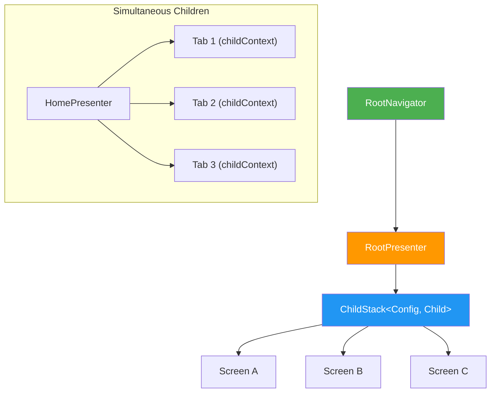

# Navigation

The project uses [Decompose](https://arkivanov.github.io/Decompose/) for shared navigation across Android and iOS. Navigation state is managed entirely in shared KMP code — platform UI simply observes and renders the current screen.

## Overview

## Core Components

### RootPresenter

The main navigation controller for the entire app. It manages a `ChildStack` — Decompose's representation of a navigation stack where only the top screen is active.

**Responsibilities:**

- Creates child presenters for each screen configuration
- Manages the navigation stack (push, pop, bring to front)
- Handles cross-cutting concerns like authentication state transitions
- Exposes global state (theme, notification permissions)

### RootDestinationConfig

A `@Serializable` sealed interface where each subclass represents a screen destination. Parameters needed by a screen are embedded in its config class.

**Examples of configs:** Home, Search, Settings, ShowDetails (with show ID parameter), SeasonDetails (with season parameters), Trailers, etc.

Serialization enables automatic state restoration — the navigation stack survives process death on Android and can be persisted across app launches.

### RootNavigator

The navigation interface exposed to child presenters via constructor injection. Provides:

| Method | Purpose |
|---|---|
| `pushNew(config)` | Push a new screen onto the stack |
| `pop()` | Remove the top screen |
| `bringToFront(config)` | Bring an existing screen to the top, or push if not in stack |
| `popTo(index)` | Pop all screens above the given index |

Child presenters receive navigation callbacks (e.g., `navigateToShowDetails: (Long) -> Unit`) rather than the full navigator, keeping them decoupled from the navigation graph.

### ChildStack

Decompose's stack data structure exposed as `StateFlow<ChildStack<Config, Child>>`. Both platforms observe this flow:

- **Android**: Uses Decompose's `Children` composable to render the active child
- **iOS**: Observes the stack and renders the top child's SwiftUI view

## Simultaneous Children

For screens with tabs or pagers where multiple children must stay alive at the same time, the project uses `childContext(key:)` instead of `childStack`.

**Key difference:**

- **`childStack`** — Only the top child is active. Others are paused/destroyed. Used for sequential navigation (screen A → screen B → screen C).
- **`childContext`** — All children remain alive with their own lifecycle. Used for parallel navigation (tab 1, tab 2, tab 3 all active).

The `HomePresenter` uses `childContext` to keep tab presenters (Discover, Library, Search, etc.) alive simultaneously, so switching tabs doesn't destroy state.

## Adding a New Screen

1. Add a new config to `RootDestinationConfig` (serializable, with any required parameters)
2. Add a corresponding `Child` subclass containing the screen's presenter
3. Add the factory mapping in `RootPresenter`'s `createScreen()` method
4. Wire navigation callbacks in the parent that navigates to this screen
