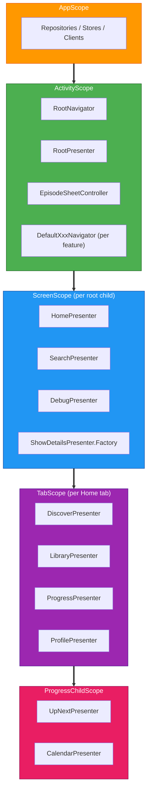

# Navigation

The project uses [Decompose](https://arkivanov.github.io/Decompose/) for shared navigation across Android and iOS. Navigation state is managed entirely in shared KMP code. Platform UI simply observes and renders the current screen.

## Scope Hierarchy

Navigation and DI scopes are aligned. Each level in the navigation tree has a corresponding Metro scope that provides `ComponentContext` to its children.



Each scope provides `ComponentContext` via `@GraphExtension.Factory`:
- `ScreenGraph.Factory.createGraph(componentContext)` creates a `ScreenScope` from the root `childStack` callback
- `HomeTabGraph.Factory.createGraph(componentContext)` creates a `TabScope` from Home's `childStack` callback
- `ProgressChildGraph.Factory.createGraph(componentContext)` creates a `ProgressChildScope` from Progress's `childContext` calls

## Core Components

### RootPresenter

The main navigation controller. Lives in `navigation/api` with zero presenter module dependencies. Manages a `ChildStack<RootDestinationConfig, RootChild>` and exposes global state (theme, notification permissions).

`RootChild` is a marker interface in `navigation/api`. The concrete screen types are in the `RootScreen` sealed interface in `navigation/implementation`.

### RootDestinationConfig

A `@Serializable` sealed interface where each subclass represents a screen destination. Parameters needed by a screen are embedded in its config class. Serialization enables automatic state restoration across process death.

### RootNavigator

The navigation interface exposed to navigator implementations. Lives in `navigation/api` so feature navigation modules can depend on it.

| Method | Purpose |
|---|---|
| `pushNew(config)` | Push a new screen onto the stack |
| `pop()` | Remove the top screen |
| `bringToFront(config)` | Bring an existing screen to the top, or push if not in stack |
| `pushToFront(config)` | Like bringToFront but always pushes |
| `popTo(index)` | Pop all screens above the given index |

### ScreenGraph

A `@GraphExtension(ScreenScope)` in `navigation/api` that resolves presenters from a `ComponentContext`. Eliminates the need for presenter factories for presenters with no screen-specific parameters.

```kotlin
@GraphExtension(ScreenScope::class)
public interface ScreenGraph {
    val homePresenter: HomePresenter          // resolved directly
    val searchPresenter: SearchShowsPresenter // resolved directly
    val showDetailsFactory: ShowDetailsPresenter.Factory // still needs screen params
    // ...
}
```

`DefaultRootPresenter` holds a single `ScreenGraph.Factory` instead of individual presenter factories.

## Navigator Pattern

Each presenter defines its own navigator interface. Implementations live in `navigation/implementation` and delegate to `RootNavigator`.

```
presenter/search/
  SearchNavigator.kt          (interface: showDetails, showGenre, goBack)
  SearchShowsPresenter.kt     (injects SearchNavigator)

navigation/implementation/navigators/
  DefaultSearchNavigator.kt   (implements SearchNavigator, delegates to RootNavigator)
```

Presenters never see `RootNavigator` or `RootDestinationConfig` directly. They call typed methods on their own navigator interface.

### Cross-Cutting Controllers

Two coordination interfaces handle navigation that spans multiple features:

| Controller | Location | Purpose |
|---|---|---|
| `EpisodeSheetController` | `navigation/api` | Show/dismiss the episode detail bottom sheet. Owns the `SlotNavigation`. |
| `HomeTabController` | `presenter/home` | Switch Home tabs (used by Discover's "Up Next" action). |

## Simultaneous Children

For screens with tabs or pagers where multiple children must stay alive:

- **`childStack`**: Only the top child is active. Others are paused/destroyed. Used for sequential navigation.
- **`childContext(key)`**: All children remain alive with their own lifecycle. Used for parallel navigation (Home tabs).

`HomePresenter` uses `childStack` with a custom `switchTab` transformer that brings existing tabs to the top rather than pushing duplicates.

`ProgressPresenter` uses `childContext(key)` to keep UpNext and Calendar alive simultaneously.

## Module Structure

```
navigation/
  api/             RootPresenter, RootNavigator, RootDestinationConfig,
                   ScreenGraph, EpisodeSheetController, SheetChild, RootChild
                   (zero presenter module dependencies)

  implementation/  DefaultRootPresenter, DefaultRootNavigator,
                   RootScreen (concrete children), EpisodeSheetChild,
                   DefaultXxxNavigator (all feature navigators),
                   DefaultEpisodeSheetController, DefaultHomeTabController
```

`navigation/api` depends on all presenter modules (for `ScreenGraph` type references) but contains no concrete presenter types in its public API. `RootPresenter` uses `RootChild` (marker) and `SheetChild` (marker) to avoid importing presenter classes.

## Adding a New Screen

1. Add a config to `RootDestinationConfig` (serializable, with parameters)
2. Add a `RootScreen` subclass in `navigation/implementation`
3. Create a `XxxNavigator` interface in the presenter module
4. Create `DefaultXxxNavigator` in `navigation/implementation/navigators/`
5. Add the presenter to `ScreenGraph` (directly if no params, as a Factory if it has params)
6. Add the mapping in `DefaultRootPresenter.createScreen()`
7. Add a no-op fake navigator in `FakeAppBindings`
