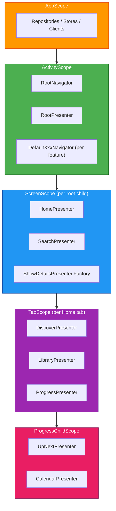

# Navigation

The project uses [Decompose](https://arkivanov.github.io/Decompose/) for shared navigation across Android and iOS. Navigation state is managed entirely in shared KMP code. Platform UI simply observes and renders the current screen.

## Scope Hierarchy

Navigation and DI scopes are aligned. Each level in the navigation tree has a corresponding Metro scope that provides `ComponentContext` to its children.



Each scope provides `ComponentContext` via `@GraphExtension.Factory`:
- `ScreenGraph.Factory.createGraph(componentContext)` creates a `ScreenScope` from the root `childStack` callback
- `HomeTabGraph.Factory.createGraph(componentContext)` creates a `TabScope` from Home's `childStack` callback
- `ProgressChildGraph.Factory.createGraph(componentContext)` creates a `ProgressChildScope` from Progress's `childContext` calls

## Core Components

### RootPresenter

The main navigation controller. Lives in `features/root/presenter` as the `RootPresenter` interface (package `com.thomaskioko.tvmaniac.presenter.root`). `DefaultRootPresenter` implements it in the same module. Manages a `ChildStack<RootDestinationConfig, RootChild>` and exposes global state (theme, notification permissions).

`RootChild` is a marker interface in `navigation/api`. Each feature defines its own destination class extending `RootChild` (e.g., `HomeDestination`, `SearchDestination`).

### RootDestinationConfig

A `@Serializable` sealed interface in `navigation/api` where each subclass represents a screen destination. Parameters needed by a screen are embedded in its config class. Serialization enables automatic state restoration across process death.

### RootNavigator

The navigation interface in `navigation/api`. Feature nav modules depend on it for routing.

| Method | Purpose |
|---|---|
| `pushNew(config)` | Push a new screen onto the stack |
| `pop()` | Remove the top screen |
| `bringToFront(config)` | Bring an existing screen to the top, or push if not in stack |
| `pushToFront(config)` | Like bringToFront but always pushes |
| `popTo(index)` | Pop all screens above the given index |

### ScreenGraph

A `@GraphExtension(ScreenScope)` in `features/root/presenter` that resolves presenters from a `ComponentContext`. Eliminates the need for presenter factories for presenters with no screen-specific parameters.

```kotlin
@GraphExtension(ScreenScope::class)
public interface ScreenGraph {
    val homePresenter: HomePresenter          // resolved directly
    val showDetailsFactory: ShowDetailsPresenter.Factory // still needs screen params
    // ...
}
```

## Navigator Pattern

Each feature owns its navigator interface and implementation:

```
features/search/
  nav/
    api/             SearchNavigator (interface)
    implementation/  DefaultSearchNavigator (delegates to RootNavigator)
  presenter/         SearchShowsPresenter (injects SearchNavigator)
  ui/                SearchScreen (Android Compose)
```

Presenters never see `RootNavigator` or `RootDestinationConfig` directly. They call typed methods on their own navigator interface.

### Cross-Cutting Controllers

| Controller | Location | Purpose |
|---|---|---|
| `EpisodeSheetNavigator` | `features/root/nav` | Show/dismiss the episode detail bottom sheet. Owns the `SlotNavigation`. |
| `HomeTabController` | `features/home/presenter` | Switch Home tabs (used by Discover's "Up Next" action). |

### Destination Classes

Each feature defines a `XxxDestination` class in its presenter module that extends `RootChild`:

```kotlin
// In features/home/presenter
class HomeDestination(val presenter: HomePresenter) : RootChild
```

Platform UI pattern-matches on these types. This keeps `navigation/api` free of presenter dependencies.

`SheetChild` is a parallel marker for modal sheets. `EpisodeDetailDestination` extends it.

## Module Structure

```
navigation/
  api/             RootNavigator, RootDestinationConfig, RootChild, SheetChild,
                   GenreShowsDestination (zero presenter deps)
  implementation/  DefaultRootNavigator, DefaultEpisodeSheetNavigator,
                   NavigationBindingContainer

features/root/
  presenter/       RootPresenter (interface), DefaultRootPresenter, ScreenGraph
  ui/              RootScreen composable (Android, routes to feature screens)
  nav/             EpisodeSheetNavigator, DeepLinkDestination, ThemeState,
                   NotificationPermissionState, ScreenSource, EpisodeSheetConfig

features/{name}/
  presenter/       XxxPresenter, XxxDestination : RootChild, state/actions/models
  ui/              XxxScreen composable (Android)
  nav/
    api/           XxxNavigator (interface)
    implementation/ DefaultXxxNavigator
```

## Adding a New Screen

1. Create `features/{name}/presenter` with the presenter, state, and `XxxDestination : RootChild`
2. Create `features/{name}/ui` with the Android Compose screen
3. Create `features/{name}/nav/api` with the `XxxNavigator` interface
4. Create `features/{name}/nav/implementation` with `DefaultXxxNavigator`
5. Add a config to `RootDestinationConfig` in `navigation/api`
6. Add the presenter to `ScreenGraph` (directly if no params, as a Factory if it has params)
7. Add the mapping in `DefaultRootPresenter.createScreen()`
8. Add a no-op fake navigator in `FakeAppBindings`
9. Register modules in `settings.gradle.kts`
10. Add nav implementation deps to `:app` and `:ios-framework`
