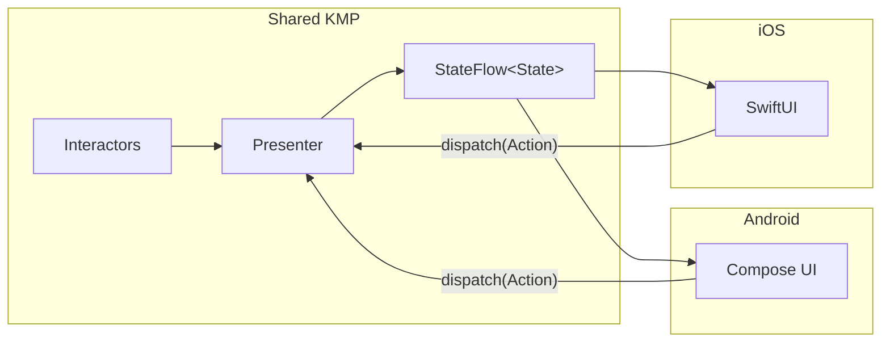

# Presentation Layer

> **What this covers**: how presenters compose state from interactors, how loading and errors are tracked, and how Android Compose and iOS SwiftUI consume the same shared state.
> **Prerequisites**: read [Navigation](NAVIGATION.md) for how presenters are created and scoped. Interactor and SubjectInteractor are summarised in the root README [Key Concepts](../../README.md#key-concepts).

The presentation layer is split between **shared KMP presenters** that manage state and **platform-specific UI** that renders it. Business logic never lives in the UI layer.

## Table of Contents

- [Overview](#overview)
- [Presenter Pattern](#presenter-pattern)
- [Platform UI Binding](#platform-ui-binding)

## Overview



## Presenter Pattern

Each feature has a presenter that:

1. **Accepts actions** from the UI via a `dispatch(action)` method
2. **Orchestrates data** by invoking interactors and observing their output
3. **Emits state** as a single `StateFlow<State>` that the UI observes

### State Management

Presenters combine multiple data streams into a single state object using `combine()`. This is the only place where disparate data sources come together.

**Key rules:**

- **Single state flow** — One `StateFlow<State>` output per presenter. No exposing multiple flows to the UI.
- **Single mutable state** — One internal `MutableStateFlow<State>` for user-driven fields (e.g., filters, pagination). No separate `MutableStateFlow` per field.
- **Combine then transform** — Domain-to-presentation mapping happens **after** `combine()`, not inside individual flow inputs.
- **No business logic** — Presenters do not sort, filter, group, or format data. That belongs in the domain layer (interactors or utility classes).
- **String localization** — All user-facing strings go through the `Localizer` interface. Domain classes return structured data (enums, sealed types), never hardcoded strings.

### Loading and Error Handling

Presenters use two shared utilities to manage loading state and errors:

- **`ObservableLoadingCounter`** — A thread-safe counter that tracks in-flight operations. Exposes a `Flow<Boolean>` that emits `true` when any operation is loading.
- **`UiMessageManager`** — A thread-safe queue of error messages for UI display. Supports deduplication and individual dismissal.

The `collectStatus()` extension ties these together: it automatically increments the loading counter when an operation starts, decrements on completion, and emits errors to the message manager. This makes error handling declarative in presenters.

### Interactor Types

Presenters work with two types of interactors:

- **`Interactor`** — One-shot operations (e.g., mark episode watched, refresh data). Returns `Flow<InvokeStatus>` with lifecycle events: `InvokeStarted` → `InvokeSuccess` or `InvokeError`.
- **`SubjectInteractor`** — Continuous data streams (e.g., observe show details, observe calendar). Exposes a `Flow<T>` that emits updates reactively. Automatically cancels previous observations when parameters change.

### Auth State Transitions

Presenters that react to authentication changes follow a specific pattern:

- Track the **previous** auth state
- Only trigger data fetching on a **transition to** `LOGGED_IN`, not on every emission
- Use an `isFirstEmission` flag to handle initial state

## Platform UI Binding

### Android (Jetpack Compose)

Compose screens collect the presenter's state flow and render it. Actions are dispatched back to the presenter.

```
Presenter.state → collectAsState() → Compose UI → dispatch(Action) → Presenter
```

Android feature modules depend on the corresponding presenter module and contain **no business logic** — they are pure rendering functions.

### iOS (SwiftUI)

SwiftUI views bind to the shared presenter's state flow using a property wrapper that bridges Kotlin `StateFlow` to SwiftUI's observation system.

```
Presenter.state → @KotlinStateFlow → SwiftUI View → dispatch(Action) → Presenter
```

The iOS app imports the shared KMP framework and follows the same contract: observe state, render UI, dispatch actions.

### What Belongs Where

| Concern | Layer |
|---|---|
| Sorting, filtering, grouping | Domain (interactors) |
| Data formatting | Domain (utility classes) |
| String localization | Presenter (via Localizer) |
| State combination | Presenter |
| Loading/error tracking | Presenter (via collectStatus) |
| UI rendering | Platform UI (Compose / SwiftUI) |
| Navigation triggers | Presenter (via Navigator or NavEventBus) |
