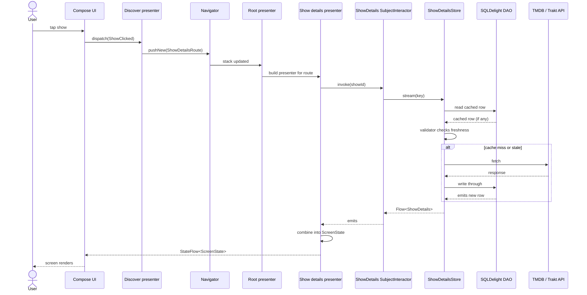

# Architecture

## Table of Contents

- [Glossary](glossary.md): One-sentence definitions for every cross-cutting term used across these documents.
- [Modularization](modularization.md): archetypes, dependency rules, and feature organization.
- [Presentation Layer](presentation-layer.md): shared presenters, state management, and platform bindings.
- [Data Layer](data-layer.md): Store pattern, caching, and hybrid APIs.
- [Navigation](navigation.md): Decompose-based shared navigation.
- [Navigation Codegen](navigation-codegen.md): Generated graph extensions and bindings.
- [Dependency Injection](dependency-injection.md): Metro scope hierarchy, graph extensions, and bindings.
- [Integration Testing](integration-testing.md): Android harness, fakes, and network stubbing.
- [Flow Test Patterns](flow-test-patterns.md): Robots, dialogs, and the recipe for writing one flow test.
- [Journey Tests](journey-tests.md): User lifecycle tests on top of the integration harness.

TvManiac is a Kotlin Multiplatform (KMP) entertainment tracker that shares business logic and data layers across Android (Jetpack Compose) and iOS (SwiftUI). It follows Clean Architecture organized by feature and layer.

> [!TIP]
> Open the [Glossary](glossary.md) first if any of the type names below are unfamiliar.

## Pillars

- **Code sharing**: Business logic, data access, and presentation state live in shared Kotlin Multiplatform modules. Android and iOS layers are thin rendering shells that consume `StateFlow` and dispatch actions.
- **Testability**: API and implementation modules ship separately. Tests depend on the API plus a fake from the `testing/` module.
- **Feature isolation**: Features communicate through [route](glossary.md#navroute) and [navigator](glossary.md#navigator) contracts. Presenter-to-presenter dependencies are prohibited, keeping the module graph acyclic.

## Trade-offs

The module count is high, which increases Gradle maintenance. The API and implementation split adds boilerplate. The [Store](glossary.md#store) pattern requires precise cache validation. Native iOS UI means each screen is built twice.

## End-to-End Flow

Standard pattern: UI dispatches an action, the [Presenter](glossary.md#presenter) calls an [interactor](glossary.md#interactor), the Store coordinates cache and network, the database emits, and the UI re-renders.

Presenters consume interactors, interactors consume repositories, and repositories consume Stores. Each layer is testable through fakes.
