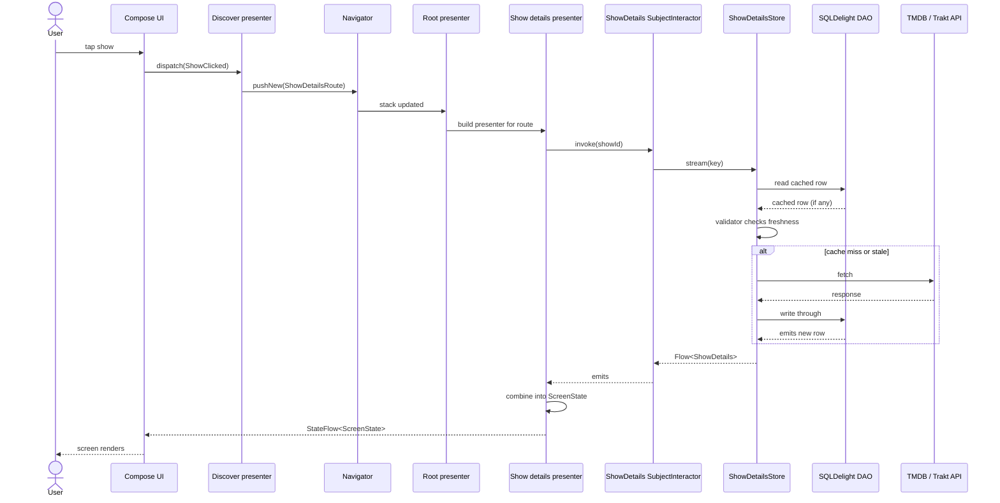

# Architecture

## Table of Contents

- [Modularization](modularization.md): archetypes, dependency rules, and feature organization.
- [Presentation Layer](presentation-layer.md): shared presenters, state management, and platform bindings.
- [Data Layer](data-layer.md): Store pattern, caching, and hybrid APIs.
- [Navigation](navigation.md): Decompose-based shared navigation.
- [Navigation Codegen](navigation-codegen.md): Generated graph extensions and bindings.
- [Dependency Injection](dependency-injection.md): Metro scope hierarchy and wiring.
- [Scope Hierarchy](scopes.md): Scope tree and lifecycle.
- [Integration Testing](integration-testing.md): Android E2E tests and network stubbing.
- [Journey Tests](journey-tests.md): End-to-end user lifecycle tests on top of integration harness.

TvManiac is a Kotlin Multiplatform (KMP) entertainment tracker sharing business logic and data layers across Android (Jetpack Compose) and iOS (SwiftUI). Follows Clean Architecture with modular design organized by feature and layer.

## Pillars

- **Code Sharing**: Business logic, data access, and presentation state live in shared KMP modules. Android and iOS layers are thin rendering shells consuming `StateFlow` and dispatching actions.
- **Testability**: API/Implementation split allows testing with fakes instead of mocks. `data/*/api` modules provide interfaces; `data/*/testing` provide fakes.
- **Feature Isolation**: Features communicate via route and navigator contracts. Presenter-to-presenter dependencies are prohibited, ensuring acyclic module graphs.

## Trade-offs

High module count increases Gradle maintenance. API/Impl split adds boilerplate. Store pattern caching requires precise validation logic. Native iOS UI requires building screens twice.

## End-to-End Flow

Standard pattern: UI dispatches action → Presenter calls interactor → Store coordinates cache/network → DAO emits → UI renders.

Presenters consume interactors, interactors consume repositories, and repositories consume stores. Each layer is testable via fakes.
