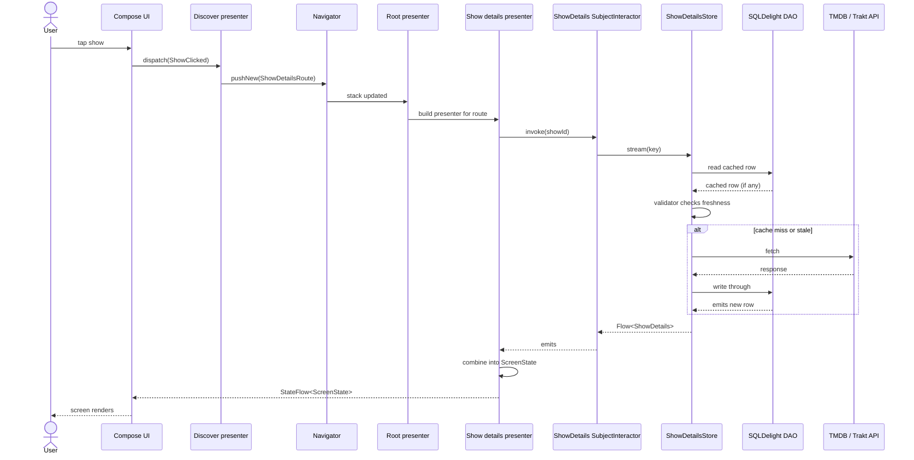

# Architecture

TvManiac is a Kotlin Multiplatform (KMP) entertainment tracking app that shares business logic and data layers across Android (Jetpack Compose) and iOS (SwiftUI). The architecture follows Clean Architecture principles with a modular design organized by feature and layer.

## Table of Contents

| Document | Description |
|---|---|
| [Modularization](MODULARIZATION.md) | Module archetypes, dependency rules, and how features are organized |
| [Presentation Layer](PRESENTATION_LAYER.md) | Shared presenters, state management, and platform UI binding |
| [Data Layer](DATA_LAYER.md) | Store pattern, caching strategy, and the hybrid API approach |
| [Navigation](NAVIGATION.md) | Decompose-based shared navigation across platforms |
| [Dependency Injection](DI.md) | Scope hierarchy and module wiring principles |

## How to Read These Docs

If you are coming to the codebase cold, the docs are easier in this order:

1. [Modularization](MODULARIZATION.md). The shape of the project: which modules exist and how they depend on each other.
2. [Dependency Injection](DI.md). How those modules are wired at runtime, including scopes and graph extensions.
3. [Navigation](NAVIGATION.md). How screens are pushed, how routes are defined, and how features stay decoupled.
4. [Presentation Layer](PRESENTATION_LAYER.md). How presenters compose state and how platform UI consumes it.
5. [Data Layer](DATA_LAYER.md). How data flows from the network through the Store cache to the UI.

Skim the project [README](../../README.md) "Key Concepts" section first if Decompose, Metro, the Store pattern, or interactors are new to you.

## End to End Flow

Here is what happens when a user taps a show in the Discover tab. The same pattern (UI dispatches an action, presenter calls an interactor, store decides cache vs network, DAO emits, UI re renders) repeats across every feature.

The presenter only sees an interactor. The interactor only sees a repository. The repository only sees a store. Each layer can be tested in isolation by swapping the layer below it for a fake.
