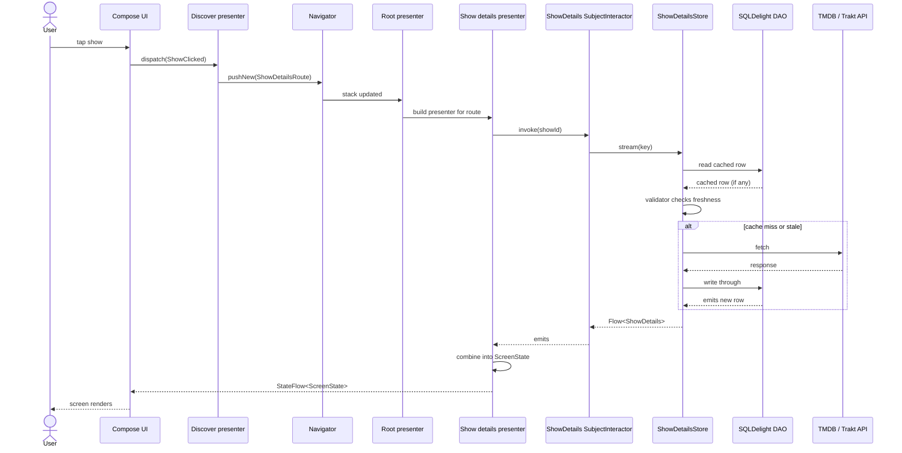

# Architecture

## Table of Contents

- [Modularization](modularization.md): module archetypes, dependency rules, and how features are organized
- [Presentation Layer](presentation-layer.md): shared presenters, state management, and platform UI binding
- [Data Layer](data-layer.md): Store pattern, caching strategy, and the hybrid API approach
- [Navigation](navigation.md): Decompose-based shared navigation across platforms
- [Navigation Codegen](navigation-codegen.md): KSP annotation processor that generates per-screen graph extensions
  and destination bindings
- [Dependency Injection](dependency-injection.md): scope hierarchy and module wiring principles
- [Scope Hierarchy](scopes.md): Metro scope tree, what lives in each scope, and how scopes are created

TvManiac is a Kotlin Multiplatform (KMP) entertainment tracking app that shares business logic and data layers across
Android (Jetpack Compose) and iOS (SwiftUI). The architecture follows Clean Architecture principles with a modular
design organized by feature and layer.

## Why This Architecture

TvManiac optimizes for three things: maximum code sharing across Android and iOS, strong testability without mocks,
and feature isolation so that parallel development on different screens does not create merge conflicts or hidden
coupling.

Code sharing is achieved by placing all business logic, data access, and presentation state in shared Kotlin
Multiplatform modules. The Android and iOS layers are thin rendering shells that consume a `StateFlow` and dispatch
typed actions. Platform-specific code only appears where it has to: background scheduling, OAuth flows, and the native
UI toolkit itself.

Testability without mocks flows from the API/implementation split. Every `data/*/api` module is a pure interface. Every
`data/*/testing` module ships a fake. Presenters and domain tests depend only on the api and testing modules. No
mocking framework is needed, and the fakes stay honest because they are maintained alongside the implementations.

Feature isolation comes from the `nav` module shape. Features talk to each other only through small route and
navigator contracts. Presenter-to-presenter dependencies are not allowed. This keeps module graphs acyclic and lets
features be built, tested, and shipped independently.

The trade-offs accepted: the module count is high, so the Gradle graph and build configuration carry real maintenance
cost. The api/impl split adds boilerplate (an interface plus a default implementation) for features that could
otherwise be a single class. The Store pattern hides staleness behind a validator, so freshness bugs can be subtle when
a cache window is set wrong. The iOS UI layer stays native SwiftUI by choice, which means screens are built twice.

## How to Read These Docs

If you are coming to the codebase cold, the docs are easier in this order:

1. [Modularization](modularization.md). The shape of the project: which modules exist and how they depend on each
   other.
2. [Dependency Injection](dependency-injection.md). How those modules are wired at runtime, including scopes and graph
   extensions.
3. [Scope Hierarchy](scopes.md). The Metro scope tree and how each scope is created from its parent via
   `@GraphExtension.Factory`.
4. [Navigation](navigation.md). How screens are pushed, how routes are defined, and how features stay decoupled.
5. [Presentation Layer](presentation-layer.md). How presenters compose state and how platform UI consumes it.
6. [Data Layer](data-layer.md). How data flows from the network through the Store cache to the UI.

Skim the project [README](../../README.md) "Key Concepts" section first if Decompose, Metro, the Store pattern, or
interactors are new to you.

**If you are adding a feature**, read [Modularization](modularization.md) (module archetypes and the "Adding a New
Feature" checklist), then [Dependency Injection](dependency-injection.md) (graph extensions), then
[Navigation](navigation.md) (wiring a new screen into the stack), then [Presentation Layer](presentation-layer.md)
(presenter patterns and state composition).

**If you are debugging a bug**, start with the End-to-End Flow diagram below, then check
[Presentation Layer](presentation-layer.md) (how state is composed and where errors surface), then
[Data Layer](data-layer.md) (Store cache path and force refresh).

## End to End Flow

Here is what happens when a user taps a show in the Discover tab. The same pattern (UI dispatches an action, presenter
calls an interactor, store decides cache vs network, DAO emits, UI re renders) repeats across every feature.

The presenter only sees an interactor. The interactor only sees a repository. The repository only sees a store. Each
layer can be tested in isolation by swapping the layer below it for a fake.
