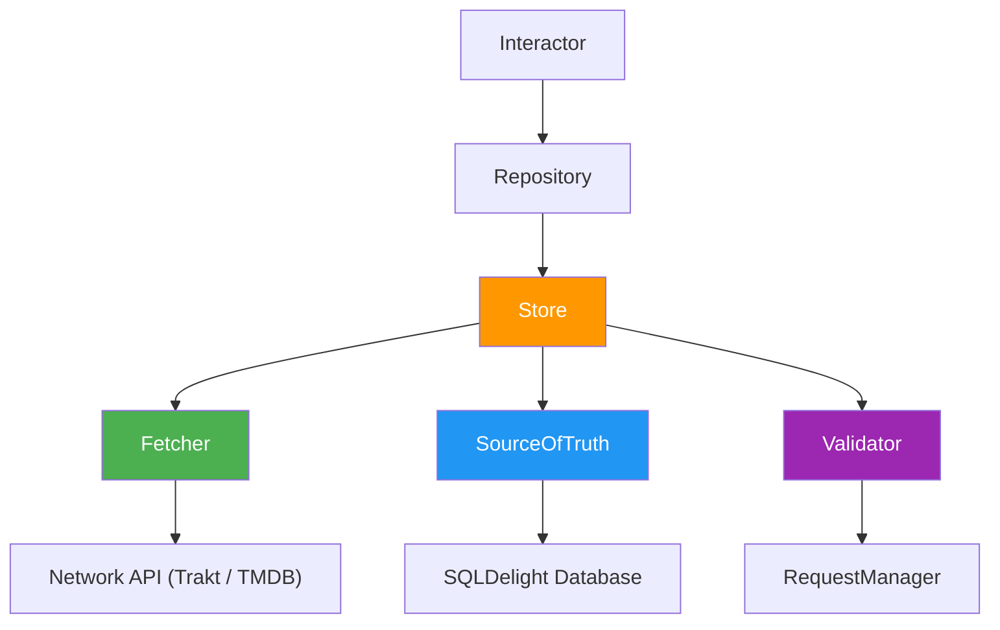

# Data Layer

## Table of Contents

- [Hybrid API Strategy](#hybrid-api-strategy)
- [Store Pattern](#store-pattern)
- [Cache Validation](#cache-validation)
- [Database](#database)
- [Error Handling](#error-handling)

The data layer fetches, caches, and persists every domain model using the [Store](glossary.md#store) pattern. Each Store combines a network [Fetcher](glossary.md#fetcher), a [SourceOfTruth](glossary.md#sourceoftruth) backed by [SQLDelight](glossary.md#sqldelight), and a [Validator](glossary.md#validator) that decides when to refresh.

## Hybrid API Strategy

Two upstream services power the catalogue. A single Store may call either or both inside one Fetcher.

- **Trakt**: Listings, authentication, and watchlist (popular, trending, profile).
- **TMDB**: Show details, images, and cast (metadata, seasons, trailers).

## Store Pattern



The shape comes from the [Store5](https://github.com/MobileNativeFoundation/Store) library. Each Store owns one cache key type and returns one model type. Repositories sit above Stores and expose the API the rest of the application calls.

### Components

- **Store**: Coordinates the other three components. Built once through `storeBuilder` and held at [`AppScope`](glossary.md#appscope).
- **Fetcher**: Calls Trakt or TMDB. Returns domain models, never raw network responses.
- **SourceOfTruth**: Reads from and writes to SQLDelight. Emits a `Flow` so subscribers see every persisted change.
- **Validator**: Calls [`RequestManagerRepository`](glossary.md#requestmanagerrepository) to compare the last fetch timestamp against a freshness threshold. Returns `true` while the cache row is still acceptable.

### Data Flow

1. **Observe**: A presenter observes data through a [`SubjectInteractor`](glossary.md#interactor) and a repository.
2. **Freshness**: The Validator checks whether the cache row is still acceptable.
3. **Cache hit**: SourceOfTruth emits the cached row directly.
4. **Cache miss**: Fetcher calls the network.
5. **Write through**: Fetcher results land in the database.
6. **Emit**: SourceOfTruth re-emits the new row to every subscriber.

### Repository Role

A repository wraps a Store and exposes two methods.

- `observe(key)`: returns a `Flow` from the SourceOfTruth.
- `fetch(key)`: triggers a freshness check and a possible network call.

### Example

A Store implementation reads like this:

```kotlin
@Inject
public class TraktGenresStore(
    private val remoteDataSource: TraktShowsRemoteDataSource,
    private val dao: TraktGenreDao,
    private val requestManagerRepository: RequestManagerRepository,
    private val dispatchers: AppCoroutineDispatchers,
) : Store<Unit, List<TraktGenreEntity>> by storeBuilder(
    fetcher = Fetcher.of { remoteDataSource.getGenres().getOrThrow() },
    sourceOfTruth = SourceOfTruth.of(
        reader = { dao.observeGenres() },
        writer = { _, response -> dao.upsert(response) },
    ).usingDispatchers(dispatchers.databaseRead, dispatchers.databaseWrite),
).validator(
    Validator.by {
        requestManagerRepository.isRequestValid(
            requestType = TRAKT_GENRES.name,
            threshold = TRAKT_GENRES.duration,
        )
    },
).build()
```

## Cache Validation

`RequestManagerRepository` records the last successful fetch timestamp for each cache key. Each Store specifies its own freshness threshold; the Validator returns `true` while elapsed time stays under that threshold.

### Force refresh

Calling `store.fresh(key)` bypasses validation and always triggers a network fetch. Used for pull-to-refresh and explicit reload actions.

## Database

[SQLDelight](https://cashapp.github.io/sqldelight/) generates type-safe Kotlin from SQL files.

- **Schema**: standard SQL in `.sq` files.
- **Migrations**: sequential `.sqm` files under `data/database/sqldelight/src/commonMain/sqldelight/com/thomaskioko/tvmaniac/migrations/`.
- **Data Access Objects**: generated Kotlin interfaces consumed by Stores and repositories.

## Error Handling

Errors propagate from the data layer to the presenter. Network failures are mapped to the `ApiResponse` sealed type in `core/network-util` so callers branch on status code without handling raw exceptions.

> [!WARNING]
> Do not catch exceptions in the data layer to return default values. Let them propagate to the presenter's `collectStatus(...)` block, which surfaces them through `uiMessageManager`.
