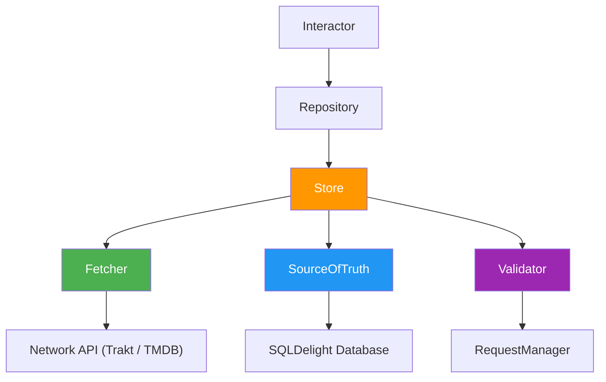

# Data Layer

## Table of Contents

- [Hybrid API Strategy](#hybrid-api-strategy)
- [Store Pattern](#store-pattern)
- [Cache Validation](#cache-validation)
- [Database](#database)
- [Error Handling](#error-handling)

Data layer handles fetching, caching, and persistence using the Store pattern.

## Hybrid API Strategy

- **Trakt**: Listings, authentication, and watchlist (popular, trending, profile).
- **TMDB**: Show details, images, and cast (metadata, seasons, trailers).

Stores can compose calls from both APIs in a single Fetcher.

## Store Pattern

### Components

- **Store**: Coordinates fetching and validation.
- **Fetcher**: Network layer calling Trakt/TMDB. Returns domain models.
- **SourceOfTruth**: Persistence layer using SQLDelight for reactive storage.
- **Validator**: Freshness check via `RequestManagerRepository`.

### Data Flow

1. **Observe**: Presenter observes data via `SubjectInteractor` and repository.
2. **Freshness**: Validator determines if cached data is stale.
3. **Cache Hit**: SourceOfTruth emits fresh cached data.
4. **Cache Miss**: Fetcher calls network APIs.
5. **Write-through**: Fetcher results written to database.
6. **Emit**: SourceOfTruth emits new data to subscribers.

### Repository Role

Repositories wrap Stores to provide a clean interface:
- **`observe()`**: Returns `Flow` from SourceOfTruth.
- **`fetch()`**: Triggers freshness check and potential network call.

## Cache Validation

`RequestManagerRepository` tracks fetch timestamps. Stores compare elapsed time against thresholds to decide if network calls are required.

### Force Refresh
Bypasses validation via `store.fresh(key)`, always triggering a network fetch.

## Database

Uses [SQLDelight](https://cashapp.github.io/sqldelight/) for type-safe SQL across platforms.
- **Schema**: Standard SQL in `.sq` files.
- **Migrations**: Sequential `.sqm` files.
- **DAOs**: Generated Kotlin interfaces.

## Error Handling

Errors propagate naturally to the presentation layer. Network errors are mapped to `ApiResponse` sealed types.

> [!WARNING]
> Do not catch exceptions in the data layer to return default values. Let them propagate to the presenter's `collectStatus()` or `collectStatus()`.
