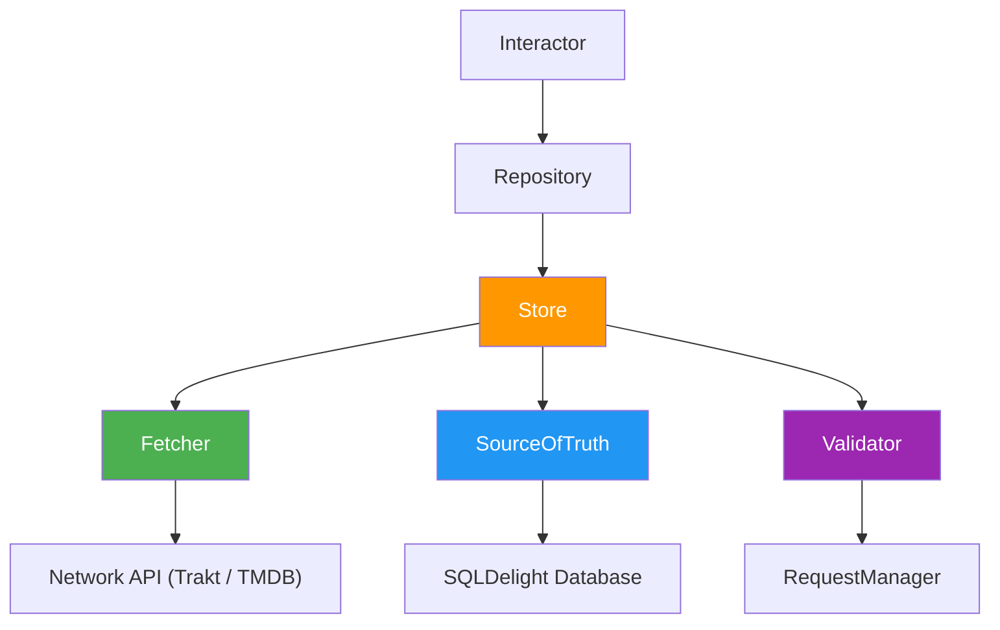

# Data Layer

## Table of Contents

- [Hybrid API Strategy](#hybrid-api-strategy)
- [Store Pattern](#store-pattern)
- [Cache Validation](#cache-validation)
- [Database](#database)
- [Error Handling](#error-handling)

> **What this covers**: the Store pattern, the hybrid Trakt and TMDB strategy, cache validation, the SQLDelight database, and how errors propagate.
> **Prerequisites**: skim the [Key Concepts](../../README.md#key-concepts) section for the Store pattern, then read [Modularization](modularization.md) for where data modules live.

The data layer handles all data fetching, caching, and persistence. It is built on the [Store pattern](https://store.mobilenativefoundation.org/) which provides a consistent approach to managing data from network and local sources.

## Hybrid API Strategy

The app uses two external APIs, each serving a different purpose.

**Trakt** handles show listings, user authentication, and watchlist management: popular shows, trending shows, watchlist, user profile.

**TMDB** handles show details, images (posters, backdrops), and cast information: show metadata, season details, trailers.

Some features require data from both APIs. For example, trending shows come from Trakt, but their poster images come from TMDB. The Store pattern handles this composition transparently: a single Store can fetch from multiple sources in its fetcher.

## Store Pattern

Every data feature follows the same architecture:

### Components

**Store**: The core component that coordinates fetching, caching, and validation. Given a key, it decides whether to serve from cache or fetch from the network.

**Fetcher**: The network layer. Calls external APIs (Trakt, TMDB, or both) and returns domain models. For hybrid features, the fetcher composes multiple API calls internally.

**SourceOfTruth**: The local persistence layer. Uses SQLDelight for type-safe SQL storage. Exposes a `reader` (observable flow of cached data) and a `writer` (stores fetched data).

**Validator**: The cache freshness check. Consults the `RequestManagerRepository` to determine if cached data is still valid based on configurable time thresholds. If valid, the Store skips the network call.

### Data Flow

1. **UI subscribes**: A presenter observes data via a `SubjectInteractor`, which calls the repository
2. **Cache check**: The Store's validator asks: "Is the cached data still fresh?"
3. **Cache hit**: If fresh, the SourceOfTruth emits cached data directly
4. **Cache miss**: If expired, the Fetcher calls the network API(s)
5. **Write-through**: Fetched data is written to the SourceOfTruth (database)
6. **Emit**: The SourceOfTruth emits the newly cached data to subscribers
7. **Force refresh**: Presenters can bypass validation with `store.fresh(key)` for pull-to-refresh

### Repository Role

Repositories wrap Stores and provide a clean interface to the domain layer:

- **`observe()`**: Returns a `Flow` from the SourceOfTruth (cache-first, reactive)
- **`fetch()`**: Triggers the Store to check freshness and potentially fetch from the network

Repositories live in `data/*/implementation/` and implement interfaces defined in `data/*/api/`.

To see the full Store-backed repository pattern, read [`ShowDetailsStore.kt`](../../data/showdetails/implementation/src/commonMain/kotlin/com/thomaskioko/tvmaniac/data/showdetails/implementation/ShowDetailsStore.kt) (Fetcher, SourceOfTruth, and Validator wiring) alongside [`DefaultShowDetailsRepository.kt`](../../data/showdetails/implementation/src/commonMain/kotlin/com/thomaskioko/tvmaniac/data/showdetails/implementation/DefaultShowDetailsRepository.kt) (how the store is wrapped and exposed to the domain layer). The repository interface consumed by presenters and interactors is in [`ShowDetailsRepository.kt`](../../data/showdetails/api/src/commonMain/kotlin/com/thomaskioko/tvmaniac/data/showdetails/api/ShowDetailsRepository.kt).

> [!TIP]
> When a bug manifests as stale data, check the Validator first. If the `RequestManagerRepository` reports data as fresh when it should not be, the threshold configuration is the likely cause. For pull-to-refresh and explicit user-triggered refreshes, the presenter should call `store.fresh(key)` to bypass the validator entirely rather than patching the threshold.

## Cache Validation

The `RequestManagerRepository` tracks when each data type was last fetched. The Store validator compares the elapsed time against a configured threshold to decide if a network fetch is needed.

### Force Refresh

Pull-to-refresh and explicit user actions bypass the validator entirely by calling `store.fresh(key)` instead of `store.get(key)`. This always triggers a network fetch regardless of cache age.

## Database

The project uses [SQLDelight](https://cashapp.github.io/sqldelight/) for type-safe SQL across platforms. All database definitions live in `data/database/sqldelight/`.

- **Schema**: Defined in `.sq` files with standard SQL
- **Migrations**: Sequential `.sqm` files using the temp-table pattern for schema changes
- **DAOs**: Generated Kotlin interfaces for type-safe queries
- **Shared**: The same database runs on both Android (SQLite) and iOS (SQLite)

## Error Handling

Errors in the data layer propagate naturally. They are **not** caught or swallowed. The presentation layer is responsible for catching errors (via `collectStatus()`) and displaying them to the user through `UiMessageManager`.

Network errors are mapped to `ApiResponse` sealed types at the HTTP client level, which allows callers to handle success and failure cases explicitly.

> [!NOTE]
> Integration tests for the data layer use a real in-memory SQLDelight database, not mocks. This is intentional: mock databases have caused past incidents where tests passed but production migrations failed. When writing data-layer tests, use the fake repository from `data/*/testing/` or spin up the full database using the test scaffolding in `core/testing/di`.

> [!WARNING]
> Never catch exceptions in the data layer to return a default value silently. Let errors propagate as exceptions or as `ApiResponse.Error`. The presentation layer's `collectStatus()` is the designated catch site. Silent swallowing at the data layer hides bugs and prevents the error from reaching `UiMessageManager`.

## Next Steps

- [Presentation Layer](presentation-layer.md) - How presenters consume repository flows, track loading state, and surface errors to the UI.
- [Modularization](modularization.md) - The api/implementation/testing module split that the data layer uses for every feature.
