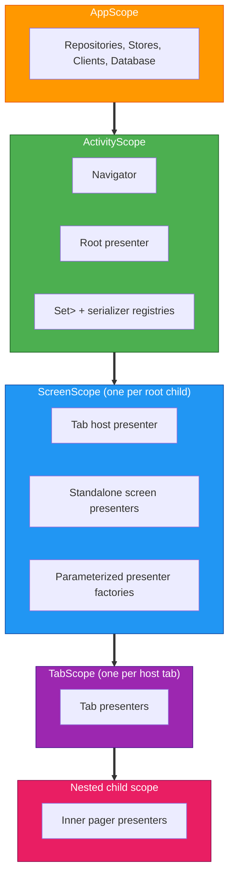

# Dependency Injection

## Table of Contents

- [Scope Hierarchy](#scope-hierarchy)
- [Graph Extensions](#graph-extensions)
- [Binding Containers](#binding-containers)
- [Qualifiers](#qualifiers)
- [Assisted Injection](#assisted-injection)
- [Graph Creation](#graph-creation)
- [Testing](#testing)

[Metro](glossary.md#metro) is the compile-time dependency injection compiler plugin used across the project. Every binding resolves at graph processing time without reflection. Each navigation level has a Metro scope that provides a `ComponentContext` to its children.

## Scope Hierarchy

Scopes align with [Decompose](glossary.md#decompose) component lifecycles. Five scopes nest from the application down to inner pagers.



### Scope responsibilities

- [`AppScope`](glossary.md#appscope): repositories, Stores, the database, Data Access Objects, Ktor clients, [`RequestManagerRepository`](glossary.md#requestmanagerrepository), the datastore, logger, and [`Localizer`](glossary.md#localizer).
- [`ActivityScope`](glossary.md#activityscope): the [`Navigator`](glossary.md#navigator), the [`RootPresenter`](glossary.md#rootpresenter), the unified `Set<NavDestination<*>>`, polymorphic serializer registries (`Set<NavRouteBinding<*>>` and `Set<NavRootBinding<*>>`), and `*ScreenGraph.Factory` instances emitted by the codegen processor.
- [`ScreenScope`](glossary.md#screenscope): tab host presenters, standalone screen presenters, and parameterized presenter factories. Created and destroyed alongside Decompose child stack entries.
- [`TabScope`](glossary.md#tabscope): tab presenters such as Discover, Library, and Search.
- Nested child scope: inner pagers or secondary navigation inside a tab.

> [!TIP]
> Use `childContext(key)` for children that must stay alive simultaneously. `childStack` destroys the previous child when a new one is pushed.

## Graph Extensions

A scope descends from its parent through a [`@GraphExtension.Factory`](glossary.md#graphextension) that accepts a Decompose `ComponentContext`. The codegen processor emits this shape for every annotated presenter (see [`navigation-codegen.md`](navigation-codegen.md)), including parent-owned children annotated with `@ChildPresenter`.

```kotlin
@Inject
@ChildPresenter(
    scope = ProgressChildScope::class,
    parentScope = ProgressRoot::class,
)
public class UpNextPresenter(componentContext: ComponentContext) : ComponentContext by componentContext

// Generated: <package>.di.UpNextChildGraph
@GraphExtension(ProgressChildScope::class)
public interface UpNextChildGraph {
    public val upNextPresenter: UpNextPresenter

    @ContributesTo(ProgressRoot::class)
    @GraphExtension.Factory
    public interface Factory {
        public fun createUpNextGraph(
            @Provides componentContext: ComponentContext,
        ): UpNextChildGraph
    }
}
```

The parent host (`ProgressPresenter`) consumes one factory per child and instantiates each through `Decompose.childContext(key)`.

### Naming Conventions

- `*Graph`: a `@DependencyGraph` entry point or a scoped `@GraphExtension`.
- `*BindingContainer`: a `public object` that groups `@Provides` methods.
- `Component` and `ComponentContext`: reserved for Decompose types.

## Binding Containers

Group related `@Provides` methods inside a [`@BindingContainer`](glossary.md#bindingcontainer) `public object`.

```kotlin
@BindingContainer
@ContributesTo(AppScope::class)
public object BaseBindingContainer {
    @Provides @SingleIn(AppScope::class)
    public fun provideDispatchers(): AppCoroutineDispatchers = ...
}
```

- Prefer `@ContributesBinding` on implementation classes.
- Use a binding container for third-party types, qualified providers, or platform types.

## Qualifiers

A [qualifier](glossary.md#qualifier) disambiguates identical types in the graph. Examples in the project:

- `@ApplicationContext`: the Android `Context`.
- `@TmdbApi`, `@TraktApi`: the two split Ktor clients.
- `@IoCoroutineScope`, `@MainCoroutineScope`, `@ComputationCoroutineScope`.

## Assisted Injection

[`@AssistedInject`](glossary.md#assistedinject) lets a presenter receive both injected dependencies and runtime parameters such as a show identifier.

```kotlin
@AssistedInject
public class ShowDetailsPresenter(
    @Assisted private val param: ShowDetailsParam,
    componentContext: ComponentContext,
    // ...
) {
    @AssistedFactory
    public fun interface Factory {
        public fun create(param: ShowDetailsParam): ShowDetailsPresenter
    }
}
```

## Graph Creation

- **Android**: `ApplicationGraph` is created once in `TvManicApplication`. `ActivityGraph` extends it for each activity.
- **iOS**: `IosApplicationGraph` is created in `AppDelegate` and exposes factories for per-view graphs.

### API and implementation boundary

- Interfaces live in `data/*/api`.
- Implementations live in `data/*/implementation` and are bound through `@ContributesBinding`.
- Consumers, including presenters and interactors, depend on the `api` module only.

## Testing

Tests build custom graphs that swap production bindings for fakes.

- `FakeAppBindingContainer`: contributes fakes such as a mock Ktor engine and feature stubs.
- `testing/` modules: each provides a fake implementation of the matching `api/` module.
- `core/integration/ui`: integration test scaffolding including the DSL, Robot, and Harness.
