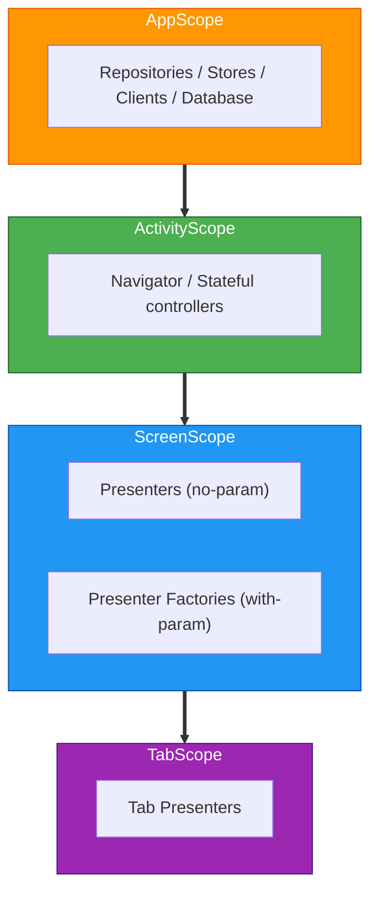

# Dependency Injection

## Table of Contents

- [Scope Hierarchy](#scope-hierarchy)
- [Naming Conventions](#naming-conventions)
- [Binding Containers](#binding-containers)
- [Qualifiers](#qualifiers)
- [Assisted Injection](#assisted-injection)
- [Graph Creation](#graph-creation)

Uses [Metro](https://zacsweers.github.io/metro/latest/) for compile-time dependency injection. Resolved at graph-processing time without reflection.

## Scope Hierarchy

Scopes align with Decompose component lifecycles.



- **AppScope**: Application-wide singletons (Repositories, Stores, Database, Clients).
- **ActivityScope**: Activity-lifetime instances (Navigators, Root Presenter).
- **ScreenScope**: Per-screen presenters and factories.

## Naming Conventions

- **`*Graph`**: Entry points (`@DependencyGraph`) or scoped extensions (`@GraphExtension`).
- **`*BindingContainer`**: Objects grouping `@Provides` methods.
- **`Component` / `ComponentContext`**: Reserved for Decompose types.

## Binding Containers

Group related `@Provides` methods into a `public object`.

```kotlin
@BindingContainer
@ContributesTo(AppScope::class)
public object BaseBindingContainer {
    @Provides @SingleIn(AppScope::class)
    public fun provideDispatchers(): AppCoroutineDispatchers = ...
}
```

- Prefer `@ContributesBinding` on implementation classes.
- Use binding containers for third-party types, qualified providers, or platform types.

## Qualifiers

Disambiguate identical types (e.g., multiple `CoroutineScope`s).
- `@ApplicationContext`: Android Context.
- `@TmdbApi`, `@TraktApi`: Split Ktor clients.
- `@IoCoroutineScope`, `@MainCoroutineScope`, `@ComputationCoroutineScope`.

## Assisted Injection

Used for presenters requiring dynamic runtime parameters (e.g., show ID).

```kotlin
@AssistedInject
public class ShowDetailsPresenter(
    @Assisted private val param: ShowDetailsParam,
    componentContext: ComponentContext,
    ...
) {
    @AssistedFactory
    public fun interface Factory {
        public fun create(param: ShowDetailsParam): ShowDetailsPresenter
    }
}
```

## Graph Creation

- **Android**: `ApplicationGraph` is created once in `TvManicApplication`. `ActivityGraph` extends it per activity.
- **iOS**: `IosApplicationGraph` is created in `AppDelegate`. Exposes factories for per-view graphs.

## API / Implementation Boundary

- Interfaces in `data/*/api`.
- Implementations in `data/*/implementation`, bound via `@ContributesBinding`.
- Consumers (presenters, interactors) depend only on `api`.

## Testing

Tests build custom graphs swapping production bindings for fakes.
- **`FakeAppBindingContainer`**: Contributes fakes (mock engines, stubs).
- **`testing/` modules**: Provide fake implementations. Mocks are prohibited.
- **`core/integration/ui`**: Integration test scaffolding (DSL, Robot, Harness).
