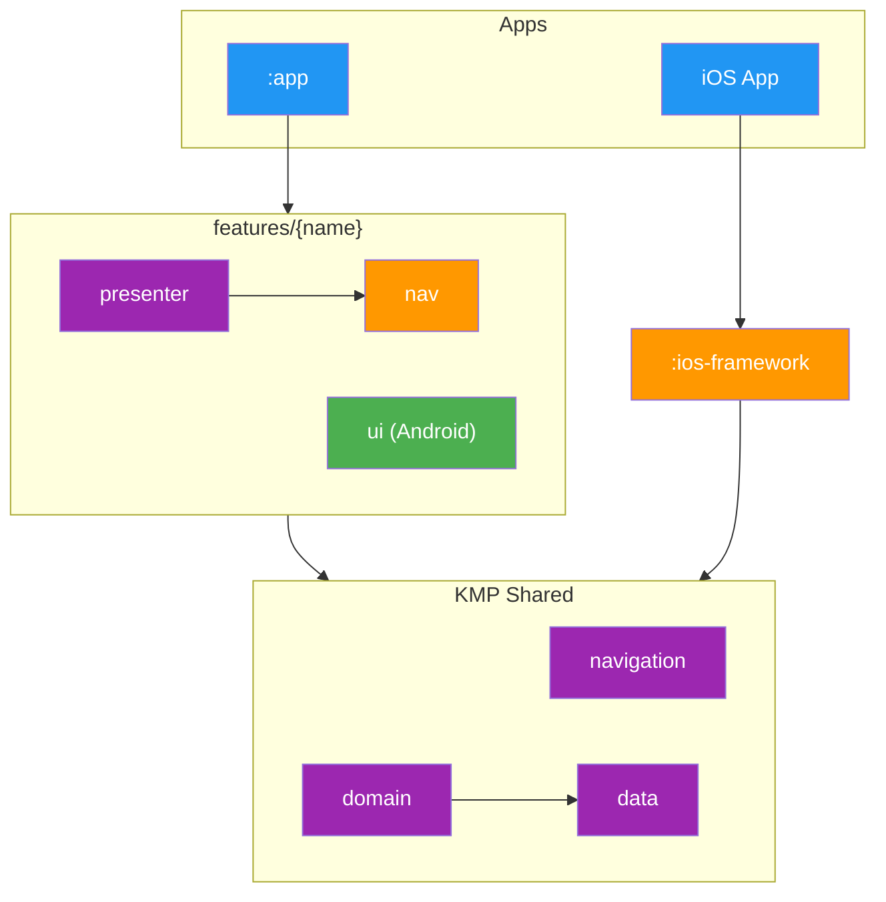

# Modularization

## Table of Contents

- [Dependency Graph](#module-dependency-graph)
- [Layers](#layers)
- [Dependency Rules](#dependency-rules)
- [Module Archetypes](#module-archetypes)
- [Adding a New Feature](#adding-a-new-feature)

Modules depend on API modules only, never on `implementation/`. Breaking this boundary prevents module isolation and testing via fakes.

## Module Dependency Graph

## Layers

1. **Entry points** (`:app`, `:ios-framework`): Wire DI graph and host binary. Only modules allowed to depend on `implementation/`.
2. **Features** (`features/{name}/*`): Co-located presenter (KMP), UI (Android), and navigation contract.
3. **Root** (`features/root/*`): Root presenter, composable, and shared nav models.
4. **Navigation** (`navigation/*`): Cross-cutting contracts and registries.
5. **Business logic** (`domain/*`): Interactors only.
6. **Data Contracts** (`data/*/api`): Repository interfaces and models.
7. **Data Implementation** (`data/*/implementation`): Stores, repositories, DAOs, and mappers.
8. **Data Infrastructure** (`data/database`, `data/datastore`, `data/request-manager`): persistence and cache validation.
9. **Network** (`api/*`): Ktor clients and auth.
10. **Localization** (`i18n/*`): Resources and generated localizer.
11. **Core** (`core/*`): Utilities, design system base, and test scaffolding.

## Dependency Rules

- **API-only**: Modules import `api/` modules. Metro resolves implementations at graph processing time.
- **Entry points**: `:app` and `:ios-framework` are the only implementation consumers.
- **Feature nav**: Contracts live in feature `nav` modules. Navigator implementations live as `internal` classes in `presenter`.
- **Fakes**: `testing/` modules provide fakes. Tests depend on `api/` + `testing/`.
- **UI modules**: Render state and dispatch intents. No business logic.

## Module Archetypes

### 1. Feature Modules
Co-located under `features/{name}/`:
- **`presenter/`**: `@Inject` presenters, screen state, and DI extensions.
- **`ui/`**: Compose screens.
- **`nav/`**: Serializable routes and scope markers.

### 2. Data Modules
Split into three parts:
- **`api/`**: Interfaces and models.
- **`implementation/`**: Store wiring and persistence.
- **`testing/`**: Fake implementations.

### 3. Domain Modules
KMP modules containing interactors and use cases.

### 4. Integration Test Modules
- **`core/integration/infra`**: DI overrides and fakes.
- **`core/integration/ui`**: UI scaffolding and DSL.

## Adding a New Feature

1. **Create Data**: Add `api/`, `implementation/`, `testing/` if persistence is needed.
2. **Add Domain**: Implement interactors.
3. **Define Route**: Create `NavRoute` in `features/{name}/nav`.
4. **Implement Presenter**: Add presenter in `features/{name}/presenter`. Use `@NavScreen` or `@TabScreen` with codegen.
5. **Implement UI**: Add Compose screen in `features/{name}/ui` using `@ScreenUi`.
6. **iOS View**: Register `presenter -> view` mapping in `ScreenRegistryBootstrap.swift`.
7. **Register**: Add module to `settings.gradle.kts` and dependencies to `:app` and `:ios-framework`.
