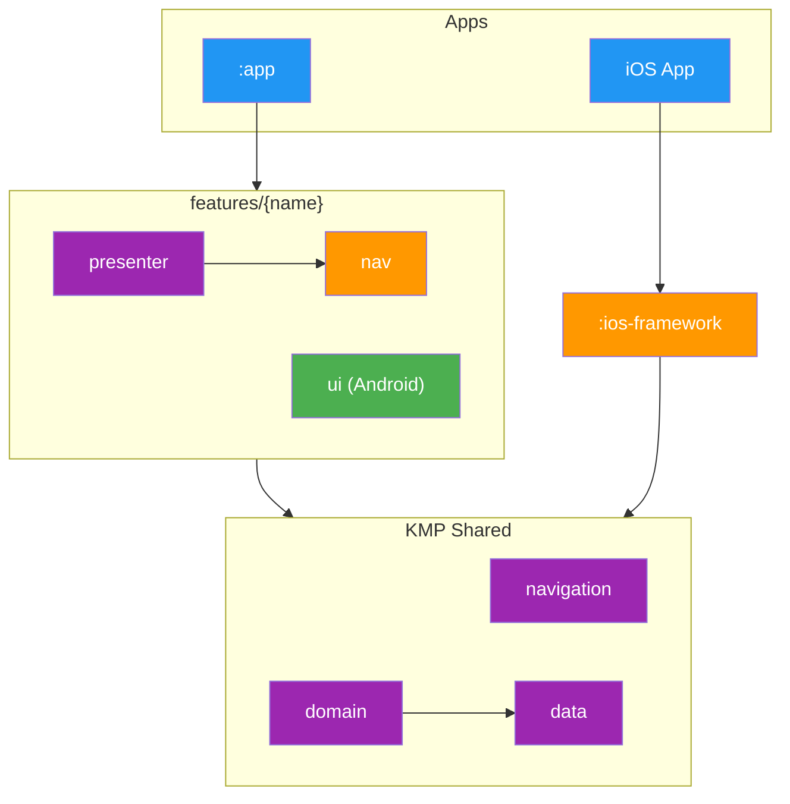

# Modularization

## Table of Contents

- [Dependency Graph](#module-dependency-graph)
- [Layers](#layers)
- [Dependency Rules](#dependency-rules)
- [Module Archetypes](#module-archetypes)
- [Adding a New Feature](#adding-a-new-feature)

The application splits into more than 330 Gradle modules grouped by layer and feature. Each module's own dependency graph is generated into its `README.md` by `./gradlew graphUpdate`; the conceptual diagram below is a hand-maintained overview. Every module depends on API contracts only; the matching implementation is selected at compile time by [Metro](glossary.md#metro). Lint rules reject any consumer that crosses the boundary into another feature's `implementation/`.

## Module Dependency Graph



## Layers

| Layer | Modules | Responsibility |
|---|---|---|
| Entry points | `:app`, `:ios-framework` | Build the dependency graph and host the binary. Only modules allowed to depend on `implementation/`. |
| Features | `features/{name}/*` | Co-located presenter (Kotlin Multiplatform), Android UI, and navigation contract. |
| Root | `features/root/*` | The [`RootPresenter`](glossary.md#rootpresenter), shared composables, and navigation models. |
| Navigation | `navigation/*` | Cross-cutting navigation contracts and registries. |
| Business logic | `domain/*` | [Interactors](glossary.md#interactor) only. |
| Data contracts | `data/*/api` | Repository interfaces and domain models. |
| Data implementation | `data/*/implementation` | [Stores](glossary.md#store), repositories, Data Access Objects, and mappers. |
| Data infrastructure | `data/database`, `data/datastore`, `data/request-manager` | Persistence and cache validation. |
| Network | `api/*` | Ktor clients and authentication. |
| Localization | `i18n/*` | Resources and the generated [`Localizer`](glossary.md#localizer). |
| Core | `core/*` | Utilities, design system base, and test scaffolding. |

## Dependency Rules

- **API only**: presenters and tests import the `api/` module. Metro resolves the matching `implementation/` at graph processing time.
- **Entry points**: `:app` and `:ios-framework` are the only modules that may depend on any `implementation/` module.
- **Feature navigation**: every route lives in `features/{name}/nav`. Navigator implementations live as `internal` classes in `navigation/implementation`.
- **Fakes**: `testing/` modules provide fake implementations. Unit tests depend on `api/` plus `testing/`, never on `implementation/`.
- **UI modules**: Compose screens render state and dispatch actions. No business logic.

## Module Archetypes

### Feature module

Three sibling Gradle modules under `features/{name}/`.

- `presenter/`: `@Inject` presenter, screen state, and Metro graph extensions.
- `ui/`: Compose screen and previews.
- `nav/`: serializable [`NavRoute`](glossary.md#navroute) types and binding multibindings.

### Data module

Three sibling Gradle modules under `data/{name}/`.

- `api/`: repository interface, domain models, and qualifiers.
- `implementation/`: [`Store`](glossary.md#store) bindings, repositories, and persistence.
- `testing/`: fake implementations of the API.

### Domain module

A single Kotlin Multiplatform module under `domain/{name}/` containing interactors and use cases.

### Integration test modules

- `core/integration/infra`: dependency injection overrides and shared fakes.
- `core/integration/ui`: UI scaffolding, DSL, and the Robot pattern.

## Adding a New Feature

The walkthrough below covers a feature named `trending`. Substitute the feature name in every path.

1. **Add the three data modules** under `data/trending/`: `api/`, `implementation/`, `testing/`. Use the `/data-module` skill to scaffold.
2. **Add the domain module** under `domain/trending/` with a [`SubjectInteractor`](glossary.md#interactor) that streams the trending list.
3. **Declare the route** in `features/trending/nav/.../TrendingShowsRoute.kt`:

   ```kotlin
   @Serializable
   public data object TrendingShowsRoute : NavRoute
   ```

4. **Add the presenter** in `features/trending/presenter/.../TrendingShowsPresenter.kt`. Annotate the class so the [code generation processor](navigation-codegen.md) emits the graph extension and the destination binding:

   ```kotlin
   @Inject
   @NavDestination(
       route = TrendingShowsRoute::class,
       parentScope = ActivityScope::class,
       kind = DestinationKind.SCREEN,
   )
   public class TrendingShowsPresenter(/* ... */)
   ```

5. **Add the Compose screen** in `features/trending/ui/.../TrendingShowsScreen.kt`. Annotate the binding with `@ScreenUi`.
6. **Bind the iOS view** by adding a presenter to SwiftUI view mapping in `ios/.../ScreenRegistryBootstrap.swift`.
7. **Register the modules** in `settings.gradle.kts` and add the module dependencies to `:app` and `:ios-framework`.

The `/navigation` skill walks through the same flow with a checklist.
