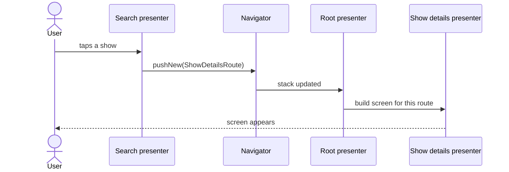
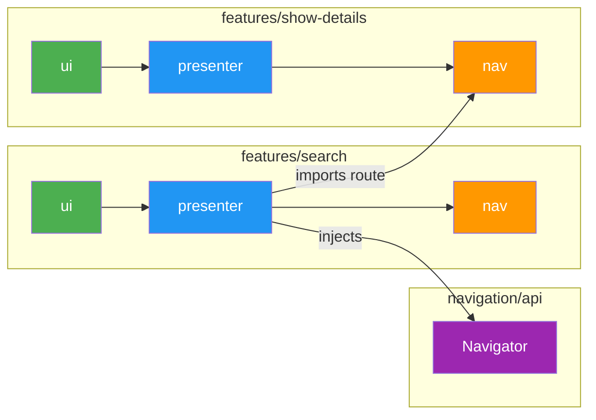

# Navigation

## Table of Contents

- [Core Components](#core-components)
- [Rendering destinations](#rendering-destinations)
- [Navigator pattern](#navigator-pattern)
- [Feature-to-feature communication](#feature-to-feature-communication)
- [Testing navigation](#testing-navigation)
- [Module structure](#module-structure)

> **What this covers**: the navigation stack, route types, Navigator, and how features communicate without depending
> on each other.
> **Prerequisites**: read [Modularization](modularization.md), [Dependency Injection](dependency-injection.md), and
> [Scope Hierarchy](scopes.md) first. Decompose is summarised in the root README
> [Key Concepts](../../README.md#key-concepts).

The project uses [Decompose](https://arkivanov.github.io/Decompose/) for shared navigation across Android and iOS.
Navigation state is managed entirely in shared KMP code. Platform UI simply observes and renders the current screen.

> [!IMPORTANT]
> Feature navigators and route types must depend on `navigation/api` only, never on `navigation/implementation`. The
> implementation module is a private detail of the entry-point graph. Importing it from a feature module creates a
> hidden dependency on the DefaultNavigator class, breaks the API/implementation boundary, and makes the feature
> untestable without the full navigation stack.

Navigation and DI scopes are aligned: each level in the navigation tree has a corresponding Metro scope. See
[Scope Hierarchy](scopes.md) for the full scope tree and how each scope is created from its parent via
`@GraphExtension.Factory`.

## Core Components

### Root presenter

The root presenter is the single owner of the root `ChildStack` and the modal sheet `ChildSlot`. It also exposes
app-wide state (theme, notification permission, deep-link handling). It lives in `features/root/presenter`.

The root presenter does not pattern-match on routes. Instead, it iterates the multibinding-injected set of feature
destinations to find one that matches the current route and asks it to build a child for the supplied
`ComponentContext`.

### Routes vs sheets

Tv Maniac has two navigation primitives, and they behave differently.

A **stack screen** (a `NavRoute`) is a full destination the user navigates into. It pushes onto the back stack, it is
the only thing on screen while active, and the user leaves it by going back or by pushing another route on top. Show
Details, Search, Settings, and the screens inside each home tab are stack screens. If the destination is something a
user can reach via a deep link or would naturally think of as its own page, it is a stack screen.

A **sheet** (a `SheetConfig`) is a modal overlay that floats on top of whatever screen the user is already on. It can
be triggered from any screen, dismissing it leaves the underlying screen exactly as it was, and only one sheet can be
active at a time. The episode details sheet (triggered from Season Details, Discover, Up Next, and Calendar) is the
canonical example.

Rule of thumb: if dismissing it should return the user to a specific previous screen rather than wherever they started,
it is a sheet. If the user is navigating to a new place and expects a back-stack entry, it is a stack route. The rest
of the navigation machinery splits along the same line. Every concept on the stack side (`NavRoute`, `NavDestination`,
`NavRouteBinding`, `NavRouteSerializer`) has a direct sheet-side counterpart (`SheetConfig`, `SheetChildFactory`,
`SheetConfigBinding`, `SheetConfigSerializer`), documented in the sections below.

### NavRoute

`NavRoute` is an open marker interface in `navigation/api`. Each feature declares its own `@Serializable` route class
that implements it, in the feature's `nav` module:

```kotlin
// features/show-details/nav
@Serializable
public data class ShowDetailsRoute(public val param: ShowDetailsParam) : NavRoute
```

Because `NavRoute` is open, no central sealed hierarchy needs to know about every screen. Polymorphic serialization
(needed by Decompose for state restoration) is rebuilt at runtime by aggregating per-feature `NavRouteBinding` entries
from a Metro multibinding. The route's `kotlinx.serialization` generated serializer is registered alongside its
`KClass`.

### Navigator

The navigator interface in `navigation/api` is the only navigation API the average presenter ever sees. It pushes
routes by type, never by config singleton.

- `pushNew(route)`: push a new screen onto the stack.
- `pop()`: remove the top screen.
- `bringToFront(route)`: bring an existing screen to the front, or push it if absent.
- `pushToFront(route)`: push the route, removing any prior occurrence.
- `popTo(toIndex)`: pop all screens above the given index.
- `getStackNavigation()`: returns the underlying Decompose `StackNavigation<NavRoute>`. Used by the root presenter when
  building the `childStack`; not used from feature code.

### SheetNavigator

`SheetNavigator` is the sheet-side counterpart to `Navigator`. It owns the single `SlotNavigation<SheetConfig>` that
backs the root modal sheet slot. The root presenter injects it to source the `childSlot`. Feature presenters that need
to open a sheet inject `SheetNavigator` directly and call `activate(config)` with their feature's `SheetConfig`. To
keep `SheetConfig` construction local to the feature and avoid duplicating it across presenters, each sheet-owning
feature typically ships a small extension function on `SheetNavigator` in its own `nav` module (for example,
`SheetNavigator.showEpisodeSheet(episodeId, source)` in `features/episode-sheet/nav`).

- `activate(config)`: activate the given `SheetConfig` in the sheet slot, replacing any currently active sheet.
- `dismiss()`: dismiss the currently active sheet, if any.
- `getSlotNavigation()`: returns the underlying `SlotNavigation<SheetConfig>`. Used by the root presenter; not called
  from feature code.

`DefaultSheetNavigator` in `features/root/presenter/di/` is the `@SingleIn(ActivityScope::class)` implementation. The
sheet's own presenter (for example, `EpisodeSheetPresenter`) injects `SheetNavigator` alongside `Navigator` so it can
combine `dismiss()` with a subsequent `pushNew` or `pushToFront` when the user drills into a show or season from the
sheet. This means the `SlotNavigation` never lives in feature code.

### Children: `RootChild`, `SheetChild`, `ScreenDestination<T>`, `SheetDestination<T>`

`RootChild` is the marker for any child in the root stack. `SheetChild` is the parallel marker for the modal sheet
slot. Both live in `navigation/api` and have no dependency on presenter types.

`ScreenDestination<T>` is a generic wrapper that holds a presenter and implements `RootChild`. `SheetDestination<T>` is
its sheet counterpart and implements `SheetChild`. Most screens and sheets use these directly, so features do not need
to declare a custom `RootChild` or `SheetChild` subclass per destination. A feature only writes its own subclass when
the destination needs to expose more than a single presenter (for example, when it wraps multiple inner controllers).

### Destination factory and route bindings

A set of multibindings in `ActivityScope` drive the wiring, split evenly between the stack and the sheet slot:

- `Set<NavDestination>`: each feature contributes one. A `NavDestination` answers `matches(route): Boolean` and
  `createChild(route, componentContext): RootChild`.
- `Set<NavRouteBinding<*>>`: each feature contributes one entry pairing its route class with its serializer. The route
  serializer aggregates these into a single polymorphic `KSerializer<NavRoute>` for Decompose.
- `Set<SheetChildFactory>`: each sheet-owning feature contributes one. A `SheetChildFactory` answers
  `matches(config: SheetConfig): Boolean` and `createChild(config, componentContext): SheetChild`.
- `Set<SheetConfigBinding<*>>`: each sheet-owning feature contributes one entry pairing its config class with its
  serializer. The sheet config serializer aggregates these into a single polymorphic `KSerializer<SheetConfig>` for
  Decompose's `childSlot`.

Because the root presenter only depends on these sets, adding a screen or sheet never requires editing the navigation
module.

The stack and sheet families are parallel by design. Every concept on the stack side has a direct counterpart on the
sheet side:

- `NavRoute` (open marker interface) / `SheetConfig` (open marker interface)
- `NavDestination` (matcher + child builder, returns `RootChild`) / `SheetChildFactory` (matcher + child builder,
  returns `SheetChild`)
- `NavRouteBinding<T>(kClass, serializer)` / `SheetConfigBinding<T>(kClass, serializer)`
- `NavRouteSerializer` (polymorphic `KSerializer<NavRoute>`) / `SheetConfigSerializer` (polymorphic
  `KSerializer<SheetConfig>`)
- `ScreenDestination<T>(presenter) : RootChild` / `SheetDestination<T>(presenter) : SheetChild`
- `DefaultNavRouteSerializer` in `navigation/implementation` / `DefaultSheetConfigSerializer` in
  `navigation/implementation`

## Rendering destinations

The previous section covered how the shared-code multibindings produce a `RootChild` (or `SheetChild`) for the active
route. This section covers the other half: turning that child into a Compose screen on Android and a SwiftUI view on
iOS. Each platform has its own registry that mirrors the shared-code multibinding, so adding a screen never requires
editing the root UI on either platform.

### Android: `Set<ScreenContent>` / `Set<SheetContent>`

`navigation/ui` is a small Android-only module holding two Compose renderer types:

```kotlin
public class ScreenContent(
    public val matches: (RootChild) -> Boolean,
    public val content: @Composable (RootChild, Modifier) -> Unit,
)

public class SheetContent(
    public val matches: (SheetChild) -> Boolean,
    public val content: @Composable (SheetChild) -> Unit,
)
```

The module also declares `@Multibinds Set<ScreenContent>` and `@Multibinds Set<SheetContent>` in
`NavigationUiMultibindings` at `ActivityScope`. Each feature's `ui` module contributes exactly one entry. The primary
way to contribute is to annotate the composable function with `@ScreenUi` (or `@SheetUi` for sheet features):

```kotlin
// features/debug/ui/.../DebugMenuScreen.kt
@ScreenUi(presenter = DebugPresenter::class, parentScope = ActivityScope::class)
@Composable
public fun DebugMenuScreen(
    presenter: DebugPresenter,
    modifier: Modifier = Modifier,
) { /* ... */ }
```

The KSP processor generates `DebugMenuScreenUiBinding` in the same module's `di/` package. For a sheet:

```kotlin
// features/episode-sheet/ui/.../EpisodeSheet.kt
@SheetUi(presenter = EpisodeSheetPresenter::class, parentScope = ActivityScope::class)
@Composable
public fun EpisodeSheet(
    presenter: EpisodeSheetPresenter,
    modifier: Modifier = Modifier,
) { /* ... */ }
```

The generated binding for `@ScreenUi` looks like this (shown for reference; authors do not write it):

```kotlin
// generated: di/DebugMenuScreenUiBinding.kt
@BindingContainer
@ContributesTo(ActivityScope::class)
public object DebugMenuScreenUiBinding {
    @Provides
    @IntoSet
    public fun provideDebugMenuScreenContent(): ScreenContent = ScreenContent(
        matches = { (it as? ScreenDestination<*>)?.presenter is DebugPresenter },
        content = { child, modifier ->
            DebugMenuScreen(
                presenter = (child as ScreenDestination<*>).presenter as DebugPresenter,
                modifier = modifier,
            )
        },
    )
}
```

For `@SheetUi`, the generated binding omits the `modifier` argument when calling the composable, because
`SheetContent.content` does not receive a `Modifier`:

```kotlin
// generated: di/EpisodeSheetUiBinding.kt
@BindingContainer
@ContributesTo(ActivityScope::class)
public object EpisodeSheetUiBinding {
    @Provides
    @IntoSet
    public fun provideEpisodeSheetContent(): SheetContent = SheetContent(
        matches = { (it as? SheetDestination<*>)?.presenter is EpisodeSheetPresenter },
        content = { child ->
            EpisodeSheet(
                presenter = (child as SheetDestination<*>).presenter as EpisodeSheetPresenter,
            )
        },
    )
}
```

`features/root/ui/RootScreen.kt` receives the two sets from the `ActivityGraph`, iterates, and delegates:

```kotlin
Children(modifier = modifier, stack = childStack) { child ->
    val instance = child.instance as? RootChild ?: return@Children
    val renderer = screenContents.firstOrNull { it.matches(instance) } ?: return@Children
    renderer.content(instance, Modifier.fillMaxSize())
}
```

Because the root UI only depends on these sets, adding a screen or sheet never requires editing `features/root/ui`. The
same decentralization the shared-code multibindings delivered at the presenter layer is now mirrored at the view layer.

> [!IMPORTANT]
> To enable codegen in a `ui` module, apply `scaffold { useCodegen() }` in the module's `build.gradle.kts` and add
> `api(projects.navigation.ui)` to its dependencies.
>
> The `app` module must directly depend on every feature `ui` module. `features/root/ui` no longer depends on any
> feature `ui` module (that was the whole point of the refactor), so there is no transitive path that exposes the
> generated `metro/hints/` classes to the app. Each feature `ui` must be a direct dependency on `app` or
> Metro reports its contribution as missing.

> [!NOTE]
> Hand-written `@Provides @IntoSet` contributions (for the rare case where codegen is not suitable) must use the
> `@BindingContainer + public object` form, not `public interface + companion object`. The interface/companion form
> requires Metro's `generateContributionProviders` to be `true`, which is disabled in the shared scaffold.
> Codegen-generated bindings use the interface form because the KSP processor emits the missing plumbing.
> Hand-written contributions must live on an `object` annotated with `@BindingContainer` so Metro picks up the
> providers directly.

### iOS: `ScreenRegistry`

iOS does not have Metro multibindings, so the equivalent is a plain Swift registry populated at app startup. It lives
in `ios/Modules/TvManiacKit/Sources/TvManiacKit/Navigation/ScreenRegistry.swift` and exposes `registerScreen`,
`registerSheet`, `view(for:)`, `sheet(for:)`, and `dismissSheet(child:)`. Typed convenience wrappers in
`ScreenRegistry+Typed.swift` allow callers to pass a presenter type and a view builder directly.
`ScreenRegistryBootstrap` makes a registry and registers each feature view:

```swift
registry.registerScreen(for: HomePresenter.self) { TabBarView(presenter: $0) }
```

`RootNavigationView` receives the registry and calls `registry.view(for: child)` inside the stack closure, and
`registry.sheet(for: child)` inside the sheet presenter. There is no inline `switch presenter` block. Adding a screen
means adding one registration in `ScreenRegistryBootstrap`; `RootNavigationView` never changes.

Sheets carry a paired dismiss closure because dismissing an episode sheet must call
`presenter.dispatch(EpisodeSheetActionDismiss())` rather than a generic action. Future sheets register their own
dismiss handler alongside their builder.

## Navigator pattern

The default rule is simple: a presenter that needs to navigate injects the navigator interface from `navigation/api`
and calls it with route values declared in feature `nav` modules. There is no per-feature navigator interface for the
typical case, and there is no per-feature `nav/implementation` module at all.

A feature introduces its own navigator interface (in its `nav` module) only when the navigation it owns is
**stateful**, meaning the implementation has to hold and mutate something beyond a single push or pop. Two current
examples:

- A tab-switching controller that owns the tab-host's child stack.
- A cross-tab navigator that lets one tab tell the tab host to switch to another tab.

Sheet entry points do *not* require a dedicated navigator interface. Feature presenters inject `SheetNavigator`
directly and, where ergonomics matter, expose an extension function in the feature's `nav` module (for example,
`SheetNavigator.showEpisodeSheet(episodeId, source)` in `features/episode-sheet/nav`). This keeps `SheetConfig`
construction in one place without adding a new interface or binding per sheet.

When a feature does declare its own navigator, the default implementation is an `internal` class inside the same
presenter module, bound via `@ContributesBinding(ActivityScope::class)`. Shared stateful hosts (the sheet slot,
the home tab stack, notification rationale) live next to the presenter that owns them:
`DefaultSheetNavigator` and `DefaultNotificationRationale` in `features/root/presenter/di/`,
`DefaultHomeTabNavigator` in `features/home/presenter/di/`. Every binding is contributed at `ActivityScope` so any
feature can inject the navigator interface without pulling in a host presenter.

### Sample feature shape

```
features/search/
  presenter/   SearchShowsPresenter annotated with @NavScreen; the KSP processor emits
               di/SearchShowsScreenGraph and di/SearchShowsNavDestinationBinding.
  ui/          SearchScreen (Android Compose) annotated with @ScreenUi; the processor
               emits di/SearchScreenUiBinding that contributes a ScreenContent into the
               renderer multibinding.
  nav/         SearchRoute (@Serializable). The route class itself is the DI scope
               marker (route-as-scope), so no separate scope class is declared.
```

The presenter injects the `Navigator` interface directly. There is no `SearchNavigator` and no `nav/implementation`
module.

The route is a small `@Serializable` data class in the feature's `nav` module:

```kotlin
// features/search/nav/.../SearchRoute.kt
@Serializable
public data object SearchRoute : NavRoute
```

The presenter injects `Navigator` from `navigation/api` and pushes routes by type. To navigate into Show Details, it
imports that feature's route from `nav` (never its presenter or UI) and calls `pushNew`:

```kotlin

@Inject
@NavScreen(route = SearchRoute::class, parentScope = ActivityScope::class)
public class SearchShowsPresenter(
    componentContext: ComponentContext,
    private val navigator: Navigator,
    // ... other deps
) : ComponentContext by componentContext {

    public fun dispatch(action: SearchShowAction) {
        when (action) {
            BackClicked -> navigator.pop()
            is SearchShowClicked -> navigator.pushNew(
                ShowDetailsRoute(ShowDetailsParam(id = action.id)),
            )
            // ...
        }
    }
}
```

The import lines are the architectural contract: `Navigator` from `navigation/api` and `ShowDetailsRoute` from the
show-details `nav` module. No import crosses the feature boundary into another feature's presenter or UI.

> [!TIP]
> When a parent presenter needs children to stay alive simultaneously (for example, a tab host whose tabs must each
> maintain their own state while the user swipes between them), use `childContext(key = "tabName")` rather than
> `childStack`. `childContext` creates an independent child `ComponentContext` that lives as long as the parent, so
> each tab presenter and its scope persist across tab switches. `childStack` is the right choice when only one child
> should be alive at a time.

## Feature-to-feature communication

A feature presenter or UI never depends on another feature's presenter or UI. Shared types live in `nav`
modules; shared stateful behavior lives behind navigator interfaces declared in `navigation/api` or a feature's
`nav` module, with implementations bound at `ActivityScope` alongside the presenter that owns the host state
(sheet slot, home tab stack, notification rationale). Every cross-feature interaction in Tv Maniac goes through
one of two mechanisms:

1. Push another feature's route.
2. Inject a cross-feature stateful navigator.

`navigation/api` also ships `NavigationResultRegistry` for navigation-for-result. It is
documented at the end of this section as a scaffolded-but-unused API.

### 1. Push another feature's route

The most common case: feature A wants to open a screen owned by feature B. Feature A's presenter module declares a
dependency on feature B's `nav` module only (never on B's `presenter` or `ui`), injects `Navigator`, and pushes the
route. Keeping `nav` as its own module lets any feature import the route contract without pulling in the owning
feature's presenter.

When a user taps a show in Search, the flow looks like this:



At the module level, the dependency is one-way and goes through `nav` only:



The Search presenter holds exactly two pieces from outside its own module: `Navigator` from `navigation/api` and
`ShowDetailsRoute` from Show details' `nav` module. Neither `ui` module crosses the feature boundary, and neither
presenter imports the other. See the [Sample feature shape](#sample-feature-shape) section above for the concrete
`SearchShowsPresenter` snippet.

### 2. Drive a cross-feature stateful navigator

Some navigation is stateful: activating a sheet, switching which tab is selected on the home host, delivering a
"show followed" signal to root, triggering the notification rationale coordinator. In each case there is one shared
piece of state that multiple features need to mutate. Those cases expose a typed interface in `navigation/api` or a
shared `nav` module; the implementation is bound at `ActivityScope` so any feature can inject the interface without
pulling in a host presenter. Shared hosts (sheet slot, home tab stack, notification rationale) live in
`features/root/presenter/di/` or `features/home/presenter/di/`.

Current stateful navigators:

- `SheetNavigator` in `navigation/api` owns the single `SlotNavigation<SheetConfig>` that backs the root modal sheet.
  Feature presenters inject it directly and call `activate(config)` with their own `SheetConfig`. Sheet-owning
  features typically ship an ergonomic extension function in their `nav` module (for example,
  `SheetNavigator.showEpisodeSheet(episodeId, source)` in `features/episode-sheet/nav`) so `EpisodeSheetConfig`
  construction stays in one place across the presenters that open the sheet (Season Details, Discover, Up Next,
  Calendar).
- `HomeTabNavigator` in `features/home/nav` switches the home tab host's selected tab. The Discover tab uses it to
  jump to Library when the user taps the "Up Next" affordance; the default implementation
  (`DefaultHomeTabNavigator`) holds the tab-host `StackNavigation<HomeConfig>` handed to it by `HomePresenter`.
- `NotificationRationale` in `features/root/nav` lets `ShowDetailsNavigator` ask the root presenter to show the
  notification-permission rationale sheet when the user follows their first show.

A feature declares its own navigator interface only when the navigation it owns is stateful in this sense. For a
plain route push, just inject `Navigator`; adding a typed wrapper is a code smell.

### navigation-for-result

`navigation/api` ships `NavigationResultRegistry`, `NavigationResultRequest`, and `NavigationResults` to support the
navigation-for-result pattern: feature A opens feature B specifically to receive a typed value back. No feature uses
this today. Trakt sign-in is the first planned call site (see
`tasks/completed/navigation-cleanup/tasks/task-16-navigation-codegen-article.md`); the section below walks through
how it is meant to land.

The flow has three participants: a **result type** declared in a shared `nav` module, a **target sheet config**
that carries the result key, and a **source presenter** that listens for the result. Sign-in returning a token
would look like this.

Declare the result type alongside the sign-in sheet's config in `features/auth/nav`:

```kotlin
// features/auth/nav/.../SignInResult.kt
public sealed interface SignInResult {
    public data class Success(public val accessToken: String) : SignInResult
    public data object Cancelled : SignInResult
}

// features/auth/nav/.../SignInSheetConfig.kt
@Serializable
public data class SignInSheetConfig(
    public val resultKey: NavigationResultRequest.Key<SignInResult>,
) : SheetConfig
```

The caller presenter (for example, settings asking the user to sign in before toggling Trakt sync) registers for the
result at construction time, collects it on its coroutine scope, then opens the sheet with the request's key:

```kotlin
// features/settings/presenter/.../SettingsPresenter.kt
@Inject
@NavScreen(route = SettingsRoute::class, parentScope = ActivityScope::class)
public class SettingsPresenter(
    componentContext: ComponentContext,
    private val navigator: Navigator,
    private val sheetNavigator: SheetNavigator,
    resultRegistry: NavigationResultRegistry,
    // ...
) : ComponentContext by componentContext {

    private val signInRequest =
        resultRegistry.registerForNavigationResult<SettingsRoute, SignInResult>()

    init {
        coroutineScope.launch {
            signInRequest.results.collect { result ->
                when (result) {
                    is SignInResult.Success -> onSignedIn(result.accessToken)
                    SignInResult.Cancelled -> { /* user backed out */ }
                }
            }
        }
    }

    public fun onSignInClicked() {
        sheetNavigator.activate(SignInSheetConfig(resultKey = signInRequest.key))
    }
}
```

The sign-in sheet presenter injects the registry and the config (so it has the key), delivers the result on success
or cancellation, then dismisses:

```kotlin
// features/auth/presenter/.../SignInSheetPresenter.kt
@AssistedInject
@NavSheet(route = SignInSheetConfig::class, parentScope = ActivityScope::class)
public class SignInSheetPresenter(
    @Assisted private val resultKey: NavigationResultRequest.Key<SignInResult>,
    private val resultRegistry: NavigationResultRegistry,
    private val sheetNavigator: SheetNavigator,
    // ...
) {
    public fun onTokenReceived(token: String) {
        resultRegistry.deliverNavigationResult(resultKey, SignInResult.Success(token))
        sheetNavigator.dismiss()
    }

    public fun onCancelled() {
        resultRegistry.deliverNavigationResult(resultKey, SignInResult.Cancelled)
        sheetNavigator.dismiss()
    }
}
```

Three properties worth noticing:

- `Key<SignInResult>` is `@Serializable`, so it survives process death when embedded in `SignInSheetConfig`.
- The key is derived from `SettingsRoute::class.qualifiedName + SignInResult::class.qualifiedName`, so it is stable
  for a given source-route / result-type pair. Two callers with the same pair share the same key, which is usually
  what you want.
- Results are kept in memory only and delivered at-most-once to the first collector. They do not persist across
  process death beyond the key itself. Reconcile authoritative state through a repository when the caller needs
  a stronger guarantee than "one transient hint".

### Choosing between them

Use **push a route** when feature A wants to open a specific screen owned by feature B. That is the default.

Use a **stateful navigator interface** only when the action mutates shared state that neither feature owns (sheet
visibility, tab selection, notification-permission rationale).

> [!WARNING]
> Presenter-to-presenter and UI-to-UI dependencies across features are not allowed. If you want to call a method on
> another feature's presenter, the interaction belongs in one of the mechanisms above. Shared types (params, route
> models) belong in `nav` modules. Shared stateful behavior belongs in a navigator interface in a `nav` module, with
> its implementation contributed at `ActivityScope` next to the presenter that owns the host state. Do not
> reintroduce a broadcast event bus to paper over a missing navigator.

## Testing navigation

Presenter tests assert on navigation through `navigation/testing`. The module ships a `TestNavigator` that implements
`Navigator` and records every call (`pushNew`, `pop`, `bringToFront`, etc.) as a `NavEvent`, plus a `NavigatorTurbine`
that wraps Turbine to consume those events in order. It also ships a `FakeSheetNavigator` that records `activate` and
`dismiss` calls into a list and a counter, so sheet-activating presenters can be tested without stubbing the
`SheetNavigator` interface inline in each test.

Wire `TestNavigator` into the feature's own navigator implementation and assert at route level. No more anonymous
`object : DiscoverNavigator` stubs with one-off local-var captures:

```kotlin
@Test
fun `navigates to season when next episode clicked`() = runTest {
    val testNavigator = TestNavigator()
    val discoverNavigator = DefaultDiscoverNavigator(
        navigator = testNavigator,
        sheetNavigator = FakeSheetNavigator(),
        homeTabNavigator = NoOpHomeTabNavigator,
    )
    val presenter = buildPresenter(navigator = discoverNavigator)

    testNavigator.test {
        presenter.dispatch(NextEpisodeClicked(showTraktId = 123L, seasonId = 10L, seasonNumber = 2L))

        awaitPushNew(
            SeasonDetailsRoute(param = SeasonDetailsUiParam(showTraktId = 123L, seasonId = 10L, seasonNumber = 2L)),
        )
    }
}
```

`Navigator.test { ... }` consumes events with `awaitPushNew`, `awaitBringToFront`, `awaitPop`, `awaitPopTo`, or the
untyped `awaitEvent()`. Unconsumed events fail the test on block exit, which mirrors Turbine's flow-test semantics and
surfaces unintentional extra navigations. For longer tests, `Navigator.testIn(scope)` returns the turbine for manual
lifecycle management.

Because `TestNavigator` implements the core `Navigator` interface (not the per-feature navigator), assertions check
the `NavRoute` instance that feature navigators ultimately construct. Feature-specific methods like
`DiscoverNavigator.showDetails(traktId)` stay thin delegates and are implicitly covered.

For sheet assertions, `FakeSheetNavigator` exposes `activatedConfigs`, `dismissCount`, and `lastActivated`; the
inline `lastActivatedAs<T>()` helper narrows to a feature's config type:

```kotlin
@Test
fun `activates episode sheet when card is clicked`() = runTest {
    val sheetNavigator = FakeSheetNavigator()
    val presenter = createPresenter(sheetNavigator = sheetNavigator)

    presenter.dispatch(EpisodeCardClicked(episodeTraktId = 42))

    sheetNavigator.lastActivatedAs<EpisodeSheetConfig>().episodeId shouldBe 42
}
```

## Module structure

```
navigation/
  api/              Navigator interface, NavRoute, NavDestination, NavRouteBinding,
                    NavRouteSerializer, NavigationResultRegistry, NavigationResultRequest,
                    RootChild, SheetChild, ScreenDestination<T>, SheetDestination<T>,
                    SheetConfig, SheetChildFactory, SheetConfigBinding, SheetConfigSerializer
  implementation/   Default navigator, default route serializer, default sheet config
                    serializer, default navigation result registry, navigation binding
                    container, multibinding declarations. (Shared stateful hosts
                    DefaultSheetNavigator, DefaultNotificationRationale, and
                    DefaultHomeTabNavigator live next to the presenter that owns them:
                    features/root/presenter/di/ and features/home/presenter/di/.)
  ui/               Android-only Compose renderer types ScreenContent and SheetContent,
                    plus the NavigationUiMultibindings declaration for
                    Set<ScreenContent> / Set<SheetContent> at ActivityScope.
  testing/          TestNavigator that records every navigation call as a NavEvent plus
                    the NavigatorTurbine assertion API (Navigator.test { awaitPushNew(...) }).
                    Also ships FakeSheetNavigator (activatedConfigs, dismissCount,
                    lastActivatedAs<T>()) for sheet-activating presenters. Consumed from
                    feature presenter-test source sets for declarative navigation assertions.

features/root/
  presenter/        Root presenter interface and default implementation. Injects the
                    navigator, the destination sets, the route and sheet serializers,
                    the sheet controller, and the notification rationale coordinator.
  ui/               Root composable (Android). Iterates Set<ScreenContent> and
                    Set<SheetContent> to render the active child. Only depends on
                    navigation/api, navigation/ui, features/root/presenter,
                    features/root/nav, and android-designsystem. No feature dependencies.
  nav/              Deep-link destinations, theme state, notification permission state,
                    notification rationale coordinator interface.

features/{name}/
  presenter/        Presenter, screen state, and di/ bindings contributing a NavDestination
                    and NavRouteBinding (plus SheetChildFactory and SheetConfigBinding for
                    sheet-owning features). Annotate the presenter with @NavScreen,
                    @TabScreen, or @NavSheet and apply scaffold { useCodegen() } in
                    build.gradle.kts; the @GraphExtension and destination binding are
                    generated. See [Navigation Codegen](navigation-codegen.md).
  ui/               Android Compose screen. Annotate the composable with @ScreenUi (or
                    @SheetUi for sheet features) and apply scaffold { useCodegen() } in
                    build.gradle.kts; the processor generates di/XxxUiBinding.kt that
                    contributes a ScreenContent (or SheetContent) into the Set.
  nav/              @Serializable route class implementing NavRoute (or SheetConfig for
                    sheet features), optional stateful navigator interface and shared
                    model types. The route class itself is the DI scope marker.

ios/Modules/TvManiacKit/Sources/TvManiacKit/Navigation/
  ScreenRegistry.swift            Plain Swift registry with registerScreen /
                                  registerSheet / view(for:) / sheet(for:) /
                                  dismissSheet(child:). iOS counterpart to Android's
                                  Set<ScreenContent> / Set<SheetContent> multibindings.
  ScreenRegistry+Typed.swift      Typed convenience wrappers: registerScreen(for:builder:)
                                  and registerSheet(for:builder:dismiss:). Handle the
                                  ScreenDestination / SheetDestination cast and AnyView wrap.

ios/ios/UI/Root/
  ScreenRegistryBootstrap.swift   Registers every feature view at app startup.
                                  Adding a new screen means adding one registration
                                  here. RootNavigationView never changes.
  RootNavigationView.swift        Consumes the registry via registry.view(for:) and
                                  registry.sheet(for:). No inline switch presenter.
```

## Next Steps

- [Presentation Layer](presentation-layer.md) - How presenters are built, how they compose state from interactors, and
  how platform UI consumes that state.
- [Dependency Injection](dependency-injection.md) - How per-screen graph extensions are wired and how the activity
  scope hosts the Navigator binding.
- [Navigation Codegen](navigation-codegen.md) - How to eliminate per-screen graph and binding boilerplate with
  `@NavScreen`, `@TabScreen`, and `@NavSheet`.
