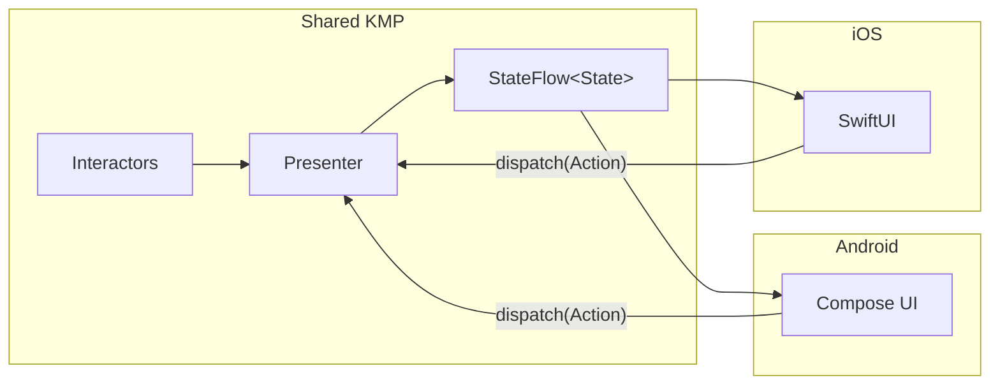

# Presentation Layer

## Table of Contents

- [Overview](#overview)
- [Presenter Pattern](#presenter-pattern)
- [Platform UI Binding](#platform-ui-binding)

> **What this covers**: how presenters compose state from interactors, how loading and errors are tracked, and how
> Android Compose and iOS SwiftUI consume the same shared state.
> **Prerequisites**: read [Navigation](navigation.md) for how presenters are created and scoped. Interactor and
> SubjectInteractor are summarised in the root README [Key Concepts](../../README.md#key-concepts).

The presentation layer is split between **shared KMP presenters** that manage state and **platform-specific UI** that
renders it. Business logic never lives in the UI layer.

## Overview



## Presenter Pattern

Each feature has a presenter that:

1. **Accepts actions** from the UI via a `dispatch(action)` method
2. **Orchestrates data** by invoking interactors and observing their output
3. **Emits state** as a single `StateFlow<State>` that the UI observes

### State Management

Presenters combine multiple data streams into a single state object using `combine()`. This is the only place where
disparate data sources come together.

**Key rules:**

- **Single state flow**: One `StateFlow<State>` output per presenter. No exposing multiple flows to the UI.
- **Single mutable state**: One internal `MutableStateFlow<State>` for user-driven fields (e.g., filters, pagination).
  No separate `MutableStateFlow` per field.
- **Combine then transform**: Domain-to-presentation mapping happens **after** `combine()`, not inside individual flow
  inputs.
- **No business logic**: Presenters do not sort, filter, group, or format data. That belongs in the domain layer
  (interactors or utility classes).
- **String localization**: All user-facing strings go through the `Localizer` interface. Domain classes return
  structured data (enums, sealed types), never hardcoded strings.

### Loading and Error Handling

Presenters use two shared utilities to manage loading state and errors:

- **`ObservableLoadingCounter`**: A thread-safe counter that tracks in-flight operations. Exposes a `Flow<Boolean>`
  that emits `true` when any operation is loading.
- **`UiMessageManager`**: A thread-safe queue of error messages for UI display. Supports deduplication and individual
  dismissal.

The `collectStatus()` extension ties these together: it automatically increments the loading counter when an operation
starts, decrements on completion, and emits errors to the message manager. This makes error handling declarative in
presenters.

The injection sites and the `collectStatus` call site look like this, drawn from `SearchShowsPresenter`
([`SearchShowsPresenter.kt`](../../features/search/presenter/src/commonMain/kotlin/com/thomaskioko/tvmaniac/search/presenter/SearchShowsPresenter.kt)):

```kotlin
// PresenterInstance inner class

private val genreLoadingState = ObservableLoadingCounter()   // tracks in-flight genre fetches
private val uiMessageManager = UiMessageManager()            // accumulates error messages for the UI

// both flow into combine() above, surfacing isRefreshing and message in the state object

private fun fetchGenreContent(category: GenreShowCategory, forceRefresh: Boolean = false) {
    coroutineScope.launch {
        fetchGenreContentInteractor(FetchGenreContentInteractor.Params(category, forceRefresh))
            .collectStatus(genreLoadingState, logger, uiMessageManager, "Genre Content", errorToStringMapper)
    }
}
```

`collectStatus` replaces a try/catch block: `InvokeStarted` increments `genreLoadingState`, `InvokeSuccess` decrements
it, and `InvokeError` routes the mapped error string to `uiMessageManager`. The UI sees only `isRefreshing: Boolean`
and `message: UiMessage?`, with no awareness of how loading state or errors are tracked.

### Interactor Types

Presenters work with two types of interactors:

- **`Interactor`**: One-shot operations (e.g., mark episode watched, refresh data). Returns `Flow<InvokeStatus>` with
  lifecycle events: `InvokeStarted` → `InvokeSuccess` or `InvokeError`.
- **`SubjectInteractor`**: Continuous data streams (e.g., observe show details, observe calendar). Exposes a `Flow<T>`
  that emits updates reactively. Automatically cancels previous observations when parameters change.

> [!WARNING]
> Interactors must expose a `Flow`, not call a `suspend fun` that returns a value. The `combine()` call in the
> presenter assembles several flows into one `StateFlow`. If you call a suspend function inside a flow transformer
> instead of composing flows, `combine` cannot observe the result reactively and the state will not update when the
> underlying data changes.

The pattern is visible in `DiscoverShowsPresenter`
([`DiscoverShowsPresenter.kt`](../../features/discover/presenter/src/commonMain/kotlin/com/thomaskioko/tvmaniac/discover/presenter/DiscoverShowsPresenter.kt)),
trimmed to the state-assembly core:

```kotlin
// features/discover/presenter/.../DiscoverShowsPresenter.kt  (PresenterInstance inner class)

private val featuredLoadingState = ObservableLoadingCounter()
private val uiMessageManager = UiMessageManager()

private val _state: MutableStateFlow<DiscoverViewState> =
    MutableStateFlow(DiscoverViewState.Empty.copy(featuredRefreshing = true))

public val state: StateFlow<DiscoverViewState> = combine(
    featuredLoadingState.observable,   // Flow<Boolean> from the loading counter
    discoverShowsInteractor.flow,      // Flow<T> from the SubjectInteractor
    uiMessageManager.message,          // Flow<UiMessage?> from the message queue
    _state,                            // MutableStateFlow for user-driven fields
) { featuredShowsIsUpdating, showData, message, currentState ->
    currentState.copy(
        featuredRefreshing = featuredShowsIsUpdating,
        message = message,
        featuredShows = showData.featuredShows.toShowList(),
    )
}.stateIn(
    scope = coroutineScope,
    started = SharingStarted.WhileSubscribed(),
    initialValue = _state.value,
)
```

`stateIn` converts the cold `combine` chain into a hot `StateFlow` so both Android and iOS can subscribe at any time
and immediately receive the latest value. `ObservableLoadingCounter.observable` and `UiMessageManager.message` are
plain `Flow<T>` values, so they compose into `combine` alongside any other interactor flow without special handling.

### Auth State Transitions

Presenters that react to authentication changes follow a specific pattern:

- Track the **previous** auth state
- Only trigger data fetching on a **transition to** `LOGGED_IN`, not on every emission
- Use an `isFirstEmission` flag to handle initial state

> [!NOTE]
> All user-facing strings must go through the `Localizer` interface, not through `context.getString()` or hardcoded
> literals. Domain classes return structured data (enums, sealed types). The presenter calls `localizer.getString(key)`
> to produce the display string. This keeps the shared KMP code free of Android `Context` and makes presenters
> testable without a UI environment.

## Platform UI Binding

### Android (Jetpack Compose)

Compose screens collect the presenter's state flow and render it. Actions are dispatched back to the presenter.

```
Presenter.state → collectAsState() → Compose UI → dispatch(Action) → Presenter
```

Android feature modules depend on the corresponding presenter module and contain **no business logic**. They are pure
rendering functions.

### iOS (SwiftUI)

SwiftUI views bind to the shared presenter's state flow using a property wrapper that bridges Kotlin `StateFlow` to
SwiftUI's observation system.

```
Presenter.state → @KotlinStateFlow → SwiftUI View → dispatch(Action) → Presenter
```

The iOS app imports the shared KMP framework and follows the same contract: observe state, render UI, dispatch actions.

### What Belongs Where

- Sorting, filtering, grouping: domain layer (interactors).
- Data formatting: domain layer (utility classes).
- String localization: presenter (via `Localizer`).
- State combination: presenter.
- Loading/error tracking: presenter (via `collectStatus`).
- UI rendering: platform UI (Compose / SwiftUI).
- Navigation triggers: presenter (via `Navigator` or a shared `nav` module coordinator).

## Next Steps

- [Data Layer](data-layer.md) - How the Store pattern feeds data into the interactors that presenters observe.
- [Navigation](navigation.md) - How presenters are scoped to the navigation stack and how they trigger navigation.
