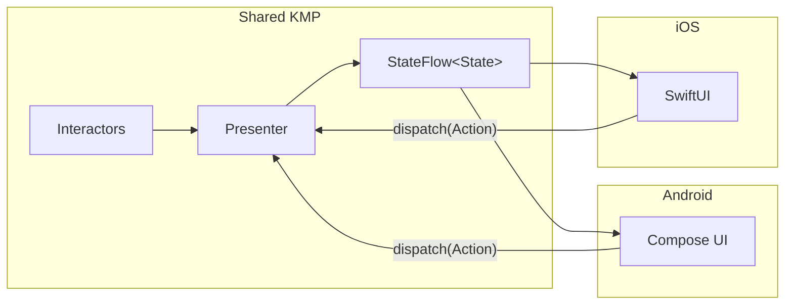

# Presentation Layer

## Table of Contents

- [Presenter Pattern](#presenter-pattern)
- [State Composition](#state-composition)
- [Loading and Error Handling](#loading-and-error-handling)
- [Interactor Types](#interactor-types)
- [Platform UI Binding](#platform-ui-binding)

A [Presenter](glossary.md#presenter) is a shared Kotlin Multiplatform class that exposes one `StateFlow<State>` and accepts dispatched actions. The same presenter feeds Android Compose and iOS SwiftUI.



## Presenter Pattern

Each feature has one presenter. The presenter accepts actions, calls one or more [interactors](glossary.md#interactor), and emits a `StateFlow<State>`.

### Rules

- **One state flow**: each presenter exposes a single `StateFlow<State>`.
- **One mutable source**: internal mutation funnels through one `MutableStateFlow`.
- **Combine, then transform**: combine input flows first, map to the screen state second.
- **No business logic**: presenters orchestrate. Filtering, sorting, and formatting belong in interactors or domain utilities.
- **Localization**: every user-facing string goes through the [`Localizer`](glossary.md#localizer) interface.

## State Composition

A presenter combines its private `MutableStateFlow`, every interactor flow, the loading counter, and the message queue into one public `StateFlow<State>`.

```kotlin
@Inject
@NavDestination(
    route = TrendingShowsRoute::class,
    parentScope = ActivityScope::class,
    kind = DestinationKind.SCREEN,
)
public class TrendingShowsPresenter(
    componentContext: ComponentContext,
    private val navigator: Navigator,
    private val observeTrendingInteractor: ObserveTrendingShowsInteractor,
    private val refreshTrendingInteractor: RefreshTrendingShowsInteractor,
    private val errorToStringMapper: ErrorToStringMapper,
    private val logger: Logger,
) : ComponentContext by componentContext {

    private val coroutineScope = coroutineScope()
    private val loadingState = ObservableLoadingCounter()
    private val uiMessageManager = UiMessageManager()
    private val _state = MutableStateFlow(TrendingShowsState())

    init { refresh(forceRefresh = false) }

    public val state: StateFlow<TrendingShowsState> = combine(
        _state,
        loadingState.observable,
        observeTrendingInteractor.flow,
        uiMessageManager.message,
    ) { current, isLoading, shows, message ->
        current.copy(isLoading = isLoading, shows = shows, message = message)
    }.stateIn(
        scope = coroutineScope,
        started = SharingStarted.WhileSubscribed(),
        initialValue = TrendingShowsState(),
    )

    public fun dispatch(action: TrendingShowsAction) {
        when (action) {
            is ShowClicked -> navigator.navigateTo(ShowDetailsRoute(ShowDetailsParam(action.traktId)))
            is Refresh -> refresh(forceRefresh = true)
        }
    }

    private fun refresh(forceRefresh: Boolean) {
        coroutineScope.launch {
            refreshTrendingInteractor(RefreshTrendingShowsInteractor.Param(forceRefresh))
                .collectStatus(loadingState, logger, uiMessageManager, errorToStringMapper = errorToStringMapper)
        }
    }
}
```

## Loading and Error Handling

`collectStatus` is the project-wide extension on `Flow<InvokeStatus>`. It increments and decrements an `ObservableLoadingCounter`, routes errors through an `ErrorToStringMapper`, and queues the resulting message in a `UiMessageManager`.

- `ObservableLoadingCounter`: tracks every in-flight invocation. Increments when one starts, decrements when it finishes or fails.
- `UiMessageManager`: queues error messages with deduplication.
- `ErrorToStringMapper`: translates exceptions into localized strings.

The combined `StateFlow` reflects loading and message state on every emission, so UI never subscribes to multiple flows.

## Interactor Types

- `Interactor`: one-shot operations returning `Flow<InvokeStatus>`.
- `SubjectInteractor`: continuous data streams returning `Flow<T>`.

> [!WARNING]
> Interactors return a `Flow`. Calling a `suspend` function inside a flow transformer prevents `combine` from observing updates reactively.

## Platform UI Binding

### Android (Compose)

Screens collect state through `collectAsState()` and dispatch actions back to the presenter. Feature UI modules contain no business logic.

### iOS (SwiftUI)

Views bind to the shared presenter through a property wrapper that bridges Kotlin `StateFlow` to a SwiftUI `@StateValue`.

## Responsibilities

- **Domain (interactors and utilities)**: sorting, filtering, formatting.
- **Presenter**: state combination, localization, loading and error tracking.
- **Platform UI**: rendering and dispatch.
- **[Navigator](glossary.md#navigator)**: navigation triggers.
