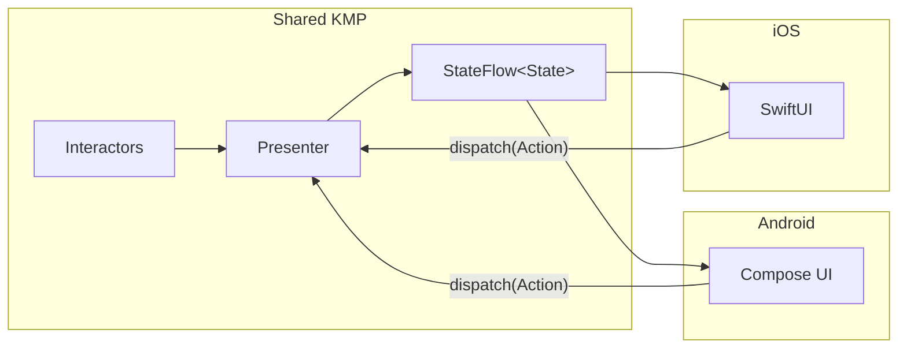

# Presentation Layer

## Table of Contents

- [Presenter Pattern](#presenter-pattern)
- [Loading and Error Handling](#loading-and-error-handling)
- [Platform UI Binding](#platform-ui-binding)

Presentation layer splits into shared KMP presenters for state management and platform-specific UI for rendering.



## Presenter Pattern

Each feature uses a presenter to accept actions, invoke interactors, and emit a single `StateFlow<State>`.

### Rules

- **Single State Flow**: Presenters expose one `StateFlow`.
- **Single Mutable State**: Internal state uses one `MutableStateFlow`.
- **Transform after Combine**: Data mapping occurs after combining input streams.
- **No Business Logic**: Presenters orchestrate data; they do not filter or sort.
- **Localization**: User-facing strings go through the `Localizer` interface.

## Loading and Error Handling

Presenters use `collectStatus()` to declaratively manage state:

- **`ObservableLoadingCounter`**: Tracks in-flight operations.
- **`UiMessageManager`**: Queues error messages with support for deduplication.

`collectStatus()` automatically increments/decrements counters and routes errors to the message manager.

```kotlin
private fun fetchContent(category: Category, forceRefresh: Boolean) {
    coroutineScope.launch {
        interactor(Params(category, forceRefresh))
            .collectStatus(loadingState, logger, uiMessageManager, "Label", errorMapper)
    }
}
```

## Interactor Types

- **`Interactor`**: One-shot operations returning `Flow<InvokeStatus>`.
- **`SubjectInteractor`**: Continuous data streams returning `Flow<T>`.

> [!WARNING]
> Interactors must return a `Flow`. Calling `suspend` functions inside flow transformers prevents `combine()` from observing updates reactively.

## Platform UI Binding

### Android (Compose)
Screens collect state via `collectAsState()` and dispatch actions back to the presenter. Feature UI modules contain no business logic.

### iOS (SwiftUI)
Views bind to the shared presenter using a property wrapper bridging Kotlin `StateFlow` to SwiftUI.

## Responsibilities

- **Domain (Interactors/Utilities)**: Sorting, filtering, formatting.
- **Presenter**: State combination, localization, loading/error tracking.
- **Platform UI**: Rendering.
- **Navigator**: Navigation triggers.
