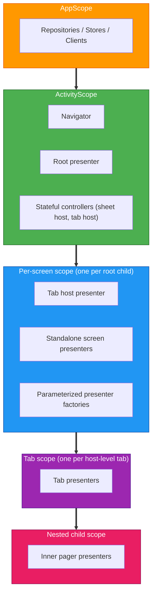

# Scope Hierarchy

## Table of Contents

- [Overview](#overview)
- [Diagram](#diagram)
- [AppScope](#appscope)
- [ActivityScope](#activityscope)
- [Per-screen Scope](#per-screen-scope)

Navigation and DI scopes are aligned. Each navigation level has a Metro scope providing `ComponentContext` to children.

## Overview

Scopes are created from parents via `@GraphExtension.Factory` which accepts a Decompose `ComponentContext`. Features own their per-screen graph extensions co-located with presenters.

```kotlin
@GraphExtension(HomeScreenScope::class)
public interface HomeScreenGraph {
    public val homePresenter: HomePresenter

    @ContributesTo(ActivityScope::class)
    @GraphExtension.Factory
    public interface Factory {
        public fun createHomeGraph(@Provides ctx: ComponentContext): HomeScreenGraph
    }
}
```

## Diagram



## AppScope
Singletons shared across the app lifetime.
- Repositories, Stores, Database, DAO.
- API clients, Request manager, Datastore.
- Logger, Localizer.

## ActivityScope
Instances tied to the activity lifetime.
- Navigators (`Navigator`, `SheetNavigator`).
- Root presenter.
- Stateful controllers (Sheet host, tab host).

## Per-screen Scope
Created and destroyed with Decompose child stack entries.
- Tab host presenters.
- Standalone screen presenters.
- Parameterized presenter factories.

## Tab Scope
Tied to tabs inside a tab host.
- Tab presenters (Discover, Library, Search).

## Nested Child Scope
Used for inner pagers or secondary navigation within a tab.

> [!TIP]
> Use `childContext(key)` for children that must stay alive simultaneously. `childStack` destroys the previous child when a new one is pushed.
