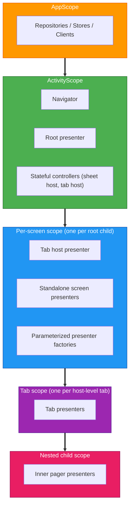

# Scope Hierarchy

## Table of Contents

- [Overview](#overview)
- [Diagram](#diagram)
- [AppScope](#appscope)
- [ActivityScope](#activityscope)
- [Per-screen scope](#per-screen-scope)
- [Tab scope](#tab-scope)
- [Nested child scope](#nested-child-scope)

> **What this covers**: the Metro scope tree, what lives in each scope, and how each scope is created from its parent.
> **Prerequisites**: read [Dependency Injection](dependency-injection.md) for binding containers, graph extensions, and Metro fundamentals. Read [Navigation](navigation.md) for how navigation and scope align.

## Overview

Navigation and DI scopes are aligned. Each level in the navigation tree has a corresponding Metro scope that provides `ComponentContext` to its children.

Each scope is created from the parent scope through a `@GraphExtension.Factory` that takes the Decompose `ComponentContext` for the new child. There is no central per-screen graph: each feature owns its own per-screen graph extension co-located with its presenter, and parent presenters (the root presenter, a tab host) call the relevant factory when a child enters the stack. Nested scopes (a tab inside a tab host, an inner pager inside a tab) follow the same pattern, one factory per level.

The three moving parts of a per-screen scope are visible in [`HomeScreenGraph.kt`](../../features/home/presenter/src/commonMain/kotlin/com/thomaskioko/tvmaniac/presenter/home/di/HomeScreenGraph.kt):

```kotlin
// features/home/presenter/.../di/HomeScreenGraph.kt

@GraphExtension(HomeScreenScope::class)          // marks this as a child graph scoped to HomeScreenScope
public interface HomeScreenGraph {
    public val homePresenter: HomePresenter       // accessor the parent presenter calls to get the fully wired presenter

    @ContributesTo(ActivityScope::class)
    @GraphExtension.Factory                       // factory contributed into ActivityScope so the parent can call it
    public interface Factory {
        public fun createHomeGraph(
            @Provides componentContext: ComponentContext,  // the child's ComponentContext, injected by the parent
        ): HomeScreenGraph
    }
}
```

`@GraphExtension` scopes the graph to `HomeScreenScope`. `@GraphExtension.Factory` is contributed into `ActivityScope` so the root presenter can call `createHomeGraph(componentContext)` without knowing anything about the home module's internals. Every presenter in a per-screen scope follows this same three-part shape: scope marker, factory, accessor.

## Diagram



## AppScope

Application-wide singletons. Created once and shared across the entire app lifetime.

**What lives here**
- Repositories and their Store instances
- Database and DAO instances
- Network API clients (TMDB, Trakt)
- Request manager (cache validation)
- Datastore (preferences)
- Logger, Localizer, and other utilities

## ActivityScope

Activity-lifetime instances. Created when the root activity is created. Destroyed when the activity is destroyed.

**What lives here**
- The `Navigator` and `SheetNavigator` interfaces and their implementations
- The root presenter
- Stateful controllers (sheet host, tab host)

## Per-screen scope

> [!NOTE]
> Per-screen scopes are created and destroyed in lock-step with the Decompose child stack entry. When a screen is pushed, its graph extension is created with the new `ComponentContext`. When it is popped, the graph extension and everything scoped to it are destroyed. Do not cache a per-screen graph reference outside the Decompose lifecycle callbacks.

One scope per root child in the navigation stack. Created when a destination enters the stack; destroyed when it is popped. Each feature owns its own `@GraphExtension` for this scope, co-located in its presenter module.

**What lives here**
- Tab host presenters
- Standalone screen presenters (no runtime parameters)
- Parameterized presenter factories (for screens that need a route param, such as a show ID)

## Tab scope

One scope per tab inside a tab host. Created alongside the tab presenter; destroyed when the tab host is removed from the stack.

**What lives here**
- Tab presenters (Discover, Library, Search, etc.)

## Nested child scope

A scope nested inside a tab for inner pager or secondary navigation within a tab. Follows the same factory pattern as every other level.

**What lives here**
- Inner pager presenters

> [!TIP]
> Use `childContext(key = "Name")` rather than `childStack` when you need two children to stay alive simultaneously (for example, pager tabs that must each hold their own presenter without being destroyed when scrolled off screen). `childStack` destroys the previous child when a new one is pushed. `childContext` keeps all named children alive in parallel, each with its own independent lifecycle.

## Next Steps

- [Dependency Injection](dependency-injection.md) - Graph types, binding containers, qualifiers, and how to add a new injectable.
- [Modularization](modularization.md) - Module archetypes and the API/implementation boundary that scopes enforce.
