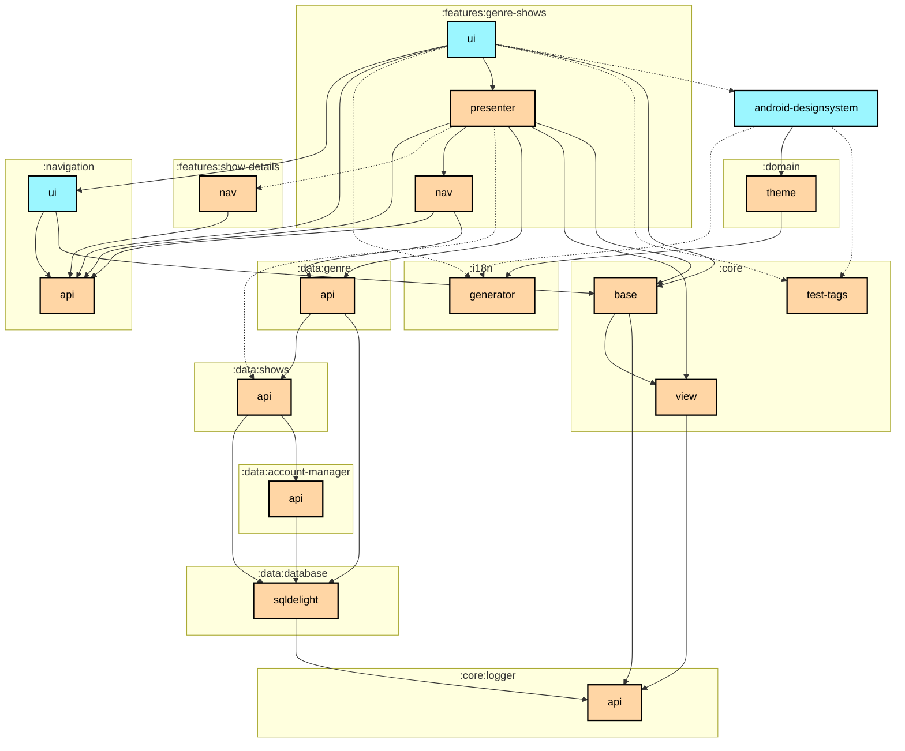
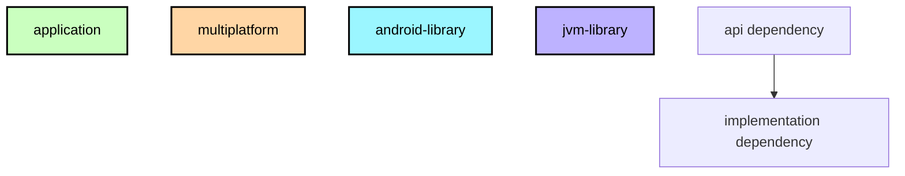

# `:features:genre-shows:ui`

## Module dependency graph

<!--region graph-->

```mermaid
graph TB
  :android-designsystem[android-designsystem]:::android-library
  subgraph :core
    direction TB
    :core:base[base]:::multiplatform
    :core:test-tags[test-tags]:::multiplatform
    :core:view[view]:::multiplatform
  end
  subgraph :core:logger
    direction TB
    :core:logger:api[api]:::multiplatform
  end
  subgraph :data:account-manager
    direction TB
    :data:account-manager:api[api]:::multiplatform
  end
  subgraph :data:database
    direction TB
    :data:database:sqldelight[sqldelight]:::multiplatform
  end
  subgraph :data:genre
    direction TB
    :data:genre:api[api]:::multiplatform
  end
  subgraph :data:shows
    direction TB
    :data:shows:api[api]:::multiplatform
  end
  subgraph :domain
    direction TB
    :domain:theme[theme]:::multiplatform
  end
  subgraph :features:genre-shows
    direction TB
    :features:genre-shows:nav[nav]:::multiplatform
    :features:genre-shows:presenter[presenter]:::multiplatform
    :features:genre-shows:ui[ui]:::android-library
  end
  subgraph :features:show-details
    direction TB
    :features:show-details:nav[nav]:::multiplatform
  end
  subgraph :i18n
    direction TB
    :i18n:generator[generator]:::multiplatform
  end
  subgraph :navigation
    direction TB
    :navigation:api[api]:::multiplatform
    :navigation:ui[ui]:::android-library
  end

  :android-designsystem -.-> :core:test-tags
  :android-designsystem --> :domain:theme
  :android-designsystem -.-> :i18n:generator
  :core:base --> :core:logger:api
  :core:base --> :core:view
  :core:view --> :core:logger:api
  :data:account-manager:api --> :data:database:sqldelight
  :data:database:sqldelight --> :core:logger:api
  :data:genre:api --> :data:database:sqldelight
  :data:genre:api --> :data:shows:api
  :data:shows:api --> :data:account-manager:api
  :data:shows:api --> :data:database:sqldelight
  :domain:theme --> :i18n:generator
  :features:genre-shows:nav --> :data:genre:api
  :features:genre-shows:nav --> :navigation:api
  :features:genre-shows:presenter --> :core:base
  :features:genre-shows:presenter --> :core:view
  :features:genre-shows:presenter --> :data:genre:api
  :features:genre-shows:presenter -.-> :data:shows:api
  :features:genre-shows:presenter --> :features:genre-shows:nav
  :features:genre-shows:presenter -.-> :features:show-details:nav
  :features:genre-shows:presenter --> :navigation:api
  :features:genre-shows:ui -.-> :android-designsystem
  :features:genre-shows:ui --> :core:base
  :features:genre-shows:ui -.-> :core:test-tags
  :features:genre-shows:ui --> :features:genre-shows:presenter
  :features:genre-shows:ui -.-> :i18n:generator
  :features:genre-shows:ui --> :navigation:api
  :features:genre-shows:ui --> :navigation:ui
  :features:show-details:nav --> :navigation:api
  :navigation:ui --> :core:base
  :navigation:ui --> :navigation:api

classDef application fill:#CAFFBF,stroke:#000,stroke-width:2px,color:#000;
classDef multiplatform fill:#FFD6A5,stroke:#000,stroke-width:2px,color:#000;
classDef android-library fill:#9BF6FF,stroke:#000,stroke-width:2px,color:#000;
classDef jvm-library fill:#BDB2FF,stroke:#000,stroke-width:2px,color:#000;
classDef unknown fill:#FFADAD,stroke:#000,stroke-width:2px,color:#000;
```

Graph legend

```mermaid
graph TB
  application[application]:::application
  multiplatform[multiplatform]:::multiplatform
  android-library[android-library]:::android-library
  jvm-library[jvm-library]:::jvm-library

  api["api dependency"] --> implementation["implementation dependency"]

classDef application fill:#CAFFBF,stroke:#000,stroke-width:2px,color:#000;
classDef multiplatform fill:#FFD6A5,stroke:#000,stroke-width:2px,color:#000;
classDef android-library fill:#9BF6FF,stroke:#000,stroke-width:2px,color:#000;
classDef jvm-library fill:#BDB2FF,stroke:#000,stroke-width:2px,color:#000;
classDef unknown fill:#FFADAD,stroke:#000,stroke-width:2px,color:#000;
```

<!--endregion-->
