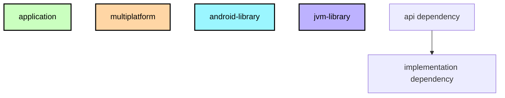

# `:ios-framework`

## Module dependency graph

<!--region graph-->
```mermaid
graph TB
  :ios-framework[ios-framework]:::multiplatform
  subgraph :api:simkl
    direction TB
    :api:simkl:api[api]:::multiplatform
    :api:simkl:implementation[implementation]:::multiplatform
  end
  subgraph :api:tmdb
    direction TB
    :api:tmdb:api[api]:::multiplatform
    :api:tmdb:implementation[implementation]:::multiplatform
  end
  subgraph :api:trakt
    direction TB
    :api:trakt:api[api]:::multiplatform
    :api:trakt:implementation[implementation]:::multiplatform
  end
  subgraph :core
    direction TB
    :core:base[base]:::multiplatform
    :core:paging[paging]:::multiplatform
    :core:test-tags[test-tags]:::multiplatform
    :core:view[view]:::multiplatform
  end
  subgraph :core:appconfig
    direction TB
    :core:appconfig:api[api]:::multiplatform
    :core:appconfig:implementation[implementation]:::multiplatform
  end
  subgraph :core:connectivity
    direction TB
    :core:connectivity:api[api]:::multiplatform
    :core:connectivity:implementation[implementation]:::multiplatform
  end
  subgraph :core:feature-flags
    direction TB
    :core:feature-flags:api[api]:::multiplatform
    :core:feature-flags:implementation[implementation]:::multiplatform
  end
  subgraph :core:imageloading
    direction TB
    :core:imageloading:api[api]:::multiplatform
  end
  subgraph :core:locale
    direction TB
    :core:locale:api[api]:::multiplatform
    :core:locale:implementation[implementation]:::multiplatform
  end
  subgraph :core:logger
    direction TB
    :core:logger:api[api]:::multiplatform
    :core:logger:implementation[implementation]:::multiplatform
  end
  subgraph :core:network-util
    direction TB
    :core:network-util:api[api]:::multiplatform
    :core:network-util:implementation[implementation]:::multiplatform
  end
  subgraph :core:notifications
    direction TB
    :core:notifications:api[api]:::multiplatform
    :core:notifications:implementation[implementation]:::multiplatform
  end
  subgraph :core:syncstate
    direction TB
    :core:syncstate:api[api]:::multiplatform
    :core:syncstate:implementation[implementation]:::multiplatform
  end
  subgraph :core:tasks
    direction TB
    :core:tasks:api[api]:::multiplatform
    :core:tasks:implementation[implementation]:::multiplatform
  end
  subgraph :core:util
    direction TB
    :core:util:api[api]:::multiplatform
    :core:util:implementation[implementation]:::multiplatform
  end
  subgraph :data:account-manager
    direction TB
    :data:account-manager:api[api]:::multiplatform
    :data:account-manager:implementation[implementation]:::multiplatform
  end
  subgraph :data:calendar
    direction TB
    :data:calendar:api[api]:::multiplatform
    :data:calendar:implementation[implementation]:::multiplatform
  end
  subgraph :data:cast
    direction TB
    :data:cast:api[api]:::multiplatform
    :data:cast:implementation[implementation]:::multiplatform
  end
  subgraph :data:continue-watching
    direction TB
    :data:continue-watching:api[api]:::multiplatform
    :data:continue-watching:implementation[implementation]:::multiplatform
  end
  subgraph :data:database
    direction TB
    :data:database:sqldelight[sqldelight]:::multiplatform
  end
  subgraph :data:datastore
    direction TB
    :data:datastore:api[api]:::multiplatform
    :data:datastore:implementation[implementation]:::multiplatform
  end
  subgraph :data:episode
    direction TB
    :data:episode:api[api]:::multiplatform
    :data:episode:implementation[implementation]:::multiplatform
  end
  subgraph :data:favorites
    direction TB
    :data:favorites:api[api]:::multiplatform
    :data:favorites:implementation[implementation]:::multiplatform
  end
  subgraph :data:featuredshows
    direction TB
    :data:featuredshows:api[api]:::multiplatform
    :data:featuredshows:implementation[implementation]:::multiplatform
  end
  subgraph :data:followedshows
    direction TB
    :data:followedshows:api[api]:::multiplatform
    :data:followedshows:implementation[implementation]:::multiplatform
  end
  subgraph :data:genre
    direction TB
    :data:genre:api[api]:::multiplatform
    :data:genre:implementation[implementation]:::multiplatform
  end
  subgraph :data:library
    direction TB
    :data:library:api[api]:::multiplatform
    :data:library:implementation[implementation]:::multiplatform
  end
  subgraph :data:logout
    direction TB
    :data:logout:api[api]:::multiplatform
    :data:logout:implementation[implementation]:::multiplatform
  end
  subgraph :data:oauth
    direction TB
    :data:oauth:api[api]:::multiplatform
    :data:oauth:implementation[implementation]:::multiplatform
  end
  subgraph :data:popularshows
    direction TB
    :data:popularshows:api[api]:::multiplatform
    :data:popularshows:implementation[implementation]:::multiplatform
  end
  subgraph :data:ratings
    direction TB
    :data:ratings:api[api]:::multiplatform
    :data:ratings:implementation[implementation]:::multiplatform
  end
  subgraph :data:recommendedshows
    direction TB
    :data:recommendedshows:api[api]:::multiplatform
    :data:recommendedshows:implementation[implementation]:::multiplatform
  end
  subgraph :data:request-manager
    direction TB
    :data:request-manager:api[api]:::multiplatform
    :data:request-manager:implementation[implementation]:::multiplatform
  end
  subgraph :data:search
    direction TB
    :data:search:api[api]:::multiplatform
    :data:search:implementation[implementation]:::multiplatform
  end
  subgraph :data:seasondetails
    direction TB
    :data:seasondetails:api[api]:::multiplatform
    :data:seasondetails:implementation[implementation]:::multiplatform
  end
  subgraph :data:seasons
    direction TB
    :data:seasons:api[api]:::multiplatform
    :data:seasons:implementation[implementation]:::multiplatform
  end
  subgraph :data:showdetails
    direction TB
    :data:showdetails:api[api]:::multiplatform
    :data:showdetails:implementation[implementation]:::multiplatform
  end
  subgraph :data:shows
    direction TB
    :data:shows:api[api]:::multiplatform
    :data:shows:implementation[implementation]:::multiplatform
  end
  subgraph :data:similar
    direction TB
    :data:similar:api[api]:::multiplatform
    :data:similar:implementation[implementation]:::multiplatform
  end
  subgraph :data:simklauth
    direction TB
    :data:simklauth:implementation[implementation]:::multiplatform
  end
  subgraph :data:start-watching
    direction TB
    :data:start-watching:api[api]:::multiplatform
    :data:start-watching:implementation[implementation]:::multiplatform
  end
  subgraph :data:subscription
    direction TB
    :data:subscription:api[api]:::multiplatform
    :data:subscription:implementation[implementation]:::multiplatform
  end
  subgraph :data:sync-activity
    direction TB
    :data:sync-activity:api[api]:::multiplatform
    :data:sync-activity:implementation[implementation]:::multiplatform
  end
  subgraph :data:topratedshows
    direction TB
    :data:topratedshows:api[api]:::multiplatform
    :data:topratedshows:implementation[implementation]:::multiplatform
  end
  subgraph :data:trailers
    direction TB
    :data:trailers:api[api]:::multiplatform
    :data:trailers:implementation[implementation]:::multiplatform
  end
  subgraph :data:traktauth
    direction TB
    :data:traktauth:implementation[implementation]:::multiplatform
  end
  subgraph :data:traktlists
    direction TB
    :data:traktlists:api[api]:::multiplatform
    :data:traktlists:implementation[implementation]:::multiplatform
  end
  subgraph :data:trendingshows
    direction TB
    :data:trendingshows:api[api]:::multiplatform
    :data:trendingshows:implementation[implementation]:::multiplatform
  end
  subgraph :data:upcomingshows
    direction TB
    :data:upcomingshows:api[api]:::multiplatform
    :data:upcomingshows:implementation[implementation]:::multiplatform
  end
  subgraph :data:upnext
    direction TB
    :data:upnext:api[api]:::multiplatform
    :data:upnext:implementation[implementation]:::multiplatform
  end
  subgraph :data:user
    direction TB
    :data:user:api[api]:::multiplatform
    :data:user:implementation[implementation]:::multiplatform
  end
  subgraph :data:watch-status
    direction TB
    :data:watch-status:api[api]:::multiplatform
    :data:watch-status:implementation[implementation]:::multiplatform
  end
  subgraph :data:watchlist-prefs
    direction TB
    :data:watchlist-prefs:api[api]:::multiplatform
    :data:watchlist-prefs:implementation[implementation]:::multiplatform
  end
  subgraph :data:watchproviders
    direction TB
    :data:watchproviders:api[api]:::multiplatform
    :data:watchproviders:implementation[implementation]:::multiplatform
  end
  subgraph :domain
    direction TB
    :domain:account-switcher[account-switcher]:::multiplatform
    :domain:calendar[calendar]:::multiplatform
    :domain:continue-watching[continue-watching]:::multiplatform
    :domain:discover[discover]:::multiplatform
    :domain:episode[episode]:::multiplatform
    :domain:favorites[favorites]:::multiplatform
    :domain:feature-flags[feature-flags]:::multiplatform
    :domain:followedshows[followedshows]:::multiplatform
    :domain:genre[genre]:::multiplatform
    :domain:library[library]:::multiplatform
    :domain:logout[logout]:::multiplatform
    :domain:notifications[notifications]:::multiplatform
    :domain:ratings[ratings]:::multiplatform
    :domain:recently-watched[recently-watched]:::multiplatform
    :domain:seasondetails[seasondetails]:::multiplatform
    :domain:settings[settings]:::multiplatform
    :domain:showdetails[showdetails]:::multiplatform
    :domain:similarshows[similarshows]:::multiplatform
    :domain:start-watching[start-watching]:::multiplatform
    :domain:sync-activity[sync-activity]:::multiplatform
    :domain:theme[theme]:::multiplatform
    :domain:traktlists[traktlists]:::multiplatform
    :domain:user[user]:::multiplatform
  end
  subgraph :features:calendar
    direction TB
    :features:calendar:presenter[presenter]:::multiplatform
  end
  subgraph :features:continue-watching
    direction TB
    :features:continue-watching:presenter[presenter]:::multiplatform
  end
  subgraph :features:debug
    direction TB
    :features:debug:nav[nav]:::multiplatform
    :features:debug:presenter[presenter]:::multiplatform
  end
  subgraph :features:discover
    direction TB
    :features:discover:nav[nav]:::multiplatform
    :features:discover:presenter[presenter]:::multiplatform
  end
  subgraph :features:episode-sheet
    direction TB
    :features:episode-sheet:nav[nav]:::multiplatform
    :features:episode-sheet:presenter[presenter]:::multiplatform
  end
  subgraph :features:feature-flags
    direction TB
    :features:feature-flags:nav[nav]:::multiplatform
    :features:feature-flags:presenter[presenter]:::multiplatform
  end
  subgraph :features:home
    direction TB
    :features:home:nav[nav]:::multiplatform
    :features:home:presenter[presenter]:::multiplatform
  end
  subgraph :features:library
    direction TB
    :features:library:nav[nav]:::multiplatform
    :features:library:presenter[presenter]:::multiplatform
  end
  subgraph :features:more-shows
    direction TB
    :features:more-shows:nav[nav]:::multiplatform
    :features:more-shows:presenter[presenter]:::multiplatform
  end
  subgraph :features:my-shows
    direction TB
    :features:my-shows:nav[nav]:::multiplatform
    :features:my-shows:presenter[presenter]:::multiplatform
  end
  subgraph :features:profile
    direction TB
    :features:profile:nav[nav]:::multiplatform
    :features:profile:presenter[presenter]:::multiplatform
  end
  subgraph :features:progress
    direction TB
    :features:progress:nav[nav]:::multiplatform
    :features:progress:presenter[presenter]:::multiplatform
  end
  subgraph :features:rating-sheet
    direction TB
    :features:rating-sheet:nav[nav]:::multiplatform
    :features:rating-sheet:presenter[presenter]:::multiplatform
  end
  subgraph :features:root
    direction TB
    :features:root:nav[nav]:::multiplatform
    :features:root:presenter[presenter]:::multiplatform
  end
  subgraph :features:search
    direction TB
    :features:search:nav[nav]:::multiplatform
    :features:search:presenter[presenter]:::multiplatform
  end
  subgraph :features:season-details
    direction TB
    :features:season-details:nav[nav]:::multiplatform
    :features:season-details:presenter[presenter]:::multiplatform
  end
  subgraph :features:settings
    direction TB
    :features:settings:nav[nav]:::multiplatform
    :features:settings:presenter[presenter]:::multiplatform
  end
  subgraph :features:show-details
    direction TB
    :features:show-details:nav[nav]:::multiplatform
    :features:show-details:presenter[presenter]:::multiplatform
  end
  subgraph :features:show-list
    direction TB
    :features:show-list:nav[nav]:::multiplatform
    :features:show-list:presenter[presenter]:::multiplatform
  end
  subgraph :features:start-watching
    direction TB
    :features:start-watching:presenter[presenter]:::multiplatform
  end
  subgraph :features:trailers
    direction TB
    :features:trailers:nav[nav]:::multiplatform
    :features:trailers:presenter[presenter]:::multiplatform
  end
  subgraph :features:upnext
    direction TB
    :features:upnext:presenter[presenter]:::multiplatform
  end
  subgraph :i18n
    direction TB
    :i18n:api[api]:::multiplatform
    :i18n:generator[generator]:::multiplatform
    :i18n:implementation[implementation]:::multiplatform
  end
  subgraph :navigation
    direction TB
    :navigation:api[api]:::multiplatform
    :navigation:implementation[implementation]:::multiplatform
  end

  :api:simkl:api --> :core:network-util:api
  :api:simkl:implementation --> :api:simkl:api
  :api:simkl:implementation --> :core:appconfig:api
  :api:simkl:implementation -.-> :core:base
  :api:simkl:implementation --> :core:logger:api
  :api:simkl:implementation --> :core:network-util:api
  :api:simkl:implementation --> :data:account-manager:api
  :api:simkl:implementation --> :data:calendar:api
  :api:simkl:implementation --> :data:episode:api
  :api:simkl:implementation --> :data:followedshows:api
  :api:simkl:implementation --> :data:library:api
  :api:simkl:implementation --> :data:oauth:api
  :api:simkl:implementation --> :data:ratings:api
  :api:simkl:implementation --> :data:start-watching:api
  :api:simkl:implementation --> :data:sync-activity:api
  :api:simkl:implementation --> :data:user:api
  :api:tmdb:api --> :core:network-util:api
  :api:tmdb:implementation --> :api:tmdb:api
  :api:tmdb:implementation --> :core:appconfig:api
  :api:tmdb:implementation -.-> :core:base
  :api:tmdb:implementation --> :core:connectivity:api
  :api:tmdb:implementation --> :core:logger:api
  :api:tmdb:implementation --> :core:network-util:api
  :api:trakt:api --> :core:network-util:api
  :api:trakt:implementation --> :api:trakt:api
  :api:trakt:implementation --> :core:appconfig:api
  :api:trakt:implementation -.-> :core:base
  :api:trakt:implementation --> :core:connectivity:api
  :api:trakt:implementation --> :core:logger:api
  :api:trakt:implementation --> :core:network-util:api
  :api:trakt:implementation --> :data:account-manager:api
  :api:trakt:implementation --> :data:calendar:api
  :api:trakt:implementation --> :data:episode:api
  :api:trakt:implementation --> :data:followedshows:api
  :api:trakt:implementation --> :data:library:api
  :api:trakt:implementation --> :data:oauth:api
  :api:trakt:implementation --> :data:ratings:api
  :api:trakt:implementation --> :data:start-watching:api
  :api:trakt:implementation --> :data:sync-activity:api
  :api:trakt:implementation --> :data:user:api
  :core:appconfig:implementation --> :api:tmdb:api
  :core:appconfig:implementation --> :api:trakt:api
  :core:appconfig:implementation --> :core:appconfig:api
  :core:appconfig:implementation -.-> :core:base
  :core:base --> :core:logger:api
  :core:base --> :core:view
  :core:connectivity:implementation -.-> :core:base
  :core:connectivity:implementation --> :core:connectivity:api
  :core:feature-flags:implementation --> :core:appconfig:api
  :core:feature-flags:implementation --> :core:base
  :core:feature-flags:implementation --> :core:feature-flags:api
  :core:feature-flags:implementation --> :core:logger:api
  :core:imageloading:api --> :domain:theme
  :core:locale:implementation -.-> :core:base
  :core:locale:implementation --> :core:locale:api
  :core:logger:implementation --> :core:appconfig:api
  :core:logger:implementation --> :core:base
  :core:logger:implementation --> :core:logger:api
  :core:network-util:api --> :core:connectivity:api
  :core:network-util:implementation --> :core:network-util:api
  :core:notifications:implementation -.-> :core:base
  :core:notifications:implementation --> :core:logger:api
  :core:notifications:implementation --> :core:notifications:api
  :core:notifications:implementation --> :core:util:api
  :core:paging -.-> :data:shows:api
  :core:syncstate:implementation --> :core:syncstate:api
  :core:tasks:implementation --> :core:logger:api
  :core:tasks:implementation --> :core:tasks:api
  :core:util:implementation --> :core:util:api
  :core:view --> :core:logger:api
  :data:account-manager:api --> :data:database:sqldelight
  :data:account-manager:implementation --> :core:base
  :data:account-manager:implementation --> :data:account-manager:api
  :data:calendar:api --> :core:network-util:api
  :data:calendar:api --> :data:account-manager:api
  :data:calendar:implementation --> :core:base
  :data:calendar:implementation -.-> :core:network-util:api
  :data:calendar:implementation --> :core:syncstate:api
  :data:calendar:implementation --> :data:account-manager:api
  :data:calendar:implementation --> :data:calendar:api
  :data:calendar:implementation --> :data:database:sqldelight
  :data:calendar:implementation --> :data:followedshows:api
  :data:calendar:implementation --> :data:request-manager:api
  :data:calendar:implementation --> :data:shows:api
  :data:cast:api --> :data:database:sqldelight
  :data:cast:implementation --> :api:tmdb:api
  :data:cast:implementation --> :api:trakt:api
  :data:cast:implementation --> :core:base
  :data:cast:implementation -.-> :core:network-util:api
  :data:cast:implementation --> :core:util:api
  :data:cast:implementation --> :data:cast:api
  :data:cast:implementation --> :data:database:sqldelight
  :data:cast:implementation --> :data:request-manager:api
  :data:cast:implementation --> :data:shows:api
  :data:continue-watching:implementation --> :api:trakt:api
  :data:continue-watching:implementation --> :core:base
  :data:continue-watching:implementation --> :core:logger:api
  :data:continue-watching:implementation -.-> :core:network-util:api
  :data:continue-watching:implementation --> :core:util:api
  :data:continue-watching:implementation --> :data:continue-watching:api
  :data:continue-watching:implementation --> :data:database:sqldelight
  :data:continue-watching:implementation --> :data:datastore:api
  :data:continue-watching:implementation --> :data:request-manager:api
  :data:continue-watching:implementation --> :data:shows:api
  :data:continue-watching:implementation --> :data:sync-activity:api
  :data:database:sqldelight --> :core:logger:api
  :data:datastore:api --> :i18n:generator
  :data:datastore:implementation -.-> :core:base
  :data:datastore:implementation --> :core:imageloading:api
  :data:datastore:implementation --> :core:locale:api
  :data:datastore:implementation --> :core:logger:api
  :data:datastore:implementation --> :data:datastore:api
  :data:episode:api --> :data:account-manager:api
  :data:episode:api --> :data:database:sqldelight
  :data:episode:api --> :data:followedshows:api
  :data:episode:api --> :data:upnext:api
  :data:episode:implementation --> :core:base
  :data:episode:implementation --> :core:logger:api
  :data:episode:implementation -.-> :core:network-util:api
  :data:episode:implementation --> :core:syncstate:api
  :data:episode:implementation --> :core:util:api
  :data:episode:implementation --> :data:account-manager:api
  :data:episode:implementation --> :data:calendar:api
  :data:episode:implementation --> :data:database:sqldelight
  :data:episode:implementation --> :data:datastore:api
  :data:episode:implementation --> :data:episode:api
  :data:episode:implementation --> :data:followedshows:api
  :data:episode:implementation --> :data:request-manager:api
  :data:episode:implementation --> :data:shows:api
  :data:episode:implementation --> :data:sync-activity:api
  :data:episode:implementation --> :data:upnext:api
  :data:episode:implementation --> :data:watch-status:api
  :data:favorites:implementation --> :api:tmdb:api
  :data:favorites:implementation --> :api:trakt:api
  :data:favorites:implementation --> :core:base
  :data:favorites:implementation -.-> :core:network-util:api
  :data:favorites:implementation --> :core:util:api
  :data:favorites:implementation --> :data:account-manager:api
  :data:favorites:implementation --> :data:database:sqldelight
  :data:favorites:implementation --> :data:favorites:api
  :data:favorites:implementation --> :data:request-manager:api
  :data:favorites:implementation --> :data:shows:api
  :data:featuredshows:api --> :core:base
  :data:featuredshows:api --> :data:database:sqldelight
  :data:featuredshows:api --> :data:shows:api
  :data:featuredshows:implementation --> :api:tmdb:api
  :data:featuredshows:implementation --> :api:trakt:api
  :data:featuredshows:implementation --> :core:base
  :data:featuredshows:implementation --> :core:util:api
  :data:featuredshows:implementation --> :data:database:sqldelight
  :data:featuredshows:implementation --> :data:featuredshows:api
  :data:featuredshows:implementation --> :data:request-manager:api
  :data:followedshows:implementation --> :core:base
  :data:followedshows:implementation --> :core:logger:api
  :data:followedshows:implementation --> :core:util:api
  :data:followedshows:implementation --> :data:database:sqldelight
  :data:followedshows:implementation --> :data:followedshows:api
  :data:genre:api --> :data:database:sqldelight
  :data:genre:api --> :data:shows:api
  :data:genre:implementation --> :api:tmdb:api
  :data:genre:implementation --> :api:trakt:api
  :data:genre:implementation --> :core:base
  :data:genre:implementation -.-> :core:network-util:api
  :data:genre:implementation --> :core:util:api
  :data:genre:implementation --> :data:database:sqldelight
  :data:genre:implementation --> :data:datastore:api
  :data:genre:implementation --> :data:genre:api
  :data:genre:implementation --> :data:request-manager:api
  :data:genre:implementation --> :data:shows:api
  :data:library:api --> :core:network-util:api
  :data:library:api --> :data:account-manager:api
  :data:library:api --> :data:database:sqldelight
  :data:library:implementation --> :api:tmdb:api
  :data:library:implementation --> :core:base
  :data:library:implementation --> :core:logger:api
  :data:library:implementation --> :core:network-util:api
  :data:library:implementation --> :core:syncstate:api
  :data:library:implementation --> :core:util:api
  :data:library:implementation --> :data:account-manager:api
  :data:library:implementation --> :data:database:sqldelight
  :data:library:implementation --> :data:datastore:api
  :data:library:implementation --> :data:followedshows:api
  :data:library:implementation --> :data:library:api
  :data:library:implementation --> :data:request-manager:api
  :data:library:implementation --> :data:shows:api
  :data:library:implementation --> :data:sync-activity:api
  :data:library:implementation --> :data:watchproviders:api
  :data:logout:implementation --> :data:database:sqldelight
  :data:logout:implementation --> :data:logout:api
  :data:logout:implementation --> :data:ratings:api
  :data:logout:implementation --> :data:request-manager:api
  :data:logout:implementation --> :data:sync-activity:api
  :data:logout:implementation --> :data:user:api
  :data:oauth:api --> :data:account-manager:api
  :data:oauth:implementation --> :core:base
  :data:oauth:implementation --> :core:logger:api
  :data:oauth:implementation --> :core:util:api
  :data:oauth:implementation --> :data:account-manager:api
  :data:oauth:implementation --> :data:datastore:api
  :data:oauth:implementation --> :data:oauth:api
  :data:oauth:implementation --> :data:request-manager:api
  :data:popularshows:api --> :core:base
  :data:popularshows:api --> :data:database:sqldelight
  :data:popularshows:api --> :data:shows:api
  :data:popularshows:implementation --> :api:tmdb:api
  :data:popularshows:implementation --> :api:trakt:api
  :data:popularshows:implementation --> :core:base
  :data:popularshows:implementation --> :core:logger:api
  :data:popularshows:implementation -.-> :core:network-util:api
  :data:popularshows:implementation --> :core:paging
  :data:popularshows:implementation --> :core:util:api
  :data:popularshows:implementation --> :data:database:sqldelight
  :data:popularshows:implementation --> :data:popularshows:api
  :data:popularshows:implementation --> :data:request-manager:api
  :data:popularshows:implementation --> :data:shows:api
  :data:ratings:api --> :core:network-util:api
  :data:ratings:api --> :data:account-manager:api
  :data:ratings:api --> :data:database:sqldelight
  :data:ratings:api --> :data:followedshows:api
  :data:ratings:implementation --> :core:base
  :data:ratings:implementation --> :core:logger:api
  :data:ratings:implementation --> :core:network-util:api
  :data:ratings:implementation --> :core:syncstate:api
  :data:ratings:implementation --> :core:util:api
  :data:ratings:implementation --> :data:account-manager:api
  :data:ratings:implementation --> :data:database:sqldelight
  :data:ratings:implementation --> :data:followedshows:api
  :data:ratings:implementation --> :data:ratings:api
  :data:ratings:implementation --> :data:request-manager:api
  :data:ratings:implementation --> :data:shows:api
  :data:recommendedshows:api --> :data:database:sqldelight
  :data:recommendedshows:implementation --> :api:tmdb:api
  :data:recommendedshows:implementation --> :api:trakt:api
  :data:recommendedshows:implementation --> :core:base
  :data:recommendedshows:implementation -.-> :core:network-util:api
  :data:recommendedshows:implementation --> :core:util:api
  :data:recommendedshows:implementation --> :data:recommendedshows:api
  :data:recommendedshows:implementation --> :data:request-manager:api
  :data:recommendedshows:implementation --> :data:shows:api
  :data:request-manager:implementation --> :core:util:api
  :data:request-manager:implementation --> :data:database:sqldelight
  :data:request-manager:implementation --> :data:request-manager:api
  :data:search:api --> :data:shows:api
  :data:search:implementation --> :api:tmdb:api
  :data:search:implementation --> :api:trakt:api
  :data:search:implementation --> :core:base
  :data:search:implementation -.-> :core:network-util:api
  :data:search:implementation --> :core:util:api
  :data:search:implementation -.-> :data:database:sqldelight
  :data:search:implementation --> :data:search:api
  :data:seasondetails:api --> :data:database:sqldelight
  :data:seasondetails:implementation --> :api:tmdb:api
  :data:seasondetails:implementation --> :core:base
  :data:seasondetails:implementation -.-> :core:network-util:api
  :data:seasondetails:implementation --> :core:util:api
  :data:seasondetails:implementation --> :data:cast:api
  :data:seasondetails:implementation --> :data:database:sqldelight
  :data:seasondetails:implementation --> :data:datastore:api
  :data:seasondetails:implementation --> :data:episode:api
  :data:seasondetails:implementation --> :data:request-manager:api
  :data:seasondetails:implementation --> :data:seasondetails:api
  :data:seasondetails:implementation --> :data:seasons:api
  :data:seasons:api --> :data:database:sqldelight
  :data:seasons:implementation --> :core:base
  :data:seasons:implementation --> :data:database:sqldelight
  :data:seasons:implementation --> :data:datastore:api
  :data:seasons:implementation --> :data:seasons:api
  :data:showdetails:api --> :data:database:sqldelight
  :data:showdetails:implementation --> :api:tmdb:api
  :data:showdetails:implementation --> :api:trakt:api
  :data:showdetails:implementation --> :core:base
  :data:showdetails:implementation -.-> :core:network-util:api
  :data:showdetails:implementation --> :core:util:api
  :data:showdetails:implementation --> :data:database:sqldelight
  :data:showdetails:implementation --> :data:request-manager:api
  :data:showdetails:implementation --> :data:seasons:api
  :data:showdetails:implementation --> :data:showdetails:api
  :data:showdetails:implementation --> :data:shows:api
  :data:shows:api --> :data:account-manager:api
  :data:shows:api --> :data:database:sqldelight
  :data:shows:implementation --> :api:tmdb:api
  :data:shows:implementation --> :core:base
  :data:shows:implementation --> :core:logger:api
  :data:shows:implementation --> :data:account-manager:api
  :data:shows:implementation --> :data:database:sqldelight
  :data:shows:implementation --> :data:shows:api
  :data:similar:api --> :data:database:sqldelight
  :data:similar:implementation --> :api:tmdb:api
  :data:similar:implementation --> :api:trakt:api
  :data:similar:implementation --> :core:base
  :data:similar:implementation -.-> :core:network-util:api
  :data:similar:implementation --> :core:util:api
  :data:similar:implementation --> :data:request-manager:api
  :data:similar:implementation --> :data:shows:api
  :data:similar:implementation --> :data:similar:api
  :data:simklauth:implementation --> :core:appconfig:api
  :data:simklauth:implementation --> :core:base
  :data:simklauth:implementation --> :data:account-manager:api
  :data:simklauth:implementation --> :data:oauth:api
  :data:start-watching:api --> :core:network-util:api
  :data:start-watching:api --> :data:account-manager:api
  :data:start-watching:implementation --> :api:tmdb:api
  :data:start-watching:implementation --> :core:base
  :data:start-watching:implementation --> :core:logger:api
  :data:start-watching:implementation --> :core:network-util:api
  :data:start-watching:implementation --> :core:util:api
  :data:start-watching:implementation --> :data:account-manager:api
  :data:start-watching:implementation --> :data:database:sqldelight
  :data:start-watching:implementation --> :data:followedshows:api
  :data:start-watching:implementation --> :data:request-manager:api
  :data:start-watching:implementation --> :data:shows:api
  :data:start-watching:implementation --> :data:start-watching:api
  :data:subscription:implementation --> :core:appconfig:api
  :data:subscription:implementation --> :core:feature-flags:api
  :data:subscription:implementation --> :data:datastore:api
  :data:subscription:implementation --> :data:subscription:api
  :data:sync-activity:api --> :core:network-util:api
  :data:sync-activity:api --> :data:account-manager:api
  :data:sync-activity:implementation --> :core:base
  :data:sync-activity:implementation --> :core:logger:api
  :data:sync-activity:implementation --> :core:network-util:api
  :data:sync-activity:implementation --> :core:util:api
  :data:sync-activity:implementation --> :data:account-manager:api
  :data:sync-activity:implementation --> :data:database:sqldelight
  :data:sync-activity:implementation --> :data:request-manager:api
  :data:sync-activity:implementation --> :data:sync-activity:api
  :data:topratedshows:api --> :core:base
  :data:topratedshows:api --> :data:database:sqldelight
  :data:topratedshows:api --> :data:shows:api
  :data:topratedshows:implementation --> :api:tmdb:api
  :data:topratedshows:implementation --> :api:trakt:api
  :data:topratedshows:implementation --> :core:base
  :data:topratedshows:implementation --> :core:logger:api
  :data:topratedshows:implementation -.-> :core:network-util:api
  :data:topratedshows:implementation --> :core:paging
  :data:topratedshows:implementation --> :core:util:api
  :data:topratedshows:implementation --> :data:database:sqldelight
  :data:topratedshows:implementation --> :data:request-manager:api
  :data:topratedshows:implementation --> :data:shows:api
  :data:topratedshows:implementation --> :data:topratedshows:api
  :data:trailers:api --> :data:database:sqldelight
  :data:trailers:implementation --> :api:tmdb:api
  :data:trailers:implementation --> :api:trakt:api
  :data:trailers:implementation --> :core:base
  :data:trailers:implementation -.-> :core:network-util:api
  :data:trailers:implementation --> :core:util:api
  :data:trailers:implementation --> :data:database:sqldelight
  :data:trailers:implementation --> :data:request-manager:api
  :data:trailers:implementation --> :data:shows:api
  :data:trailers:implementation --> :data:trailers:api
  :data:traktauth:implementation --> :api:trakt:api
  :data:traktauth:implementation --> :core:base
  :data:traktauth:implementation --> :core:logger:api
  :data:traktauth:implementation --> :core:tasks:api
  :data:traktauth:implementation --> :data:account-manager:api
  :data:traktauth:implementation --> :data:oauth:api
  :data:traktlists:implementation --> :api:trakt:api
  :data:traktlists:implementation --> :core:base
  :data:traktlists:implementation -.-> :core:network-util:api
  :data:traktlists:implementation --> :core:util:api
  :data:traktlists:implementation --> :data:database:sqldelight
  :data:traktlists:implementation -.-> :data:followedshows:api
  :data:traktlists:implementation --> :data:request-manager:api
  :data:traktlists:implementation --> :data:traktlists:api
  :data:trendingshows:api --> :core:base
  :data:trendingshows:api --> :data:database:sqldelight
  :data:trendingshows:api --> :data:shows:api
  :data:trendingshows:implementation --> :api:tmdb:api
  :data:trendingshows:implementation --> :api:trakt:api
  :data:trendingshows:implementation --> :core:base
  :data:trendingshows:implementation --> :core:logger:api
  :data:trendingshows:implementation -.-> :core:network-util:api
  :data:trendingshows:implementation --> :core:paging
  :data:trendingshows:implementation --> :core:util:api
  :data:trendingshows:implementation --> :data:database:sqldelight
  :data:trendingshows:implementation --> :data:request-manager:api
  :data:trendingshows:implementation --> :data:trendingshows:api
  :data:upcomingshows:api --> :core:base
  :data:upcomingshows:api --> :data:database:sqldelight
  :data:upcomingshows:api --> :data:shows:api
  :data:upcomingshows:implementation --> :api:tmdb:api
  :data:upcomingshows:implementation --> :api:trakt:api
  :data:upcomingshows:implementation --> :core:base
  :data:upcomingshows:implementation --> :core:logger:api
  :data:upcomingshows:implementation --> :core:paging
  :data:upcomingshows:implementation --> :core:util:api
  :data:upcomingshows:implementation --> :data:database:sqldelight
  :data:upcomingshows:implementation --> :data:request-manager:api
  :data:upcomingshows:implementation --> :data:upcomingshows:api
  :data:upnext:implementation --> :data:datastore:api
  :data:upnext:implementation --> :data:episode:api
  :data:upnext:implementation --> :data:upnext:api
  :data:user:api --> :core:network-util:api
  :data:user:api --> :data:account-manager:api
  :data:user:api --> :data:database:sqldelight
  :data:user:implementation --> :core:base
  :data:user:implementation -.-> :core:network-util:api
  :data:user:implementation --> :core:util:api
  :data:user:implementation --> :data:account-manager:api
  :data:user:implementation --> :data:database:sqldelight
  :data:user:implementation --> :data:request-manager:api
  :data:user:implementation --> :data:user:api
  :data:watch-status:api --> :data:database:sqldelight
  :data:watch-status:implementation --> :core:base
  :data:watch-status:implementation --> :core:util:api
  :data:watch-status:implementation --> :data:database:sqldelight
  :data:watch-status:implementation --> :data:watch-status:api
  :data:watchlist-prefs:implementation --> :data:datastore:api
  :data:watchlist-prefs:implementation --> :data:watchlist-prefs:api
  :data:watchproviders:api --> :data:database:sqldelight
  :data:watchproviders:implementation --> :api:tmdb:api
  :data:watchproviders:implementation --> :core:base
  :data:watchproviders:implementation --> :core:util:api
  :data:watchproviders:implementation --> :data:database:sqldelight
  :data:watchproviders:implementation --> :data:request-manager:api
  :data:watchproviders:implementation --> :data:watchproviders:api
  :domain:account-switcher --> :core:base
  :domain:account-switcher --> :data:account-manager:api
  :domain:account-switcher --> :data:episode:api
  :domain:account-switcher --> :data:library:api
  :domain:account-switcher --> :data:logout:api
  :domain:account-switcher --> :data:traktlists:api
  :domain:account-switcher --> :domain:continue-watching
  :domain:account-switcher --> :domain:library
  :domain:account-switcher --> :domain:user
  :domain:calendar --> :core:base
  :domain:calendar --> :core:util:api
  :domain:calendar --> :data:calendar:api
  :domain:calendar --> :data:followedshows:api
  :domain:continue-watching --> :core:base
  :domain:continue-watching --> :core:feature-flags:api
  :domain:continue-watching --> :core:logger:api
  :domain:continue-watching --> :core:network-util:api
  :domain:continue-watching --> :core:tasks:api
  :domain:continue-watching --> :core:util:api
  :domain:continue-watching --> :data:account-manager:api
  :domain:continue-watching --> :data:continue-watching:api
  :domain:continue-watching --> :data:datastore:api
  :domain:continue-watching --> :data:episode:api
  :domain:continue-watching --> :data:request-manager:api
  :domain:continue-watching --> :data:upnext:api
  :domain:continue-watching -.-> :domain:episode
  :domain:continue-watching --> :domain:showdetails
  :domain:continue-watching --> :domain:sync-activity
  :domain:discover --> :core:base
  :domain:discover --> :data:featuredshows:api
  :domain:discover --> :data:genre:api
  :domain:discover --> :data:popularshows:api
  :domain:discover --> :data:shows:api
  :domain:discover --> :data:topratedshows:api
  :domain:discover --> :data:trendingshows:api
  :domain:discover --> :data:upcomingshows:api
  :domain:episode --> :core:base
  :domain:episode --> :core:logger:api
  :domain:episode --> :core:syncstate:api
  :domain:episode --> :core:tasks:api
  :domain:episode -.-> :core:view
  :domain:episode --> :data:account-manager:api
  :domain:episode --> :data:database:sqldelight
  :domain:episode --> :data:episode:api
  :domain:episode --> :data:library:api
  :domain:favorites --> :core:base
  :domain:favorites --> :data:favorites:api
  :domain:feature-flags --> :core:base
  :domain:feature-flags --> :core:feature-flags:api
  :domain:followedshows --> :core:base
  :domain:followedshows --> :data:followedshows:api
  :domain:followedshows --> :data:library:api
  :domain:genre --> :core:base
  :domain:genre --> :data:genre:api
  :domain:library --> :core:base
  :domain:library --> :core:logger:api
  :domain:library --> :core:network-util:api
  :domain:library --> :core:syncstate:api
  :domain:library --> :core:tasks:api
  :domain:library --> :core:util:api
  :domain:library --> :data:account-manager:api
  :domain:library --> :data:datastore:api
  :domain:library --> :data:followedshows:api
  :domain:library --> :data:library:api
  :domain:library -.-> :data:request-manager:api
  :domain:library --> :domain:showdetails
  :domain:library --> :domain:sync-activity
  :domain:logout --> :core:base
  :domain:logout --> :data:account-manager:api
  :domain:logout --> :data:datastore:api
  :domain:logout --> :data:logout:api
  :domain:logout --> :data:user:api
  :domain:notifications --> :core:base
  :domain:notifications --> :core:logger:api
  :domain:notifications --> :core:network-util:api
  :domain:notifications --> :core:notifications:api
  :domain:notifications --> :core:syncstate:api
  :domain:notifications --> :core:tasks:api
  :domain:notifications --> :core:util:api
  :domain:notifications --> :data:account-manager:api
  :domain:notifications --> :data:datastore:api
  :domain:notifications --> :data:episode:api
  :domain:notifications --> :data:seasondetails:api
  :domain:notifications --> :data:seasons:api
  :domain:notifications --> :i18n:api
  :domain:ratings --> :core:base
  :domain:ratings --> :data:ratings:api
  :domain:recently-watched --> :core:base
  :domain:recently-watched --> :data:episode:api
  :domain:seasondetails --> :core:base
  :domain:seasondetails --> :data:cast:api
  :domain:seasondetails --> :data:episode:api
  :domain:seasondetails --> :data:seasondetails:api
  :domain:settings --> :core:base
  :domain:settings --> :core:util:api
  :domain:settings --> :data:datastore:api
  :domain:settings --> :domain:theme
  :domain:showdetails --> :core:base
  :domain:showdetails --> :core:util:api
  :domain:showdetails --> :data:cast:api
  :domain:showdetails --> :data:episode:api
  :domain:showdetails --> :data:followedshows:api
  :domain:showdetails --> :data:library:api
  :domain:showdetails --> :data:seasondetails:api
  :domain:showdetails --> :data:seasons:api
  :domain:showdetails --> :data:showdetails:api
  :domain:showdetails --> :data:similar:api
  :domain:showdetails --> :data:trailers:api
  :domain:showdetails --> :data:watchproviders:api
  :domain:similarshows --> :core:base
  :domain:similarshows --> :data:similar:api
  :domain:start-watching --> :core:base
  :domain:start-watching --> :data:episode:api
  :domain:start-watching --> :data:start-watching:api
  :domain:sync-activity --> :core:base
  :domain:sync-activity --> :data:sync-activity:api
  :domain:theme --> :i18n:generator
  :domain:traktlists --> :core:base
  :domain:traktlists --> :data:traktlists:api
  :domain:traktlists --> :data:user:api
  :domain:user --> :core:base
  :domain:user --> :data:account-manager:api
  :domain:user --> :data:traktlists:api
  :domain:user --> :data:user:api
  :features:calendar:presenter -.-> :core:base
  :features:calendar:presenter --> :core:logger:api
  :features:calendar:presenter --> :core:view
  :features:calendar:presenter --> :data:account-manager:api
  :features:calendar:presenter -.-> :data:calendar:api
  :features:calendar:presenter --> :domain:calendar
  :features:calendar:presenter -.-> :features:episode-sheet:nav
  :features:calendar:presenter --> :features:progress:nav
  :features:calendar:presenter --> :i18n:api
  :features:calendar:presenter --> :i18n:generator
  :features:calendar:presenter --> :navigation:api
  :features:continue-watching:presenter --> :core:base
  :features:continue-watching:presenter --> :core:feature-flags:api
  :features:continue-watching:presenter --> :core:logger:api
  :features:continue-watching:presenter --> :core:view
  :features:continue-watching:presenter --> :data:account-manager:api
  :features:continue-watching:presenter --> :data:watchlist-prefs:api
  :features:continue-watching:presenter --> :domain:continue-watching
  :features:continue-watching:presenter --> :domain:episode
  :features:continue-watching:presenter --> :domain:followedshows
  :features:continue-watching:presenter --> :features:my-shows:nav
  :features:continue-watching:presenter -.-> :features:season-details:nav
  :features:continue-watching:presenter -.-> :features:show-details:nav
  :features:continue-watching:presenter --> :i18n:api
  :features:continue-watching:presenter --> :navigation:api
  :features:debug:nav --> :navigation:api
  :features:debug:presenter --> :core:base
  :features:debug:presenter --> :core:logger:api
  :features:debug:presenter --> :core:util:api
  :features:debug:presenter --> :core:view
  :features:debug:presenter --> :data:account-manager:api
  :features:debug:presenter --> :data:datastore:api
  :features:debug:presenter --> :data:subscription:api
  :features:debug:presenter --> :domain:continue-watching
  :features:debug:presenter --> :domain:library
  :features:debug:presenter --> :domain:notifications
  :features:debug:presenter --> :features:debug:nav
  :features:debug:presenter --> :features:feature-flags:nav
  :features:debug:presenter --> :i18n:api
  :features:debug:presenter -.-> :i18n:generator
  :features:debug:presenter --> :navigation:api
  :features:discover:nav --> :navigation:api
  :features:discover:presenter --> :core:base
  :features:discover:presenter --> :core:logger:api
  :features:discover:presenter --> :core:view
  :features:discover:presenter --> :data:account-manager:api
  :features:discover:presenter -.-> :data:start-watching:api
  :features:discover:presenter --> :domain:continue-watching
  :features:discover:presenter --> :domain:discover
  :features:discover:presenter --> :domain:episode
  :features:discover:presenter --> :domain:followedshows
  :features:discover:presenter --> :domain:genre
  :features:discover:presenter --> :domain:showdetails
  :features:discover:presenter --> :domain:start-watching
  :features:discover:presenter --> :features:discover:nav
  :features:discover:presenter -.-> :features:episode-sheet:nav
  :features:discover:presenter -.-> :features:home:nav
  :features:discover:presenter -.-> :features:more-shows:nav
  :features:discover:presenter -.-> :features:progress:nav
  :features:discover:presenter -.-> :features:search:nav
  :features:discover:presenter -.-> :features:season-details:nav
  :features:discover:presenter -.-> :features:show-details:nav
  :features:discover:presenter --> :i18n:api
  :features:discover:presenter --> :navigation:api
  :features:episode-sheet:nav --> :navigation:api
  :features:episode-sheet:presenter --> :core:base
  :features:episode-sheet:presenter --> :core:logger:api
  :features:episode-sheet:presenter --> :core:view
  :features:episode-sheet:presenter --> :domain:episode
  :features:episode-sheet:presenter --> :domain:followedshows
  :features:episode-sheet:presenter --> :domain:ratings
  :features:episode-sheet:presenter --> :features:episode-sheet:nav
  :features:episode-sheet:presenter --> :features:rating-sheet:nav
  :features:episode-sheet:presenter -.-> :features:season-details:nav
  :features:episode-sheet:presenter -.-> :features:show-details:nav
  :features:episode-sheet:presenter --> :i18n:api
  :features:episode-sheet:presenter -.-> :i18n:generator
  :features:episode-sheet:presenter --> :navigation:api
  :features:feature-flags:nav --> :navigation:api
  :features:feature-flags:presenter --> :core:base
  :features:feature-flags:presenter --> :core:feature-flags:api
  :features:feature-flags:presenter --> :core:util:api
  :features:feature-flags:presenter --> :domain:feature-flags
  :features:feature-flags:presenter --> :features:feature-flags:nav
  :features:feature-flags:presenter --> :i18n:api
  :features:feature-flags:presenter -.-> :i18n:generator
  :features:feature-flags:presenter --> :navigation:api
  :features:home:nav --> :navigation:api
  :features:home:presenter --> :core:base
  :features:home:presenter --> :domain:user
  :features:home:presenter -.-> :features:discover:nav
  :features:home:presenter --> :features:home:nav
  :features:home:presenter -.-> :features:library:nav
  :features:home:presenter -.-> :features:my-shows:nav
  :features:home:presenter -.-> :features:profile:nav
  :features:home:presenter -.-> :features:progress:nav
  :features:home:presenter --> :navigation:api
  :features:library:nav --> :navigation:api
  :features:library:presenter --> :core:base
  :features:library:presenter --> :core:logger:api
  :features:library:presenter --> :core:view
  :features:library:presenter --> :data:account-manager:api
  :features:library:presenter --> :data:library:api
  :features:library:presenter --> :domain:library
  :features:library:presenter -.-> :features:home:nav
  :features:library:presenter --> :features:library:nav
  :features:library:presenter -.-> :features:show-details:nav
  :features:library:presenter --> :navigation:api
  :features:more-shows:nav --> :navigation:api
  :features:more-shows:presenter --> :core:base
  :features:more-shows:presenter --> :data:popularshows:api
  :features:more-shows:presenter --> :data:topratedshows:api
  :features:more-shows:presenter --> :data:trendingshows:api
  :features:more-shows:presenter --> :data:upcomingshows:api
  :features:more-shows:presenter --> :features:more-shows:nav
  :features:more-shows:presenter -.-> :features:show-details:nav
  :features:more-shows:presenter --> :navigation:api
  :features:my-shows:nav --> :navigation:api
  :features:my-shows:presenter --> :core:base
  :features:my-shows:presenter --> :data:watchlist-prefs:api
  :features:my-shows:presenter --> :features:continue-watching:presenter
  :features:my-shows:presenter -.-> :features:home:nav
  :features:my-shows:presenter --> :features:my-shows:nav
  :features:my-shows:presenter --> :features:start-watching:presenter
  :features:my-shows:presenter --> :i18n:api
  :features:my-shows:presenter --> :navigation:api
  :features:profile:nav --> :navigation:api
  :features:profile:presenter --> :core:base
  :features:profile:presenter --> :core:feature-flags:api
  :features:profile:presenter --> :core:logger:api
  :features:profile:presenter --> :core:view
  :features:profile:presenter --> :data:account-manager:api
  :features:profile:presenter -.-> :data:user:api
  :features:profile:presenter --> :domain:continue-watching
  :features:profile:presenter --> :domain:favorites
  :features:profile:presenter --> :domain:library
  :features:profile:presenter --> :domain:recently-watched
  :features:profile:presenter --> :domain:traktlists
  :features:profile:presenter --> :domain:user
  :features:profile:presenter -.-> :features:home:nav
  :features:profile:presenter --> :features:profile:nav
  :features:profile:presenter -.-> :features:settings:nav
  :features:profile:presenter -.-> :features:show-details:nav
  :features:profile:presenter --> :i18n:api
  :features:profile:presenter --> :navigation:api
  :features:progress:nav --> :navigation:api
  :features:progress:presenter --> :core:base
  :features:progress:presenter --> :features:calendar:presenter
  :features:progress:presenter -.-> :features:home:nav
  :features:progress:presenter --> :features:progress:nav
  :features:progress:presenter --> :features:upnext:presenter
  :features:progress:presenter --> :navigation:api
  :features:rating-sheet:nav --> :data:ratings:api
  :features:rating-sheet:nav --> :navigation:api
  :features:rating-sheet:presenter --> :core:base
  :features:rating-sheet:presenter --> :core:logger:api
  :features:rating-sheet:presenter --> :core:view
  :features:rating-sheet:presenter --> :data:ratings:api
  :features:rating-sheet:presenter --> :domain:ratings
  :features:rating-sheet:presenter --> :features:rating-sheet:nav
  :features:rating-sheet:presenter --> :i18n:api
  :features:rating-sheet:presenter --> :i18n:generator
  :features:rating-sheet:presenter --> :navigation:api
  :features:root:nav --> :domain:theme
  :features:root:presenter --> :core:base
  :features:root:presenter --> :core:logger:api
  :features:root:presenter --> :core:syncstate:api
  :features:root:presenter -.-> :core:view
  :features:root:presenter --> :data:account-manager:api
  :features:root:presenter --> :data:datastore:api
  :features:root:presenter --> :domain:logout
  :features:root:presenter -.-> :domain:theme
  :features:root:presenter --> :domain:user
  :features:root:presenter -.-> :features:debug:nav
  :features:root:presenter --> :features:home:presenter
  :features:root:presenter --> :features:root:nav
  :features:root:presenter -.-> :features:season-details:nav
  :features:root:presenter -.-> :features:settings:presenter
  :features:root:presenter -.-> :features:show-details:nav
  :features:root:presenter --> :i18n:api
  :features:root:presenter --> :navigation:api
  :features:search:nav --> :navigation:api
  :features:search:presenter --> :core:base
  :features:search:presenter --> :core:logger:api
  :features:search:presenter --> :core:util:api
  :features:search:presenter --> :core:view
  :features:search:presenter --> :data:genre:api
  :features:search:presenter --> :data:search:api
  :features:search:presenter --> :domain:genre
  :features:search:presenter --> :features:search:nav
  :features:search:presenter -.-> :features:show-details:nav
  :features:search:presenter --> :i18n:api
  :features:search:presenter --> :navigation:api
  :features:season-details:nav --> :navigation:api
  :features:season-details:presenter --> :core:base
  :features:season-details:presenter --> :core:logger:api
  :features:season-details:presenter --> :core:view
  :features:season-details:presenter --> :data:episode:api
  :features:season-details:presenter --> :data:seasondetails:api
  :features:season-details:presenter --> :domain:episode
  :features:season-details:presenter --> :domain:ratings
  :features:season-details:presenter --> :domain:seasondetails
  :features:season-details:presenter -.-> :features:episode-sheet:nav
  :features:season-details:presenter --> :features:rating-sheet:nav
  :features:season-details:presenter --> :features:season-details:nav
  :features:season-details:presenter --> :navigation:api
  :features:settings:nav --> :navigation:api
  :features:settings:presenter --> :core:appconfig:api
  :features:settings:presenter --> :core:base
  :features:settings:presenter --> :core:feature-flags:api
  :features:settings:presenter --> :core:logger:api
  :features:settings:presenter --> :core:view
  :features:settings:presenter --> :data:account-manager:api
  :features:settings:presenter --> :data:datastore:api
  :features:settings:presenter --> :data:user:api
  :features:settings:presenter --> :domain:account-switcher
  :features:settings:presenter --> :domain:logout
  :features:settings:presenter --> :domain:notifications
  :features:settings:presenter --> :domain:settings
  :features:settings:presenter --> :domain:theme
  :features:settings:presenter -.-> :features:debug:nav
  :features:settings:presenter --> :features:settings:nav
  :features:settings:presenter --> :i18n:api
  :features:settings:presenter --> :i18n:generator
  :features:settings:presenter --> :navigation:api
  :features:show-details:nav --> :navigation:api
  :features:show-details:presenter --> :core:base
  :features:show-details:presenter --> :core:logger:api
  :features:show-details:presenter --> :core:notifications:api
  :features:show-details:presenter --> :core:view
  :features:show-details:presenter --> :data:account-manager:api
  :features:show-details:presenter --> :data:episode:api
  :features:show-details:presenter --> :data:followedshows:api
  :features:show-details:presenter --> :data:seasondetails:api
  :features:show-details:presenter --> :domain:episode
  :features:show-details:presenter --> :domain:notifications
  :features:show-details:presenter --> :domain:ratings
  :features:show-details:presenter --> :domain:showdetails
  :features:show-details:presenter --> :domain:similarshows
  :features:show-details:presenter --> :features:rating-sheet:nav
  :features:show-details:presenter --> :features:root:nav
  :features:show-details:presenter -.-> :features:season-details:nav
  :features:show-details:presenter --> :features:show-details:nav
  :features:show-details:presenter --> :features:show-list:nav
  :features:show-details:presenter -.-> :features:trailers:nav
  :features:show-details:presenter --> :i18n:api
  :features:show-details:presenter --> :navigation:api
  :features:show-list:nav --> :navigation:api
  :features:show-list:presenter --> :core:base
  :features:show-list:presenter --> :core:feature-flags:api
  :features:show-list:presenter --> :core:logger:api
  :features:show-list:presenter --> :core:view
  :features:show-list:presenter --> :data:account-manager:api
  :features:show-list:presenter --> :domain:traktlists
  :features:show-list:presenter --> :features:show-list:nav
  :features:show-list:presenter --> :i18n:api
  :features:show-list:presenter -.-> :i18n:generator
  :features:show-list:presenter --> :navigation:api
  :features:start-watching:presenter --> :core:base
  :features:start-watching:presenter --> :core:logger:api
  :features:start-watching:presenter --> :core:syncstate:api
  :features:start-watching:presenter --> :core:view
  :features:start-watching:presenter --> :data:account-manager:api
  :features:start-watching:presenter -.-> :data:start-watching:api
  :features:start-watching:presenter --> :data:watchlist-prefs:api
  :features:start-watching:presenter --> :domain:start-watching
  :features:start-watching:presenter --> :features:my-shows:nav
  :features:start-watching:presenter -.-> :features:show-details:nav
  :features:start-watching:presenter --> :navigation:api
  :features:trailers:nav --> :navigation:api
  :features:trailers:presenter --> :core:base
  :features:trailers:presenter --> :data:trailers:api
  :features:trailers:presenter --> :features:trailers:nav
  :features:trailers:presenter --> :navigation:api
  :features:upnext:presenter --> :core:base
  :features:upnext:presenter --> :core:logger:api
  :features:upnext:presenter --> :core:syncstate:api
  :features:upnext:presenter --> :core:view
  :features:upnext:presenter --> :data:account-manager:api
  :features:upnext:presenter --> :data:upnext:api
  :features:upnext:presenter --> :domain:continue-watching
  :features:upnext:presenter --> :domain:episode
  :features:upnext:presenter --> :domain:followedshows
  :features:upnext:presenter -.-> :features:episode-sheet:nav
  :features:upnext:presenter --> :features:progress:nav
  :features:upnext:presenter -.-> :features:season-details:nav
  :features:upnext:presenter -.-> :features:show-details:nav
  :features:upnext:presenter --> :navigation:api
  :i18n:api --> :i18n:generator
  :i18n:implementation --> :core:base
  :i18n:implementation --> :core:locale:api
  :i18n:implementation -.-> :core:network-util:api
  :i18n:implementation --> :i18n:api
  :ios-framework -.-> :api:simkl:implementation
  :ios-framework -.-> :api:tmdb:api
  :ios-framework -.-> :api:tmdb:implementation
  :ios-framework --> :api:trakt:api
  :ios-framework -.-> :api:trakt:implementation
  :ios-framework --> :core:appconfig:api
  :ios-framework --> :core:appconfig:implementation
  :ios-framework -.-> :core:base
  :ios-framework -.-> :core:connectivity:api
  :ios-framework -.-> :core:connectivity:implementation
  :ios-framework --> :core:feature-flags:api
  :ios-framework -.-> :core:feature-flags:implementation
  :ios-framework -.-> :core:locale:api
  :ios-framework -.-> :core:locale:implementation
  :ios-framework -.-> :core:logger:api
  :ios-framework -.-> :core:logger:implementation
  :ios-framework --> :core:network-util:api
  :ios-framework --> :core:network-util:implementation
  :ios-framework --> :core:notifications:api
  :ios-framework --> :core:notifications:implementation
  :ios-framework -.-> :core:syncstate:api
  :ios-framework -.-> :core:syncstate:implementation
  :ios-framework -.-> :core:tasks:api
  :ios-framework -.-> :core:tasks:implementation
  :ios-framework --> :core:test-tags
  :ios-framework --> :core:util:api
  :ios-framework -.-> :core:util:implementation
  :ios-framework --> :data:account-manager:api
  :ios-framework --> :data:account-manager:implementation
  :ios-framework --> :data:calendar:api
  :ios-framework -.-> :data:calendar:implementation
  :ios-framework -.-> :data:cast:api
  :ios-framework -.-> :data:cast:implementation
  :ios-framework --> :data:continue-watching:api
  :ios-framework --> :data:continue-watching:implementation
  :ios-framework -.-> :data:datastore:implementation
  :ios-framework -.-> :data:episode:api
  :ios-framework -.-> :data:episode:implementation
  :ios-framework --> :data:favorites:api
  :ios-framework --> :data:favorites:implementation
  :ios-framework -.-> :data:featuredshows:api
  :ios-framework -.-> :data:featuredshows:implementation
  :ios-framework --> :data:followedshows:api
  :ios-framework --> :data:followedshows:implementation
  :ios-framework -.-> :data:genre:api
  :ios-framework -.-> :data:genre:implementation
  :ios-framework --> :data:library:api
  :ios-framework --> :data:library:implementation
  :ios-framework -.-> :data:logout:implementation
  :ios-framework -.-> :data:oauth:api
  :ios-framework -.-> :data:oauth:implementation
  :ios-framework -.-> :data:popularshows:api
  :ios-framework -.-> :data:popularshows:implementation
  :ios-framework --> :data:ratings:api
  :ios-framework --> :data:ratings:implementation
  :ios-framework -.-> :data:recommendedshows:api
  :ios-framework -.-> :data:recommendedshows:implementation
  :ios-framework -.-> :data:request-manager:api
  :ios-framework -.-> :data:request-manager:implementation
  :ios-framework -.-> :data:search:api
  :ios-framework -.-> :data:search:implementation
  :ios-framework -.-> :data:seasondetails:api
  :ios-framework -.-> :data:seasondetails:implementation
  :ios-framework -.-> :data:seasons:api
  :ios-framework -.-> :data:seasons:implementation
  :ios-framework -.-> :data:showdetails:api
  :ios-framework -.-> :data:showdetails:implementation
  :ios-framework -.-> :data:shows:api
  :ios-framework -.-> :data:shows:implementation
  :ios-framework -.-> :data:similar:api
  :ios-framework -.-> :data:similar:implementation
  :ios-framework -.-> :data:simklauth:implementation
  :ios-framework --> :data:start-watching:api
  :ios-framework --> :data:start-watching:implementation
  :ios-framework --> :data:subscription:api
  :ios-framework -.-> :data:subscription:implementation
  :ios-framework --> :data:sync-activity:api
  :ios-framework --> :data:sync-activity:implementation
  :ios-framework -.-> :data:topratedshows:api
  :ios-framework -.-> :data:topratedshows:implementation
  :ios-framework -.-> :data:trailers:api
  :ios-framework -.-> :data:trailers:implementation
  :ios-framework -.-> :data:traktauth:implementation
  :ios-framework -.-> :data:traktlists:api
  :ios-framework -.-> :data:traktlists:implementation
  :ios-framework -.-> :data:trendingshows:api
  :ios-framework -.-> :data:trendingshows:implementation
  :ios-framework -.-> :data:upcomingshows:api
  :ios-framework -.-> :data:upcomingshows:implementation
  :ios-framework --> :data:upnext:api
  :ios-framework --> :data:upnext:implementation
  :ios-framework -.-> :data:user:api
  :ios-framework -.-> :data:user:implementation
  :ios-framework -.-> :data:watch-status:api
  :ios-framework -.-> :data:watch-status:implementation
  :ios-framework --> :data:watchlist-prefs:api
  :ios-framework -.-> :data:watchlist-prefs:api
  :ios-framework --> :data:watchlist-prefs:implementation
  :ios-framework -.-> :data:watchlist-prefs:implementation
  :ios-framework -.-> :data:watchproviders:api
  :ios-framework -.-> :data:watchproviders:implementation
  :ios-framework --> :domain:calendar
  :ios-framework --> :domain:continue-watching
  :ios-framework --> :domain:favorites
  :ios-framework --> :domain:feature-flags
  :ios-framework --> :domain:followedshows
  :ios-framework -.-> :domain:followedshows
  :ios-framework -.-> :domain:logout
  :ios-framework --> :domain:notifications
  :ios-framework --> :domain:recently-watched
  :ios-framework --> :domain:settings
  :ios-framework --> :domain:start-watching
  :ios-framework -.-> :domain:theme
  :ios-framework -.-> :domain:traktlists
  :ios-framework -.-> :domain:user
  :ios-framework --> :features:calendar:presenter
  :ios-framework --> :features:continue-watching:presenter
  :ios-framework --> :features:debug:presenter
  :ios-framework --> :features:discover:nav
  :ios-framework --> :features:discover:presenter
  :ios-framework --> :features:episode-sheet:presenter
  :ios-framework --> :features:feature-flags:nav
  :ios-framework --> :features:feature-flags:presenter
  :ios-framework --> :features:home:nav
  :ios-framework --> :features:home:presenter
  :ios-framework --> :features:library:nav
  :ios-framework --> :features:library:presenter
  :ios-framework --> :features:more-shows:presenter
  :ios-framework --> :features:my-shows:nav
  :ios-framework --> :features:my-shows:presenter
  :ios-framework --> :features:profile:nav
  :ios-framework --> :features:profile:presenter
  :ios-framework --> :features:progress:nav
  :ios-framework --> :features:progress:presenter
  :ios-framework --> :features:rating-sheet:presenter
  :ios-framework --> :features:root:nav
  :ios-framework --> :features:root:presenter
  :ios-framework --> :features:search:presenter
  :ios-framework --> :features:season-details:nav
  :ios-framework --> :features:season-details:presenter
  :ios-framework --> :features:settings:presenter
  :ios-framework --> :features:show-details:nav
  :ios-framework --> :features:show-details:presenter
  :ios-framework --> :features:show-list:nav
  :ios-framework --> :features:show-list:presenter
  :ios-framework --> :features:start-watching:presenter
  :ios-framework --> :features:trailers:presenter
  :ios-framework --> :features:upnext:presenter
  :ios-framework --> :i18n:api
  :ios-framework -.-> :i18n:implementation
  :ios-framework --> :navigation:api
  :ios-framework -.-> :navigation:implementation
  :navigation:implementation --> :core:base
  :navigation:implementation -.-> :features:home:nav
  :navigation:implementation --> :navigation:api

classDef application fill:#CAFFBF,stroke:#000,stroke-width:2px,color:#000;
classDef multiplatform fill:#FFD6A5,stroke:#000,stroke-width:2px,color:#000;
classDef android-library fill:#9BF6FF,stroke:#000,stroke-width:2px,color:#000;
classDef jvm-library fill:#BDB2FF,stroke:#000,stroke-width:2px,color:#000;
classDef unknown fill:#FFADAD,stroke:#000,stroke-width:2px,color:#000;
```

<details><summary>Graph legend</summary>



</details>
<!--endregion-->
